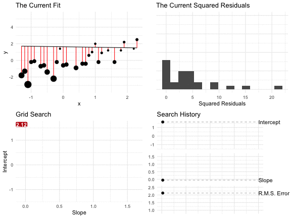

# Regression

```{r, include=FALSE}
library(tidyverse)
library(kableExtra)
library(broom)
library(ggrepel)
knitr::opts_chunk$set(echo = TRUE, fig.width=5, fig.height=3, fig.align = "center",
                      message=FALSE, warning=FALSE)
doc_theme <- ggplot2::theme_bw()
```

## Review

So far, we've made comparison between sets of measurements by...

1. Comparing the histograms of the sets of measurements (e.g., the ideologies of representatives from the 100th and 115th Congresses).
1. Comparing the average or SD of sets of the measurements (e.g., the ideologies of representatives from the 100th and 115th Congresses).
1. Computing the correlation coefficient between two sets of measurements (e.g., the portfolio share and the seat share for coalition governments)

Regression allows us to extend the correlation coefficient--a measure of how well two variables "go together"--into a more intuitive, informative quantity.

Regression allows us to answer the question "What is the average of $y$?" for many different values of $x$. Rather than compare a small number of scenarios (e.g., the 100th and 115th Congresses), the regression line allows us to compare the average of $y$ as $x$ varies continuously.

In short, we describe the average value of $y$ as a linear function of $x$, so that

$\text{the average of } Y = mX + b$.

Before we hop into regression, let's review where we've been. Let's do it with an exercise.

```{exercise, label = "description-review"}
One of the simplest democratic mechanims goes like this: If things are going well, vote for the incumbent. If things are going poorly, vote against the incumbent. Normatively, we want to see voters punish incumbents for bad outcomes. 

Let's see if incumbents get fewer votes when things go poorly. The dataset below shows incumbent presidents' margins of victory (in the popular vote) and the percent change in the real disposable income from Q2 in the year before the election to Q2 in the year of the election.

Do the following analyses with a pencil-and-paper. (You can use a computer for things like addition and multiplication if that makes it easier, but show your work on the paper.)

1. Use the percent change in the RDI to break incumbents into "good performers" and "bad performers". You may use more than two categories if you want. Draw a histogram of the margin of victory for the good performers and another for the bad performers. Compare and interpret.
1. Compute the average and SD for each category. Compare and interpret.
1. Compute the correlation between the percent change in the RDI and the margin of victory. Interpret.

Now replicate the pencil-and-paper work with R. You can find the data [here](https://raw.githubusercontent.com/pos5737/economic-models/master/data/economic-models.csv).

Overall, do voters punish incumbents for bad outcomes?
```

```{r echo = FALSE}
read_csv("https://raw.githubusercontent.com/pos5737/economic-models/master/data/economic-models.csv") %>%
  select(year, incumbent_name, ch_rdi, incumbent_margin) %>%
  rename(Year = year, 
         Incumbent = incumbent_name, 
         `% Change in RDI` = ch_rdi, 
         `Margin of Victory` = incumbent_margin) %>%
  kable(format = "html", digits = 2) %>%
  kable_styling(bootstrap_options = "striped", 
                full_width = FALSE,
                position = "center")

```

Two warnings:

1. Social scientists use the term "regression" imprecisely. In one case, they might use "regression" to refer to a broad class of models. In another case, they might use it to refer to the particular model discussed below. So watch out for inconsistent meanings, but the context should make the meaning clear.
1. Methodologists often motivate regression from a random sampling perspective. This is not necessary but it's common. In my view, it's unfortunate because regression is a useful tool with datasets that are not random samples and it unnecessarily complicated the results. However, in the random sampling framework, one can motivate the methods below quite elegantly.

## The Equation

Let's start by describing a scatterplot using a line. Indeed, we can think of the regression equation as an equation for a scatterplot.

First, let's agree that we won't encounter a scatterplot where all the points $(x_i, y_i)$ fall exactly along a line. As such, we need a notation that allows us to distinguish the line from the observed values. 

We commonly refer to the values along the line as the "fitted values" (or "predicted values" or "predictions" and the observations themselves as the "observed values" or "observations."

We use $y_i$ to denote the $i$th observation of $y$ and use $\hat{y}_i$ to denote the fitted value (usually given $x_i$). 

We write the equation for the line as $\hat{y} = \alpha + \beta x$ and the fitted values as $\hat{y}_i = \alpha + \beta x_i$.

We refer to the intercept $\alpha$ and the slope $\beta$ as **coefficients**.

We refer to the difference between the observed value $y_i$ and the fitted value $\hat{y}_i = \alpha + \beta x_i$ as the **residual** $r_i = y_i - \hat{y}_i$. 

Thus, for *any* $\alpha$ and $\beta$, we can write $y_i = \alpha + \beta x_i + r_i$ for the observations $i = \{1, 2, ..., n\}$. 

Notice that we can break each $y_i$ into two pieces components

1. the linear function of $x_i$: $\alpha + \beta x_i$
1. the residual $r_i$.

In short, we can describe any scatterplot using the model $y_i = \alpha + \beta x_i + r_i$. 

1. The black points show the individual observations $(x_i, y_i)$,
1. The green line shows the equation $\hat{y} = \alpha + \beta x$.
1. The purple star shows the prediction $\hat{y}_i$ for $x = x_i$.
1. The orange vertical line shows the residual $r_i = y_i - \hat{y}_i$.

```{r echo=FALSE, fig.height=5, fig.width=6}
set.seed(50478)
b <- -3
m <- 0.2
df <- tibble(x = -5:5) %>%
  mutate(y = x + round(rnorm(nrow(.), sd = 3)), 
         y_hat = m*x + b)

ggplot(df, aes(x, y)) + 
  theme_minimal() + 
  # label line
  geom_abline(intercept = b, slope = m, 
              color = "#1b9e77") + 
  annotate("segment", x = 2.5, y = -4, xend = 2, yend = -3, 
           arrow = arrow(length = unit(0.08, "inches")), 
           color = "#1b9e77") +
  annotate("label", x = 2.5, y = m*2.5 + b - 2, 
           label = "hat(y) == alpha + beta *x", 
           parse = TRUE, 
           color = "#1b9e77") + 
  # label point
  annotate("segment", x = -1, y = 3, xend = -1.9, yend = 2.1, 
           arrow = arrow(length = unit(0.08, "inches"))) +
  annotate("label", x = -1, y = 3, 
           label = "list(x[i], y[i])", 
           parse = TRUE) + 
  # residual
  annotate("segment", x = -2, xend = -2, y = 2, yend = m*(-2)+b,
           linetype = "dotted", color = "#d95f02") + 
  annotate("label", x = -2, y = -0.5, 
           label = "r[i]", 
           parse = TRUE, 
           color = "#d95f02") + 
  # label prediction
  annotate("segment", x = -3, y = -6, xend = -2.2, yend = -3.8, 
           arrow = arrow(length = unit(0.08, "inches")),
           color = "#7570b3") +
  annotate("label", x = -3, y = -6, 
           label = "hat(y)[i] == alpha + beta *x[i]", 
           parse = TRUE, color = "#7570b3") + 
  annotate("point", x = -2, m*(-2)+b, shape = 8, fill = "white",
           color = "#7570b3", size = 3) + 
  # add points
    geom_point()
```

Using this generic approach, we can describe *any* scatterplot using *any* line. Of course, the line above isn't a very good line. 

How can we go about finding a *good* line?

```{exercise}
Before we talk about a good *line*, let's talk about a good *point*. Suppose you have a dataset $y = \{y_1, y_2, ... , y_n\}$ and you want to predict these observations with a single point $\theta$. Use calculus to find the $\theta$ that minimizes the r.m.s. of the residuals $r_i = y_i - \theta$ or that minimizes $f(\theta) = \sqrt{\dfrac{\sum_{i = 1}^n(y_i - \theta)^2}{n}}$.
```
<details><summary>Hint</summary>
1. Realize that the $\theta$ that minimizes $f(\theta) = \sqrt{\dfrac{\displaystyle \sum_{i = 1}^n (y_i - \theta)^2}{n}}$ also minimizes $g(\theta) = \dfrac{\displaystyle \sum_{i = 1}^n(y_i - \theta)^2}{n}$. We know this because the square root function is monotonically increase (for positive values, which this must always be) and preserves the order of observations. In other words, the $\theta$ that produces the smallest RMS of the deviations also produces the smallest MS of the deviations.
1. Realize that the $\theta$ that minimizes $g(\theta) = \dfrac{\displaystyle \sum_{i = 1}^n(y_i - \theta)^2}{n}$ also minimizes $h(\theta) = \displaystyle \sum_{i = 1}^n(y_i - \theta)^2$. Removing a constant just shifts the curve up or down, but it does not change the $\theta$ that minimizes the curve. So work with $h(\theta) = \displaystyle \sum_{i = 1}^n(y_i - \theta)^2$.
1. To make things easier, expand $h(\theta) = \displaystyle \sum_{i = 1}^n(y_i - \theta)^2$ to $h(\theta) = \displaystyle \sum_{i = 1}^n(y_i^2 - 2\theta y_i + \theta^2)$.
1. Distribute the summation operator to obtain $h(\theta) = \displaystyle \sum_{i = 1}^n y_i^2 - 2 \theta \sum_{i = 1} y_i + n\theta^2$.
1. Now take the derivative of $h(\theta)$ w.r.t. $\theta$, set that derivative equal to zero, and solve for $\theta$. The result should be familiar. 
</details>

```{exercise}
See how other authors conceptualize the regression model. 

- Read Lewis-Beck (1980), pp. 9-13 (up to "Least Squares Principle")
- Read Wooldridge (2013), pp. 22-26 (Section 2.1). Do q. 1, p. 60. 
```

## The Conditional Average

Have a look at the scatterplot below. What's the portfolio share of a party in a coalition government with a seat share of 25%?

```{r, echo = FALSE}
df <- read_rds("data/gamson.rds") 
ggplot(df, aes(x = seat_share, y = portfolio_share)) + 
  geom_point(alpha = 0.5) + 
  theme_minimal() + 
  scale_y_continuous(labels = scales::percent_format(accuracy = 1)) + 
  scale_x_continuous(labels = scales::percent_format(accuracy = 1)) + 
  labs(x = "Seat Share",
       y = "Portfolio Share")
```

Your eyes probably immediately begin examining a vertical strip above 25%. 

```{r, echo = FALSE}
df_grey <- df %>%
  filter(seat_share < 0.22 | seat_share > 0.28)
df_color <- df %>%
  filter(seat_share >= 0.22 & seat_share <= 0.28)

ggplot(df_color, aes(x = seat_share, y = portfolio_share)) + 
  geom_point(data = df_grey, alpha = 0.5) + 
  geom_point(color = "#d95f02", alpha = 0.5) + 
  theme_minimal() + 
  scale_y_continuous(labels = scales::percent_format(accuracy = 1)) + 
  scale_x_continuous(labels = scales::percent_format(accuracy = 1)) + 
  labs(x = "Seat Share",
       y = "Portfolio Share")
```

You probably estimate the average is a little more than 25%... call it 27%. You can see that the SD is about 10% because you'd need to go out about 10 percentage points above and below the average to grab about 2/3rds of the data. 

```{r, echo = FALSE}

df_sum <- df_color %>%
  summarize(y = mean(portfolio_share),
            ymin = mean(portfolio_share) - sd(portfolio_share),
            ymax = mean(portfolio_share) + sd(portfolio_share)) %>%
  mutate(x = 0.25)

lab_df <- tribble(
  ~x, ~y, ~label ,
  df_sum$x,   df_sum$y, "average in window is about 27%",
  df_sum$x,   df_sum$ymax, "SD is about 10 percentage points"
)

  

ggplot(df_color, aes(x = seat_share, y = portfolio_share)) + 
  geom_point(data = df_grey, alpha = 0.2) + 
  geom_point(color = "#d95f02", alpha = 0.2) + 
    geom_label_repel(data = lab_df, aes(x = x, y = y, label = label), 
                   xlim = c(0.29, 1), size = 3,
                   segment.color = "grey50", segment.size = 0.3) + 
  geom_point(data = df_sum, aes(x = x, y = y, ymin = ymin, ymax = ymax), size = 3) + 
  geom_errorbar(data = df_sum, aes(x = x, y = y, ymin = ymin, ymax = ymax), 
                width = 0.02, size = 1) + 
  scale_y_continuous(labels = scales::percent_format(accuracy = 1)) + 
  scale_x_continuous(labels = scales::percent_format(accuracy = 1)) + 
  theme_minimal() + 
  labs(x = "Seat Share",
       y = "Portfolio Share")
```

Now you're informed by the data and ready to answer the question.

- Q: What's the portfolio share of a party in a coalition government with a seat share of 25%?
- A: It's about 28% give or take 10 percentage points or so.

Notice that if we break the data into many small windows, we can visually create an average (and an SD) for each. Freedman, Pisani, and Purves (2008) refer to this as a "graph of averages." Fox (2008) calls this "naive nonparametric regression." It's a conceptual tool to help us understand regression.

```{r, echo = FALSE}
window_df <- df %>%
  mutate(window = cut_width(seat_share, width = 0.05, boundary = 0)) %>% 
  mutate(window_color = factor(as.numeric(window) %% 2))

windowsum_df <- window_df %>%
  separate(window, c("lwr", "upr"), sep = ",", remove = FALSE) %>%
  mutate(lwr = str_remove(lwr, "\\["),
         lwr = str_remove(lwr, "\\("),
         upr = str_remove(upr, "\\]"),
         upr = str_remove(upr, "\\)"),
         lwr = as.numeric(lwr),
         upr = as.numeric(upr),
         mid = (lwr + upr)/2) %>%
  group_by(window, window_color, mid, upr, lwr) %>%
  summarize(avg = mean(portfolio_share),
            sd = sd(portfolio_share),
            upr0 = avg + sd,
            lwr0 = avg - sd) 

ggplot(window_df, aes(x = seat_share, y = portfolio_share)) + 
  geom_point(alpha = 0.15, aes(color = window_color)) + 
  theme_minimal() + 
  scale_color_manual(values = c("1" = "#d95f02", "0" = "#1b9e77")) + 
  scale_y_continuous(labels = scales::percent_format(accuracy = 1)) + 
  scale_x_continuous(labels = scales::percent_format(accuracy = 1)) + 
  geom_point(data = windowsum_df, aes(x = mid, y = avg, color = window_color), size = 2) + 
    geom_errorbar(data = windowsum_df, aes(x = mid, y = avg, 
                                           ymin = lwr0, ymax = upr0, 
                                           color = window_color), 
                width = 0.02, size = 1) + 
  labs(x = "Seat Share",
       y = "Portfolio Share") + 
  theme(legend.position = "none")
```

For some datasets, these averages will fall roughly along a line. In that case, we can described the average value of $y$ for each value of $x$--that is, the *conditional* average of $y$--with a line.

```{r, echo = FALSE}
ggplot(window_df, aes(x = seat_share, y = portfolio_share)) + 
  geom_point(alpha = 0.15, aes(color = window_color)) + 
  theme_minimal() + 
  scale_color_manual(values = c("1" = "#d95f02", "0" = "#1b9e77")) + 
  scale_y_continuous(labels = scales::percent_format(accuracy = 1)) + 
  scale_x_continuous(labels = scales::percent_format(accuracy = 1)) + 
  geom_point(data = windowsum_df, aes(x = mid, y = avg, color = window_color), size = 2) + 
    geom_errorbar(data = windowsum_df, aes(x = mid, y = avg, ymin = lwr0, ymax = upr0, color = window_color), 
                width = 0.02, size = 1) + 
  labs(x = "Seat Share",
       y = "Portfolio Share") + 
  geom_smooth(method = "lm", se = FALSE, color = "black") + 
  theme(legend.position = "none")
```

Here's the takeaway: a "good" line is the conditional average.

```{exercise}
Other authors use this "graph of averages". 

- Read FPP, ch. 10. 
   - Set A, p. 161: 1-4.
   - Set B, p. 163: 1, 3.
   - Set C, p. 167: 1-3.
   - Set D, p. 174: 1, 2.
   - Set E, p. 175: 1, 2.
   - Section 6, p. 176: 1-3, 5-7, 10.
- Read Read Fox (2008), pp. 17-21. (Optional: Section 2.3 describes how to create a smoothed average in a more principled manner.)
```

## The Best Line

So far, we have to results:

1. The average is the point that minimizes the RMS of the deviations.
1. We want a line that captures the conditional average.

Just as the average minimizes the RMS of the deviations, perhaps we should choose the line that minimizes the RMS of the residuals... that's exactly what we do. 

**We want the pair of coefficients $(\hat{\alpha}, \hat{\beta})$ that minimizes the RMS of the residuals or **

$\DeclareMathOperator*{\argmin}{arg\,min}$

\begin{equation}
(\hat{\alpha}, \hat{\beta}) = \displaystyle \argmin_{( \alpha, \, \beta ) \, \in \, \mathbb{R}^2} \sqrt{\frac{r_i^2}{n}}
\end{equation}

Let's explore three methods to find the coefficients that minimize the RMS of the residuals.

1. grid search 
1. numerical optimization, to get additional intuition and preview more advanced methods
1. analytical optimization

### Grid Search

Because we're looking for the pair $(\hat{\alpha}, \hat{\beta})$ that minimize the sum of the RMS residuals, we could simply check lots of different values. In some applications, this is a reasonable optimization routine. (It is not reasonable in the context of regression, where we have much faster and accuracy tools.)

The figure below shows the result of a grid search.

- In the top-left panel, we see the line and the residuals for each intercept-slope pair. The size of the points indicates the residual *squared*. Notice that some lines make big errors and other lines make small errors. 
- In the top-right panel, we see a histogram of the squared residuals.
- In the lower-left panel, each point in the grid shows a intercept-slope pair. The label, color, and size indicate the RMS of the residuals. As we move around the grid, the RMS changes--we're looking for the smallest.
- In the lower-right panel, the three lines show the evolution of the intercept, slope, and RMS of the residuals, respectively. Again, we're looking for the pair that produces the smallest RMS of the residuals.

For this search, the intercept -0.36 and the slope 0.89 produce the smallest RMS of the residuals (of the combinations we considered).



### Numerical Optimization

Remember that we simply need to minimize the function 

$f(\alpha, \beta) = \displaystyle \sqrt{\frac{\sum_{i = 1}^n r_i^2}{n}} = \sqrt{\frac{\sum_{i = 1}^n (y_i - \hat{y}_i)^2}{n}} = \sqrt{\frac{ \sum_{i = 1}^n [y_i - (\alpha + \beta x_i)]^2}{n}}$, 

shown below.

```{r, echo = FALSE, fig.height=6, fig.width = 7}

df <- tribble(
    ~x,   ~y,
    -1, -0.2,
   1.1, -0.2,
  -1.1, -2.9,
  -0.2, -0.2,
  -0.5, -1.4,
   1.9,  2.2,
   1.2,  0.9,
   0.1, -0.5,
   0.7, -0.4,
  -1.3, -1.8,
   2.3,  2.5,
   0.4, -0.9,
     1,    2,
  -0.9, -0.1,
  -0.1,  1.4,
  -1.2, -1.3,
   0.9,    1,
     0, -0.6,
  -0.6, -0.6,
  -0.3, -2.2,
   1.4,  1.2,
   1.8,  1.2,
   1.6, -0.2,
   2.2,  1.4,
  -0.7, -0.7,
   0.6, -0.4,
   0.8,  0.6
  )

f <- function(par, data) {
  alpha <- par[1]
  beta <- par[2]
  y_hat <- alpha + beta*data$x
  r <- data$y - y_hat
  rms <- sqrt(mean(r^2))
  return(rms)
}

slope     <- seq(-3, 3, by = 0.1)
intercept <- seq(-3, 3, by = 0.1)

rms <- matrix(NA, nrow = length(slope), ncol = length(intercept))
for (i in 1:length(slope)) {
  for (j in 1:length(intercept)) {
    rms[i, j] <- f(c(intercept[j], slope[i]), data = df)
  }
}

library(plotly)
plot_ly(x = ~ slope, y = ~ intercept, z = ~ rms) %>% 
  add_surface(showscale = FALSE) %>%
  layout(
    scene = list(
      xaxis = list(title = "Slope"),
      yaxis = list(title = "Intercept"),
      zaxis = list(title = "RMS of Residuals")))
```

Hill-climbing algorithms, such as Newton-Raphson, find the optimum *numerically* by investigating the shape of $f$ at its current location, taking a step uphill, and then repeating. When no step leads uphill, the algorithm has found the optimum. Under meaningful restrictions (e.g., no local optima), these algorithms find the *global* optimum.

First, let's add the data from the grid search example above using `tribble()`.

```{r}
df <- tribble(
    ~x,   ~y,
    -1, -0.2,
   1.1, -0.2,
  -1.1, -2.9,
  -0.2, -0.2,
  -0.5, -1.4,
   1.9,  2.2,
   1.2,  0.9,
   0.1, -0.5,
   0.7, -0.4,
  -1.3, -1.8,
   2.3,  2.5,
   0.4, -0.9,
     1,    2,
  -0.9, -0.1,
  -0.1,  1.4,
  -1.2, -1.3,
   0.9,    1,
     0, -0.6,
  -0.6, -0.6,
  -0.3, -2.2,
   1.4,  1.2,
   1.8,  1.2,
   1.6, -0.2,
   2.2,  1.4,
  -0.7, -0.7,
   0.6, -0.4,
   0.8,  0.6
  )
```

Now let's create a function that takes the parameters (to be optimized over) as the first argument. 


```{r}
f <- function(par, data) {
  alpha <- par[1]
  beta <- par[2]
  y_hat <- alpha + beta*data$x
  r <- data$y - y_hat
  rms <- sqrt(mean(r^2))
  return(rms)
}
```

Now we can optimize this function `f()` using `optim()`. The default `method` is `"Nelder-Mead"`, which works similarly to the Newton-Raphson algorithm you might have seen before.

```{r}
results <- optim(
  par = c(0, 0),    # initial slope and intercept
  fn = f,           # function to optimize
  data = df         # dataset for f()
  )

results$par
results$value
```

The Nelder-Mead optimization routine finds that intercept of -0.36 and a slope of 0.94 result in the smallest RMS of the residuals 0.84.

This somewhat agrees with the results from the coarse grid search. If the grid search were more fine-grained, we could easily obtain solutions that agree to two decimal places.

### Analytical Optimization

In the case of finding the line that minimizes the RMS of the residuals, we have an easy analytical solution. We don't need a grid search, and we don't need to optimize numerically.

#### Scalar Form

Remember that we simply need to minimize the function 

$f(\alpha, \beta) = \displaystyle \sqrt{\frac{\sum_{i = 1}^n [y_i - (\alpha + \beta x_i)]^2}{n}}$.

This is equivalent to minimizing $h(\alpha, \beta) = \sum_{i = 1}^n(y_i - \alpha - \beta x_i)^2$. We sometimes refer to this quantity as the SSR or "sum of squared residuals."

To minimize $h(\alpha, \beta)$, remember that we need to solve for $\frac{\partial h}{\partial \alpha} = 0$ and $\frac{\partial h}{\partial \beta} = 0$ (i.e., the first-order conditions).

Using the chain rule, we have the partial derivatives

$\frac{\partial h}{\partial \alpha} = \sum_{i = 1}^n [2 \times (y_i - \alpha - \beta x_i) \times (-1)] = -2 \sum_{i = 1}^n(y_i - \alpha + \beta x_i)$

and

$\frac{\partial h}{\partial \beta} = \sum_{i = 1}^n 2 \times (y_i - \alpha - \beta x_i) \times (-x_i) = -2 \sum_{i = 1}^n(y_i - \alpha - \beta x_i)x_i$

and the two first-order conditions

$-2 \sum_{i = 1}^n(y_i - \hat{\alpha} + \hat{\beta} x_i) = 0$

and

$-2 \sum_{i = 1}^n(y_i - \hat{\alpha} + \hat{\beta} x_i)x_i = 0$

##### The 1st First-Order Condition

\begin{align}
-2 \sum_{i = 1}^n(y_i - \hat{\alpha} - \hat{\beta} x_i) &= 0 \\
\sum_{i = 1}^n(y_i - \hat{\alpha} - \hat{\beta} x_i) &= 0 \text{   (divide both sizes by $-2$)} \\
\sum_{i = 1}^n y_i - \sum_{i = 1}^n \hat{\alpha}  - \sum_{i = 1}^n \hat{\beta} x_i &= 0 \text{   (distribute the sum)} \\
\sum_{i = 1}^n y_i -  n \hat{\alpha}  - \hat{\beta}\sum_{i = 1}^n  x_i &= 0 \text{   (move constant $\beta$ in front and realize that $\sum_{i = 1}^n \hat{\alpha} = n\hat{\alpha}$)} \\
\sum_{i = 1}^n y_i & = n \hat{\alpha}  + \hat{\beta}\sum_{i = 1}^n  x_i \text{   (rearrange)} \\
\frac{\sum_{i = 1}^n y_i}{n} & = \hat{\alpha}  + \hat{\beta} \frac{\sum_{i = 1}^n  x_i}{n} \text{   (divide both sides by $n$)} \\
\overline{y} & = \hat{\alpha}  + \hat{\beta} \overline{x} \text{   (recognize the average of $y$ and of $x$)} \\
\end{align}

```{theorem, label = "pt-of-avgs"}
The 1st first-order condition implies that the regression line $\hat{y} = \hat{\alpha} + \hat{\beta}x$ equals $\overline{y}$ when $x = \overline{x}$. Thus, the regression line must go through the point $(\overline{x}, \overline{y})$ or "the point of averages".  
```

The figure below shows a regression line that goes through the point of averages.

```{r echo = FALSE}
set.seed(1234)
x <- rnorm(10)
y <- -x + rnorm(10)
df <- tibble(x, y)

fit <- lm(y ~ x, data = df)
block_df <- tibble(x = seq(min(df$x), max(df$x), by = 0.1)) %>%
  mutate(y = predict(fit, newdata = .)) %>%
  bind_rows(crossing(x = seq(min(df$x), max(df$x), by = 0.1), y = mean(y))) %>%
  bind_rows(crossing(x = mean(x), y = seq(min(df$y), max(df$y), by = 0.1))) %>%
  mutate(label = "") 

ann_df <- tribble(
  ~label, ~x, ~y,
  "average of x",   mean(x), -1.5,
  "average of y",   -1.5, mean(y),
  "point of averages",   mean(x), mean(y),
  "regression line", -1.5, sum(coef(fit)*c(1, -1.5))
) %>% 
  bind_rows(block_df) %>%
  bind_rows(df %>% mutate(label = ""))

library(ggrepel)
ggplot(df, aes(x, y)) + 
  geom_smooth(method = "lm", se = FALSE, linetype = 1, color = 1) +
  geom_vline(xintercept = mean(x), linetype = 3) + 
  geom_hline(yintercept = mean(y), linetype = 3) + 
  geom_label_repel(data = ann_df, aes(x = x, y = y, label = label), 
                   box.padding = 1,  
                   segment.color = "grey70") + 
  geom_point() + 
  theme_minimal() + 
  geom_point(x = mean(x), y = mean(y), 
             shape = 21, fill = "white", 
             size = 3)
```

```{theorem, label = "1st-order"}
We can rearrange the identity $\hat{y} = \hat{\alpha} + \hat{\beta}x$ from Theorem \@ref(thm:pt-of-avgs) to obtain the identity $\hat{\alpha} = \overline{y} - \hat{\beta}\overline{x}$
```

##### The 2nd First-Order Condition

Sometimes, when writing proofs, you obtain a result that's not particularly interesting, but true and useful later. We refer to these results as "lemmas." We'll need the following Lemmas in the subsequent steps.

```{lemma, label = "ny"}
$\sum_{i = i}^n y_i = n\overline{y}$.
```
```{exercise}
Prove Lemma \@ref(lem:ny).
```

*A personal perspective on proofs:* In my experience, proofs are not intuitive. Sometimes I have a sneaking suspicion about a result, but sometimes that sneaking suspicion is *wildly* wrong. When I investigate a the suspicion analytically, the path to the result is unclear. A maze analogy works quite well. To obtain the result, just move things around, sometimes getting further from the result. Eventually, you just happen upon the correct sequence of movements. 

```{lemma, label = "sum-of-dev-prods"}
$\sum_{i = 1}^n x_i y_i - n \overline{x} \overline{y} = \sum_{i = 1}^n (x_i - \overline{x})(y_i - \overline{y})$.
```
```{exercise}
Prove Lemma \@ref(lem:sum-of-dev-prods).
```

```{lemma, label = "sum-of-squared-devs"}
$\sum_{i = 1}^n x_i ^2 - n \overline{x}^2 = \sum_{i = 1}^n (x_i - \overline{x})^2$.
```
```{exercise}
Prove Lemma \@ref(lem:sum-of-squared-devs).
```

\begin{align}
-2 \sum_{i = 1}^n(y_i - \hat{\alpha} - \hat{\beta} x_i)x_i &= 0 \\
\sum_{i = 1}^n(y_i - \hat{\alpha} - \hat{\beta} x_i)x_i &= 0 \text{   (divide both sides by -2)} \\
\sum_{i = 1}^n(y_i x_i - \hat{\alpha}x_i - \hat{\beta} x_i^2) &= 0 \text{   (distribute the $x_i$)}
\end{align}

Now we can use  use Theorem \@ref(thm:1st-order) and replace $\hat{\alpha}$ with $\overline{y} - \hat{\beta}\overline{x}$.

\begin{align}
\sum_{i = 1}^n(y_i x_i - (\overline{y} - \hat{\beta}\overline{x})x_i - \hat{\beta} x_i^2) &= 0 \text{   (use the identity $\hat{\alpha} = \overline{y} - \hat{\beta}\overline{x}$)} \\
\sum_{i = 1}^n( x_i y_i - \overline{y} x_i + \hat{\beta}\overline{x} x_i - \hat{\beta} x_i^2) &= 0 \text{   (expand the middle term)} \\
\sum_{i = 1}^n x_i y_i  - \overline{y} \sum_{i = 1}^n x_i + \hat{\beta}\overline{x} \sum_{i = 1}^n x_i - \hat{\beta} \sum_{i = 1}^n x_i^2 &= 0 \text{   (distribute the sum)}
\end{align}

Now we can use Lemma \@ref(lem:ny) to replace $\sum_{i = i}^n y_i$ with $n\overline{y}$.

\begin{align}
\sum_{i = 1}^n  x_i y_i - n \overline{y} \overline{x} + \hat{\beta}n \overline{x}^2 - \hat{\beta} \sum_{i = 1}^n x_i^2 &= 0 \text{   (use the identity $\sum_{i = i}^n y_i = n\overline{y}$)}\\
\sum_{i = 1}^n x_i y_i  - n \overline{x} \overline{y}  &= \hat{\beta} \left(\sum_{i = 1}^n x_i^2 - n \overline{x}^2 \right) \text{   (rearrange)}\\
\hat{\beta} &=\dfrac{\sum_{i = 1}^n x_i y_i - n \overline{x} \overline{y}}{\sum_{i = 1}^n x_i^2 - n \overline{x}^2} \text{   (rearrange)}\\
\end{align}

This final result is correct, but unfamiliar. In order to make sense of this solution, we need to connect this identity to previous results.

Now we can use Lemmas \@ref(lem:sum-of-dev-prods) and \@ref(lem:sum-of-squared-devs) to replace the numerator $\sum_{i = 1}^n x_i y_i - n \overline{x} \overline{y}$ with the more familiar expression $\sum_{i = 1}^n (x_i - \overline{x})(y_i - \overline{y})$ and replace the denominator $\sum_{i = 1}^n x_i ^2 - n \overline{x}^2$ with the more familiar expression $\sum_{i = 1}^n (x_i - \overline{x})^2$.

\begin{align}
\hat{\beta} &=\dfrac{\sum_{i = 1}^n (x_i - \overline{x})(y_i - \overline{y})}{\sum_{i = 1}^n (x_i - \overline{x})^2} \\
\end{align}

Denote the SD of $x$ as $\text{SD}_x$ and the the SD of $y$ as $\text{SD}_y$. Multiply the top and bottom by $\frac{1}{n \times \text{SD}_x^2 \times \text{SD}_y}$ and rearrange strategically.

\begin{align}
\hat{\beta} &=\frac{\frac{\sum_{i = 1}^n \left(\frac{x_i - \overline{x}}{\text{SD}_x} \right)\left(\frac{y_i - \overline{y}}{\text{SD}_y} \right)}{n} \times \frac{1}{\text{SD}_x}}{ \frac{1}{n \times \text{SD}_x^2 \times \text{SD}_y} \times \sum_{i = 1}^n (x_i - \overline{x})^2} \\
\end{align}

Now we recognize that the left term $\dfrac{\sum_{i = 1}^n \left(\frac{x_i - \overline{x}}{\text{SD}_x} \right)\left(\frac{y_i - \overline{y}}{\text{SD}_y} \right)}{n}$ in the numerator is simply the correlation coefficient $r$ between $x$ and $y$.

\begin{align}
\hat{\beta} &=\dfrac{r \times \frac{1}{\text{SD}_x}}{\frac{1}{\text{SD}_x^2 \times \text{SD}_y}\sum_{i = 1}^n \frac{(x_i - \overline{x})^2}{n}} \\
\end{align}

Now we recognize that $\sum_{i = 1}^n \frac{(x_i - \overline{x})^2}{n}$ is almost the $\text{SD}_x$. Conveniently, it's $\text{SD}_x^2$, which allows us to cancel those two terms.

\begin{align}
\hat{\beta} &=\dfrac{r \times \frac{1}{\text{SD}_x}}{\frac{1}{\text{SD}_y}} \\
            & r \times \frac{\text{SD}_y}{\text{SD}_x}
\end{align}

This final result clearly connects $\hat{\beta}$ to previous results.

```{theorem, label = "2nd-order"}
$\hat{\beta} = r \times \dfrac{\text{SD of } y}{\text{SD of }x} = \dfrac{\sum_{i = 1}^n (x_i - \overline{x})(y_i - \overline{y})}{\sum_{i = 1}^n (x_i - \overline{x})^2} = \dfrac{\sum_{i = 1}^n x_i y_i - n \overline{x} \overline{y}}{\sum_{i = 1}^n x_i^2 - n \overline{x}^2}$.
```

In summary, we can obtain the smallest RMS of the residuals with results from Theorems \@ref(thm:1st-order) and \@ref(thm:2nd-order).

\begin{align}
\hat{\beta} &= r \times \dfrac{\text{SD of } y}{\text{SD of }x} \\
\hat{\alpha} &= \overline{y} - \hat{\beta}\overline{x}
\end{align}

```{exercise}
Other authors develop this least-squares approach using slightly different language and notation. 

- Read FPP, ch. 12.
   - Set A, p. 207: 1, 2, 3, 4.
   - Set B, p. 210: 1, 2.
   - Section 4, p. 213: 1-5, 8.
- Read Fox (2008), pp. 77-86. Do p. 96, q. 5.2.
- Read Wooldridge (2013), pp. 27-35. Do pp. 60-61, q. 3 (*i*, *ii*, and *iii*) and q. 6.
- Read DeGroot and Schervish (2012), pp. 689-692. 
```

```{exercise}
[HARD] Do Fox (2008), p. 97, q. 5.4.
```

#### Matrix Form

In some cases, a matrix approach might help analytically or numerically compared to the scalar approach.
Rather than writing the model as $y_i = \alpha + \beta x_i + r_i$, we can write the model in an equivalent matrix form 

\begin{align}
y &= X\beta + r \\
\begin{bmatrix}
y_1\\
y_2\\
\vdots\\
y_n
\end{bmatrix} 
&= 
\begin{bmatrix}
1 & x_1\\
1 & x_2 \\
\vdots & \vdots \\
1 & x_n 
\end{bmatrix}
\times 
\begin{bmatrix}
\beta_1 \\ 
\beta_2\\
\end{bmatrix} + 
\begin{bmatrix}
r_1\\
r_2\\
\vdots\\
r_n
\end{bmatrix} .
\end{align}

In this case, our intercept $\alpha$ and slope $\beta$ are combined into a single vector $\beta = \begin{bmatrix} \beta_1 \\ \beta_2\\ \end{bmatrix}$, where $\beta_1$ represents the intercept and $\beta_2$ represents the slope.

```{exercise}
Show that the scalar representation $y_i = \alpha + \beta x_i + r_i$ and the matrix formulation $y = X\beta + r$ are equivalent.
```
<details><summary>Hint</summary>
Do the matrix multiplication $X\beta$ and show that $y_i = \beta_1 + \beta_2x + r_i$.
</details>


```{theorem}
In matrix form we can combine Theorems \@ref(thm:1st-order) and \@ref(thm:2nd-order) and compute the slope and intercept as $\hat{\beta} = (X'X)^{-1}X'y$.
```
<details><summary>Proof</summary>
See Fox (2008), pp. 192-193
</details>

## The RMS of the Residuals

Just like the SD offers a give-or-take number around the average, the RMS of the residuals offers a give-or-take number around the regression line. 

Indeed, the SD is the RMS of the deviations from the average and the RMS of the residuals is the RMS of the deviations from the regression line. The RMS of the residuals tells us how far typical points fall from the regression line.

Sometimes the RMS of the residuals is called the "RMS error (of the regression)," the "standard error of the regression," or denoted as $\hat{\sigma}$.

We can compute the RMS of the regression by computing each residual and then taking the root-mean-square. But we can also use the much simpler formula $\sqrt{1 - r^2} \times \text{ SD of }y$. 

This formula makes sense because $y$ has an SD, but $x$ explains some of that variation. As $r$ increases, $x$ explains more and more of the variation. As $x$ explains more variation, then the RMS of the residuals shrinks away from SD of $y$ toward zero. It turns out that the SD of $y$ shrinks toward zero by a factor of $\sqrt{1 - r^2}$.

```{exercise}
Read FPP, ch. 11. Do the following exercises.

- Set A, p. 184: 1-4, 6, 7.
- Set B, p. 187: 1, 2.
- Set C, p. 189: 1-3.
- Set D, p. 193: 1, 2, 4-6.
- Set E, p. 197: 1, 2.
- Section 6, p. 198: 1, 2, 4, 6, 7,10, 12.
```

## $R^2$

Some authors use the quantity $R^2$ to assess the fit of the regression model. I prefer the RMS of the residuals because it's on the same scale as $y$. Also, $R^2$ computes the what fraction of the *variance* of $y$, which is the SD squared, is explained by $x$. I have a hard time making sense of variances, because they are not on the original scale.

However, $R^2$ is a common quantity, so do the following exercises.

```{exercise}
Read Lewis-Beck (1980), pp. 20-25. Read Wooldridge (2013), pp. 36-39. Do pp. 60-61, q. 3 (part *iv*)
```

### Adequacy of a Line

In some cases, a line can describe the average value $y$ quite well. In other cases, a line describes the data poorly. 

Remember, the regression line describes the average value of $y$ *for different values of $x$*. In the figure below, the left panel shows a dataset in which a line does not (and cannot) adequately describe the average values of $y$ for describe low, middle, and high values (at least ad the same time). The right panel shows a data in which a line can adequately describe how the average value of $y$ changes with $x$. We can see that when $x \approx -2$, then $y \approx 0$. Similarly, when $x \approx 0$, then $y \approx 4$. A line can describe the average value of $y$ for varying values of $x$ when the average of $y$ changes *linearly* with $x$.

```{r echo=FALSE, fig.height=3, fig.width=7}
n <- 100
well <- tibble(x = runif(n, -2, 2)) %>%
  mutate(y = 4 + 2*x + rnorm(n), 
         descr = "A Line Works Well")

poorly <- tibble(x = rnorm(n)) %>%
  mutate(y = x^2 + x + rnorm(n, sd = 0.5),
         descr = "A Line Works Poorly")

df <- bind_rows(well, poorly)

ggplot(df, aes(x, y)) + 
  geom_point(alpha = 0.5) + 
  geom_smooth(method = "lm", se = FALSE, color = "black") + 
  facet_wrap(vars(descr), scales = "free") + 
  theme_minimal()
```

A line does a great job of describing the relationship between seat shares and portfolio shares in government coalitions. 

```{r, echo = FALSE}
df <- read_rds("data/gamson.rds") 
ggplot(df, aes(x = seat_share, y = portfolio_share)) + 
  geom_point(alpha = 0.5) + 
  geom_smooth(method = "lm", se = FALSE, color = "black") + 
  theme_minimal() + 
  labs(x = "Seat Share",
       y = "Portfolio Share")
```

A line poorly describes the relationship between Polity IV's DEMOC measure and GDP per capita.

```{r echo = FALSE}
df <- read_csv("https://raw.githubusercontent.com/pos5737/democracy-life/master/data/democracy-life.csv") 

ggplot(df, aes(x = democ, y = gdp_per_capita)) + 
  geom_point(alpha = 0.5) + 
  geom_smooth(method = "lm", se = FALSE, color = "black") + 
  theme_minimal() + 
  labs(x = "Democracy Score",
       y = "GDP Per Capita")
```

When we have variable that's skewed heavily to the right, we can sometimes more easily describe the *log* of the variable. For this dataset, the line poorly describes the average logged GDP per capita for the various democracy scores.

```{r echo = FALSE}
ggplot(df, aes(x = democ, y = gdp_per_capita)) + 
  geom_point(alpha = 0.5) + 
  geom_smooth(method = "lm", se = FALSE, color = "black") + 
  theme_minimal() + 
  scale_y_log10(labels = scales::comma) + 
  labs(x = "Democracy Score",
       y = "Log of GDP Per Capita")
```

## Fitting Regression Models

To fit a regression model in R, we can use the following approach:

1. Use `lm()` to fit the model.
1. Use `coef()`, `arm::display()`, `texreg::screenreg()`, or `summary()` to quickly inspect the slope and intercept.
1. Use `glance()`, `tidy()`, and `augment()` functions in the broom package to process the fit more thoroughly.

### `geom_smooth()`

In the context of ggplot, we can show the fitted line with `geom_smooth()`.

```{r}
gamson <- read_rds("data/gamson.rds")

ggplot(gamson, aes(x = seat_share, y = portfolio_share)) + 
  geom_point() + 
  geom_smooth()
```

By default, `geom_smooth()` fits a smoothed curve rather than a straight line. There's nothing wrong with a smoothed curve---sometimes it's preferable to a straight line. But we don't understand how to fit a smoothed curve. To us the least-squares fit, we supply the argument `method = "lm"` to `geom_smooth()`.

`geom_smooth()` also includes the uncertainty around the line by default. Notice the grey band around the line, especially in the top-right. We don't have a clear since of how uncertainty enters the fit, nor do we understand a standard error, so we should not include the uncertainty in the plot (at least for now). To remove the grey band, we supply the argument `se = FALSE` to `geom_smooth()`.

The line $y = x$ is theoretically relevant--that's the line that indicates a perfectly proportional portfolio distribution. To include it, we can use `geom_abline()`.

```{r}
ggplot(gamson, aes(x = seat_share, y = portfolio_share)) + 
  geom_point() + 
  geom_smooth(method = "lm", se = FALSE) + 
  geom_abline(intercept = 0, slope = 1, color = "red")
```


### `lm()`

The `lm()` function takes two key arguments.

1. The first argument is a formula, which is a special type of object in R. It has a left-hand side and a right-hand side, separated by a `~`. You put the name of the outcome variable $y$ on the LHS and the name of the explanatory variable $x$ on the RHS. 
1. The second argument is the dataset.

```{r}
fit <- lm(portfolio_share ~ seat_share, data = gamson)
```

### Quick Look at the Fit

We have several ways to look at the fit. Experiment with `coef()`, `arm::display()`, `texreg::screenreg()`, and `summary()` to see the differences. For now, we only understand the slope and intercept, so `coef()` works perfectly.

```{r}
coef(fit)
```

The `coef()` function outputs a numeric vector with named entries. The intercept is named `(Intercept)` and the slope is named after its associated variable.

### Post-Processing

The intercept and slope have a nice, intuitive interpretation so it's tempting to just examine those values and call it quits. That's a mistake, and it's an especially bad habit to carry into richer models.

The broom package offers three useful tools to explore the fit in more detail. The core of broom contains three functions: `glance()`, `tidy()`, and `augment()`. broom works nicely in our usual workflow because it produces a *data frame* containing information about the fit. These functions work for a wide range of models, so you can use this workflow as models become richer.

#### `glance()`

`glance()` produces a one-row data frame that contains summaries of the model fit.

```{r}
fit_summary <- glance(fit) %>%
  glimpse()
```

We don't understand many of these (yet, see `?glance.lm` for the definitions), so let's `select()` only those we understand.

```{r}
fit_summary <- glance(fit) %>%
  select(r.squared, sigma, nobs) %>%
  glimpse()
```

- `r.squared` is the $R^2$ statistic.
- `sigma` is the RMS of the residuals.
- `nobs` is the number of observations.

#### `tidy()`

`tidy()` produces a usually several-row data frame that contains summaries of the "components" of the model. The "components" are usually the main focus of the model. In the case of an `lm()` fit, it's the intercept and slope(s).

```{r}
fit_components <- tidy(fit) %>%
  glimpse()
```

You can see that tidy gives us one row per coefficient (one for intercept and one for slope).

Again, there are several columns we don't understand (yet, see `?tidy.lm` for the definitions), so let's `select()` the rows we know.

```{r}
fit_components <- tidy(fit) %>%
  select(term, estimate) %>%
  glimpse()
```

- `term` contains the name of the coefficient.
- `estimate` contains the estimate for that coefficient.

This gives us the same information as `coef(fit)`, except in a data frame rather than a named vector. The data frame is more convenient for computing and plotting. For example, we can plot the coefficients.

```{r}
ggplot(fit_components, aes(x = estimate, y = term)) + 
  geom_point()
```

You can see that this sort of plot might be useful for more complicated models. We might have similar models that we want to compare, or the same model fit to different subsets of data.

#### `augment()`

Lastly, `augment()` creates a data frame with information about each observation.

```{r}
obs_fit <- augment(fit) %>%
  glimpse()
```

Again, there are several columns we don't understand (yet, see `?augment.lm` for the definitions), so let's `select()` the rows we know.

```{r}
obs_fit <- augment(fit) %>%
  select(portfolio_share:.resid) %>%
  glimpse()
```

- The couple of variables are the $x$ and $y$ from the original dataset used to fit the model.
- `.fitted` is the fitted or predicted value that we denote as $\hat{y}$
- `.resid` is the residual or the difference between the predicted and observed value.

Now we have an important data set for assessing the fit of the model. Does it describe the data well? Poorly? We can use `augment()`ed dataset to create a plot of the fitted/predicted values versus the residuals.

```{r}
ggplot(obs_fit, aes(x = .fitted, y = .resid)) + 
  geom_point() + 
  geom_hline(yintercept = 0, color = "red")
```

```{exercise}
Using the democracy-life dataset from [here](https://raw.githubusercontent.com/pos5737/democracy-life/master/data/democracy-life.csv), fit the regression model $\text{GDP per captia} = \alpha + \beta \times \text{DEMOC}$. Use `glance()`, `tidy()`, and `augment()` to obtain data frames with the information of the fit. Create a fitted versus residual plot and use to to make a judgement about the fit of the model to the data. Review FPP, pp. 187-192 for more about plotting the fitted values verus the residuals.
```

<details><summary>Solution</summary>
```{r echo = TRUE}
dem_life <- read_csv("https://raw.githubusercontent.com/pos5737/democracy-life/master/data/democracy-life.csv")  %>%
  glimpse()

fit <- lm(gdp_per_capita ~ democ, data = dem_life)

glance(fit)

tidy(fit)

obs_df <- augment(fit) %>%
  glimpse()

ggplot(obs_df, aes(x = .fitted, y = .resid)) + 
  geom_point() + 
  geom_hline(yintercept = 0, color = "red")
```
</details>

## Standard Errors and *p*-Values

Almost all software reports *p*-values or standard errors by default. At this point, you should ignore these. In order to use these, you must be able to:

1. Define a *p*-value. It's the probability of...?
1. Define a sampling distribution.
1. Describe how randomness noise makes it's way into your fitted coefficients.

We'll take a lot of care with (1) and (2). For most applications, it isn't at all immediately clear how randomness enters the data (if at all).

That said, regression is a powerful tool for description. Use it often.

## A Warning

When we simply describe a single set of measurements with a histogram or an average, then we intuitively remain in the world of description. Indeed, making a causal claim requires a comparing factual and counterfactual scenarios. In the case of a single histogram or average we only have one scenario and there is no comparison.

When we have descriptions of multiple sets of measurements, say the average life expectancy for democracies and the average life expectancy for autocracies, we an easily interpret one scenario as factual and the other as counterfactual. On its face, though, both scenarios are factual. We can comfortably say that democracies have healthier populations than autocracies without claiming that the regime type causes this difference. But it is... oh. so. tempting. 

Regression models, by design, describe an outcome across a range of scenarios. Indeed, a regression model describes how the average value of $y$ changes as $x$ varies. The temptation to treat these neatly arranged scenarios as factual and counterfactual grows even stronger. But unless one makes a strong argument otherwise, **statistical models describe the factual world**. 

> With few exceptions, statistical data analysis describes the outcomes of real social processes and not the processes themselves. It is therefore important to attend to the descriptive accuracy of statistical models, and to refrain from reifying them. ---Fox (2008, p.3)

Note that some methodologists claim that their statistical models can obtain estimates of the causal effects. These models might actually succeed on occasion. However, the researcher should carefully avoid seeing counterfactual worlds from regression models. Usually, credible causal inferences come from careful design in the data collection stage, not from complicated conditioning at the modeling stage.

```{exercise}
Read Berk's "
What You Can and Can’t Properly Do with Regression" [[pdf](http://www.public.asu.edu/~gasweete/crj604/readings/2010-Berk%20(what%20you%20can%20and%20can%27t%20do%20with%20regression).pdf)]. This is an easy reading and nicely wraps up our discussion of description and previews our future discussion of random sampling.
```

## Review Exercises

```{exercise}
Use `devtools::install_github("pos5737/pos5737data")` to get the latest version of the pos5737 data package. Load the data set `anscombe` into R with `data(anscombe, package = "pos5737data")`. Use `glimpse(anscombe)` to get a quick look at the data. Realize that this one data frame actually contains four different datasets stacked on top of each other and numbered I, II, III, and IV.

1. Fit a regression model on each "dataset" in the anscombe dataset. To only use a subset of the dataset, you can `filter()` the dataset before supplying the `data` to `lm()` or use can supply the `subset` argument to `lm()`. In this case, just supplying `subset = dataset == "I"`, for example, is probably easiest. Fit the regression to all four datasets and put the intercept, slope, RMS of the residuals, and number of observations for each regression in a little table. Interpret the results.
1. For each of the four regression fits, create a scatterplot of the fitted values versus the residuals. Describe any inadequacies.
```

```{exercise}
Use regression to test Clark and Golder's (2006) theory. First, create scatterplots between ENEG and ENEP faceted by the electoral system with with the least-squares fit included in each. Then fit three separate regression models. Fit the model $\text{ENEP}_i = \alpha + \beta \text{ENEG}_i + r_i$ for SMD systems, small-magnitude PR systems, and large-magnitude PR systems. Include the intercept, slope, and RMS of the residuals from each fit in a little table. Explain the results. For each regression, assess the fit using a scatterplot of the fitted values versus the residuals. Explain any inadequacies.
```

```{exercise}

Use a regression model (fit in R) to assess the question in Exercise \@ref(exr:description-review). Briefly discuss the strengths and weaknesses of each approach. 

1. Histogram
1. Average and/or SD
1. Scatterplot
1. Correlation Coefficient
1. Regression

What's the best approach (or combination of approaches)?
```

```{exercise}
This continues Exercise \@ref(exr:description-review). Get the economic-model CSV dataset [from GitHub](https://github.com/pos5737/economic-models/blob/master/data/economic-models.csv). 

1. In three separate regressions, use GDP, RDI, and unemployment to explain the incumbent's margin of victory. Which measure of economic performance best describes incumbents' vote shares? 
1. Using the best model of the three, which incumbents did much better than the model suggests? Which incumbents did much worse?
  
Use tables and figures wisely to answer the questions above.
```

