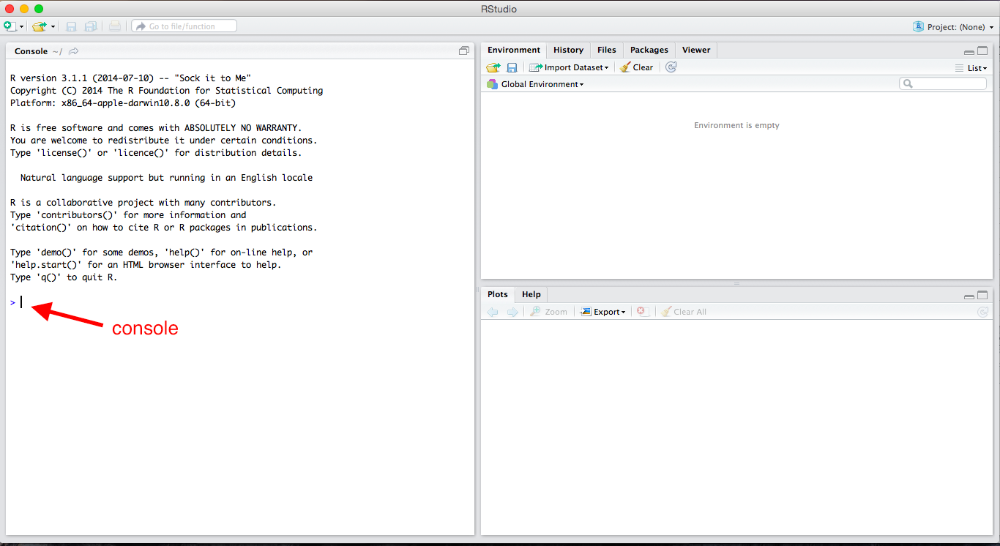
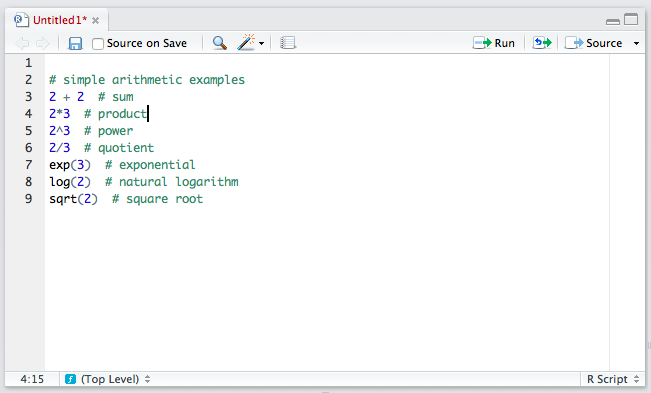
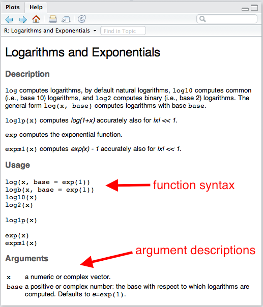
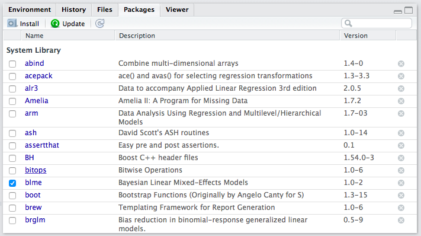
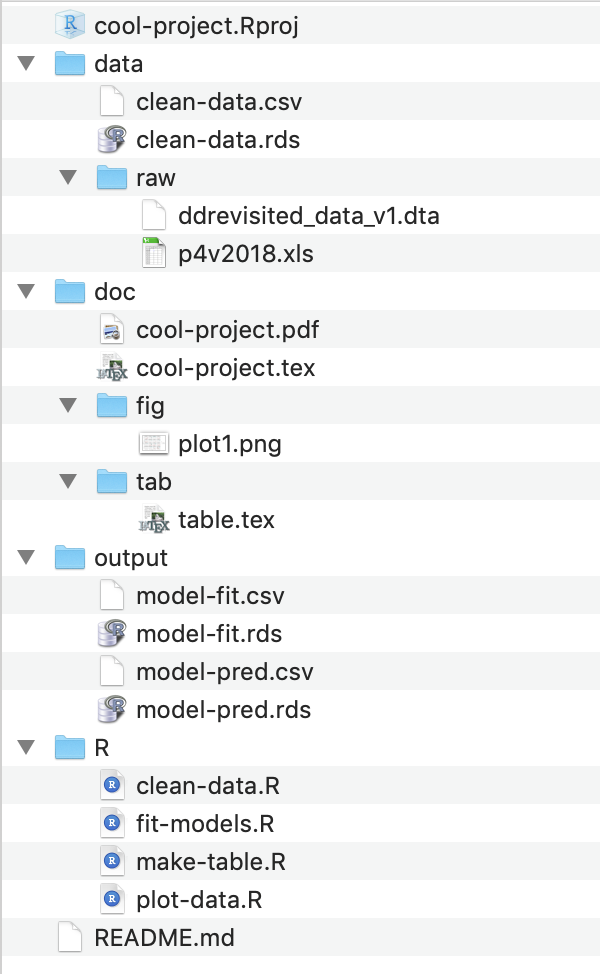

--- 
title: "Concepts and Computation: An Introduction to Political Methodology"
author: "Carlisle Rainey"
date: "`r Sys.Date()`"
site: bookdown::bookdown_site
documentclass: book
bibliography: [book.bib, packages.bib]
biblio-style: apalike
link-citations: yes
description: "These are my notes for my class introducing the fundamental conceptual and computational tools to first-year PhD students in politial science."
---

# Overview

<!--chapter:end:index.Rmd-->

# Statistical Computing with R 

R is a complex, powerful statistical programming language. It's also free! I use R to do all my empirical and methodological work. I use R to wrangle data, fit statistical models, perform simulation studies, and draw graphics. 

R works by scripts. The user writes a program called a "script"" and R executes the program. This might intimidate you a little. That's okay. It's easier than it sounds, and I'm here to help you.

We'll learn a lot about R this semester, but we'll learn only *some* aspects of R. I have to include some features of R and exclude others. Just because I show you one way to tackle a problem doesn't mean it's the only (or the best) way. But in order to get you working with data ASAP, we have to exclude some important concepts and tools in R. 

Rather than use R directly, though, we'll use RStudio to manage and run our R programs. RStudio is simply a way to organize our R code. I use RStudio for all my R programming. I even use RStudio to write documents and make presentations using RMarkdown.

## R as a Calculator

To get started with R, just open up RStudio and look around. If you want, you can use R like a calculator--just type directly into the console as you would a calculator.



```{r}
2 + 2
2*3
2^3
2/3
exp(3)
log(2)  # this is the natural log
sqrt(2)
```

**Review Exercises**

Using R as a calculator, calculate the following (in the console):

1. $32 + 17$
1. $32 \times 17$
1. $\frac{32}{17}$
1. $32^2$
1. $\sqrt{32}$
1. $\log{32}$

## Scripts

Ultimately, we'll want to write all of our code in scripts so that we can modify, reproduce, and check our work. From now on, almost everything we do will go in a script. The idea is not to do an analysis, but to write a script that can do an analysis for us.


To open a new R script, click *File*, *New File*, *R Script.* You can type lines of code directly into this script. In the upper-right corner of the script window, you'll see a *Run* button. This runs the entire line that the cursor is currently on *or* all the highlighted lines. This is equivalent to Command + Enter (or Control + Enter on Windows). Unless the script takes a long time to run (and I don't think any of ours will), I recommend hitting Command + A (or Control + A on Windows) to highlight the entire script and then Command + Enter (Control + Enter on Windows) to run *the entire script*. You need to get into the habit of running the entire script, because you want to entire script to work in one piece when you are done. It is much easier to do this if you're running the entire script all along.

> ProTip: To run your code, press command + a (or control + a on Windows) and then press command + enter (or control + enter on Windows).

To save this script, simply click *File* > *Save.* I discuss *where* to save files a little later, but for now, just realize that R scripts will have a `.R` extension, such as `my-script.R` or `important-analysis.R`.

### Importance

Doing your work in a script is important. You might have done a statistical analysis before or at least manipulated data with Excel. Most likely, you went though several steps and perhaps ended with a graph. That's fantastic, but there are several problems.

1. If you want to re-do your analysis, you must go through the whole process again.
1. You might forget what you did. (I shouldn't say "might"--you *will* forget.)
1. You cannot easily show others what you did. Instead, they must take your word for it.
1. You cannot make small changes to your analysis without going through the whole process again.

Scripting solves each of these problems.

1. If you want to re-do your analysis, just open your script and click *Run.*
1. If you forget what you did, just look at your script.
1. If you want to show others exactly what you did, just show them your script.
1. If you want to make a small change to your analysis, just make a small change to your script and click *Run.*

Scripting might seem like a lot more work. At first, it will be more work. By the end of the semester, it will be less work. As part of the papers you'll write for this class, you'll write a script. 

### Comments

You can also insert comments into R scripts. This is very important, especially when you are first learning to program. To insert a comment, simply type a pound or hash sign `#` (i.e., "hashtag" to me) anywhere in the code. Anything on the line after the hash will be ignored. I'll always carefully comment my R code, and I'll be even more careful about it for this class. Here's an example of some commented code for the previous example.



> ProTip: Use comments often to clearly describe the code to others and your future self.

## Object-Oriented Programming

But R is much more powerful than a simple calculator, partly because it allows object-oriented programming. You can store things as "objects" to reference later. Just about anything can be stored as an object, including variables, data sets, functions, numbers, and many others.

### Scalars

Let's start with a single number, sometimes called a "scalar." Let's create an object `b` that holds or contains the number 2. To do this, we simply use the assignment operator `<-`, which we read as "gets."

```{r}
b <- 2 # read as "b gets 2"
```

We can be very creative with naming objects. Rather than `b`, we could have used `myobject`, `myObject`, `my.object`, or `my_object`. From a style perspective, I prefer `my_object` or `important_variable`. In general, you want to give objects descriptive names so that you code is easy to read, but short names so that the code is compact and easy to read and write.

> ProTip: Give objects short, descriptive names.

We can now repeat some of the calculations from above, using `b` instead of two. Given that you know `b` equals two, check that the following calculations make sense.

```{r}
b + 3
b*3
b^3
3^b
b/3
exp(b)
log(b)
sqrt(b)
```

You probably realize that it would be easier to just use `2` rather than `b`. But we'll be doing more complicated calculations. Rather than `b` holding scalars, it might hold thousands of survey responses. Rather than applying a simple function, we might apply many functions.

### Functions

So what is a function? In the above examples `exp()`, `log()`, and `sqrt()` are functions. Importantly, functions are followed immediately by parentheses (i.e., `()`, not `[]` or `{}`, which have different meanings). *Arguments* are supplied in the functions that tell the function what to do.

You probably didn't think about it at the time, but you can use many different bases when taking a logarithm. What base did we use when we ran `log(b)`? To see this, let's open the help file. 

```{r}
help(log) # or, equivalently ?log
```



The section "Usage" shows the typical function syntax. The `log()` function takes up to two arguments. The first argument `x` is a "numeric vector." We'll talk more specifically about numeric vectors below, but for now, we can consider a scalar as a numeric vector. If we provide the arguments in the same order that the appear in the functions in the "Usage" section, then we do not have to name the argument, but we still can. For example, `log(b)` and `log(x = b)` are equivalent. 

> ProTip: If you need to know how to use a particular function such as `exp()`, then type `help(exp)` or `?exp` into the console. 

You'll also see from the help file that the default that default is `base = exp(1)`, where `exp(1)` is just the number $e$, the base of the natural log. This means that if you don't specify `base`, it will use `base = exp(1)`. 

```{r}
log(b) # natural log
log(b, base = exp(1)) # also natural log
log(b, base = 10) # base-10 log
log(b, 10) # also a base-10 log
```

Notice that if we put the arguments in the proper order, we do not have to name the argument, so that `log(b, base = 10)` is equivalent to `log(b, 10)`. However, the meaning of `log(b, base = 10)` is more clear, so I prefer that approach.

> ProTip: If arguments are supplied to functions in the correct order, then names are unnecessary. However, names should be included whenever there might be doubt about the meaning of the argument. In practice, this most often means leaving the first argument unnamed and naming the rest.

**Review Exercises**

1. Open a new script and give the object `x` the scalar 32.
1. Repeat the first set of review exercises using `x` rather than the number 32.
1. Add comments explaining what the code is doing.

### Vectors

But if we can only work with single numbers, we won't get very far.

When we do statistical computing, we'll usually want to work with collections of numbers (or collections of character strings, like `"Republican"` or `"Male"`). In an actual problem, the collection might contain thousands or millions of numbers. Maybe these are survey respondents' ages or hourly stock prices over the last few years. Maybe they are a respondent's sex (i.e., `"Male"` or `"Female"`) or party identification (i.e., `"Republican"`, `"Democrat"`, `"Independent"`, or `"Other"`).

We'll call this collection of numbers or character strings a "vector" and we'll refer to the number of elements in the vectors as the "length" of the vector. 

There are several types of vectors, classified by the sort of elements they contain.

- `numeric`: contain numbers, such as 1.1, 2.4, and 3.4. Sometimes numeric variables are subdivided into `integer` (whole numbers, e.g., 1, 2, 3, etc.) and `double` (fractions, e.g., 1.47, 3.35462, etc.).
- `character`: contain character strings, such as `"Republican"` or `"Argentina (2001)"`.
- `factor`: contain character strings, such as `"Very Liberal"`, `"Weak Republican"`, or `"Female"`. Similar to `character`, except the entire set of possible levels (and their ordering) is defined.
- `logical`: contain `TRUE` and/or `FALSE`.

#### Numeric Vectors

Rather than the scalar `2`, for example, we might want to work with the collection `2`, `5`, `9`, `7`, and `3`. Let's assign the collection above to the object `a`.

We can create a vector using the "collect" function `c()`. 

```{r}
a <- c(2, 5, 9, 7, 3)
```

> ProTip: To create a vector, *one* tool we can use is the "collect" function `c()`.

If we want to look at the object `a`, we need to enter `a` on a line by itself. This will print the object `a` for us to inspect. But since we only need to check this once, maybe we just type it in the console instead of including it in the script.

```{r}
a
```

We can now apply functions to the vector `a` just like we did for the scalar `b`. In each case, the function is applied to each element of the vector.

```{r}
a + 3
a*3
a^3
3^a
a/3
exp(a)
log(a)
log(a, base = 10)
sqrt(a)

# sum() adds all the elements together
sum(a)

# mean() finds the average--now we're doing statistics!
mean(a)
```

So far, we've only used numeric vectors--vectors that contain numbers. But we can create and work with other types of vectors as well. For now, let's just illustrate two types: vectors of character strings, factors (and ordered factors), and logical vectors.

**Review Exercises**

1. In a script (perhaps the script you began in the exercises above), create a numeric vector assigning the collection 2, 6, 4, 3, 5, and 17 to the object `my_vector`.
1. Create another numeric vector assigning the collection 64, 13, and 67 to the object `myOtherVector`.
1. Use the `sum()` function to add the elements of `my_vector` together.
1. Use the `sqrt()` function to take the square root of the elements of `myOtherVector`.
1. Add 3 to the elements of `my_vector`.
1. Add comments to the script explaining what this code is doing.

#### Character Vectors

Character strings are simply letters (or numbers, I suppose) surrounded by quotes, such as `"Republican"` or `"Male"`. If we put `c()` (i.e., "combine") together multiple character strings, then we have a character vector.

```{r, error = TRUE}
# create character vector
x <- c("Republican", "Democrat", "Republican", "Independent")

# print x
x

# for fun, try to multiply x times 3
x*3  # doesn't work
```

A comment about escapes: Inside a string (i.e., text surrounded by quotes, e.g., `"Male"`), a backslash `\` is considered an "escape." For example `\n` represents new line and `\t` represents tab.

```{r}
# new line
cat("Repub\nlican")

# tab
cat("Demo\tcrat")
```

This is important because filenames are sometimes represented with back-slashes, such as `data\nominate.csv`. If entered this way, R will not read the data properly, because it treats `\n` as an escape and tries to put a new line there.

The solution is to use two back-slashes to represent one (e.g., `data\\nominate.csv`). Or you can use a forward-slash `/` instead (e.g., `data/nominate.csv`). Note that Mac uses forward-slashes in file names by default, so it might not come up. For Windows users, though, you need to use either double back-slashes or switch to forward slashes.

**Review Exercises**

1. Create a character vector containing the elements Male, Female, Male, Male, and Female. Assign this vector to the object `sex`.
2. Create a character vector containing the elements Liberal, Moderate, Moderate, Conservative, and Liberal. Assign this vector to the object `ideology`.


#### Factor Vectors

A factor vector is much like a character vector, but can only take on predefined values. While we might use a character vector to encode a variable that can have a variety of values (e.g., respondent's name), we might use a factor to encode a variable that can take on just a few values, such as party identification (e.g., "Republican," "Independent," "Democrat," "Other"). We refer to the possible values of a factor as the "levels."

Creating a factor is more tricky than creating a numeric or character vector. We might take several approaches, but I suggest the following two-step approach:

1. Create a character vector containing the information using `c()`.
2. Add the levels using the `factor` function.

Factor vectors have two particular advantages over character vectors.

1. It allows us to easily see when one category has zero observations.
2. It allows us to control the order in which the categories appear. This will be useful, even for categorical variables that have no natural ordering (e.g., race, eye color).

```{r}
# create a character vector
pid <- c("Republican", "Republican", "Democrat", "Other")

# check type
class(pid)

# table pid
table(pid) # two problems: 1-weird order; 2-"Indpendents" missing
```

We can fix these two problems by using a factor vector instead.

```{r}
# create a factor vector in two steps
## step 1: create a character vector
pid <- c("Republican", "Republican", "Democrat", "Other")
## step 2: add levels using factor()
pid <- factor(pid, levels = c("Republican",
                              "Independent",
                              "Democrat",
                              "Other"))

# check type
class(pid)

# table pid
table(pid) # two problems fixed
```

You can see that by creating a factor variable that contains the level information, we can see that we have no Independents in our sample of four respondents. We can also control the ordering of the categories. 

**Review Exercises**

1. Change the character vector `sex` created above to a factor vector. Be sure to explicitly add the levels. The order does not matter. Assign this new factor variable to the object `sex_factor`.
1. Change the character vector `ideology` created above to a factor vector. Be sure to explicitly add the levels. Use an intuitive ordering. Assign this new factor variable to the object `ideology_factor`.

#### Logical Vectors

Logical vectors contain elements that are true or false. R has a special way to represent true and false elements. R uses `TRUE` (without quotes) to represent true elements and `FALSE` (again, without quotes) to represent false elements. To create a logical vector, we can `c()` together a series of `TRUE`'s and/or `FALSE`'s. 

```{r, error = TRUE}
# create logical vector
x <- c(TRUE, TRUE, FALSE, TRUE, FALSE)

# print x
x
```

**Review Excercises** 

1. Create the logical vector containing. True, False, False, True, and True. Assign it to the object `logic1`.
1. Multiply `logic1` times 3. What do you get? Does that make sense? 

### More Information

You should treat my notes as incomplete. I gloss over some potentially relevant distinction to get you up and going quickly. For a complete description of vectors, see [chapter 4](https://adv-r.hadley.nz/vectors-chap.html) of *Advanced R Programming*. You can find a similar description in [chapter 20](http://r4ds.had.co.nz/vectors.html) of *R4DS*. 

I don't mention dates and times at all, but R makes it easy to work with vectors of dates and date-times. We'll discuss those when we get talk about data wrangling, because it's a more advanced topic. For reference, you can see the [lubridate page](https://lubridate.tidyverse.org) on the tidyverse website.

## Missing Values

Missing data are extremely common in statistics. For example, a survey respondent might refuse to reveal her age or income. Or we might not know the GDP or child mortality rate for a particular country in a particular year. In R, we can represent these values with `NA` ("not available"). Notice that `NA` does not have quotes. 

Different functions handle `NA`'s differently. Some function will drop missing values (e.g., compute the statistic using the non-missing data) and other functions will fail. Most of the simple functions that we'll use at first will fail by default (e.g., `sum()`, `mean()`), but many of the more advanced functions we'll use later (e.g., `lm()`) will drop missing values by default.

```{r, error = TRUE}
x <- c(1, 4, 3, NA, 2)
log(x) # doesn't fail: computes the log for observed data, returns NA for missing data
sum(x) # fails: can't know the sum without know the value of the missing data
sum(x, na.rm = TRUE)  # doesn't fail: setting na.rm = TRUE tell the function to drop the missing data
```

**Review Exercises**

1. Create the object `x` using `x <- c(1, 4, 3, NA, 2)`. Using `mean()` to find the mean of `x` with and without using the argument `na.rm = TRUE`. In a comment, explain why the results are different. Is `na.rm = TRUE` a reasonable choice?
1. Repeat using `sum()` rather than `mean()`.

## Logical Operators

Occasionally, we'd like R to test whether a certain condition holds. We'll use this most often to choose a subset of a data set. For example, we might need only the data from the 100th Congress (from a data set that contains all Congresses) or only data before 1990 (for a data set that contains all years from 1945 to 2000).

The logical operators in R are `<`, `<=`, `==`, `>=`, `>`, and `!=`. Notice that we must use `==`, not `=`, to test for (exact) equality. We use `!=` to test for inequality. We can use `&` to represent "and" conditions and `|` to represent "or." Logical operators return either `TRUE` or `FALSE`.

Operator  | Syntax
------------- | -------------
"less than"  | `<`
"less than or equal to"  | `<=`
"exactly equal to"  | `==`
"greater than or equal to"  | `>=`
"greater than"  | `>`
"not equal to"  | `!=`
"or" | `|`
"and" | `&`

Try running some of the following. Make sure you can anticipate the result.

```
# less than
2 < 1
2 < 2
2 < 3

# less than or equal to
2 <= 1
2 <= 2
2 <= 3

# equal to
2 == 1
2 == 2
2 == 3

# greater than or equal to
2 >= 1
2 >= 2
2 >= 3

# greater than
2 > 1
2 > 2
2 > 3

# not equal to
2 != 1
2 != 2
2 != 3

# or 
(1 > 2) | (3 > 4)
(1 < 2) | (2 > 4)
(1 < 2) | (3 < 4)

# and
(1 > 2) & (3 > 4)
(1 < 2) & (2 > 4)
(1 < 2) & (3 < 4)
```

**Review Exercises**

Use logical operators to test the whether each element of `my_vector` (created above) is...

1. greater than 3.
1. less than 3.
1. equal to 3
1. greater than 3 or less than 3.
1. less than or equal to 3
1. greater than or equal to 3
1. greater than 2 or less than 1
1. greater than 2 and less than 1
1. greater than 1 and less than 2


## Packages

Because R is an open-source program, it is easy to write extensions, and thousands of people have. These extensions come in the form of "packages" and these packages contain mostly functions that do stuff with data. For example, I've written an R package that does plotting. (I've since deferred to ggplot2). I've written another package that estimates statistical model. Hadley Wickam has written many R packages, some of which we'll use. He's written haven, which we can use to read proprietary data formats, such as Stata (`.dta`) files. He's also written readr, which we can use to *quickly* read in better formats, such as comma-separated values (`.csv`), which I'll encourage you to use throughout the course. He's also written a package that is helpful for creating plots called ggplot2. We see that later.

In order to use a package, it must be installed once and then loaded in each session (i.e., after each restart). Some packages come pre-installed in R (e.g., stats, MASS). Some of these pre-installed packages are automatically loaded in each session (e.g., stats), while others must be loaded manually in each session (e.g., MASS) if you want to use them. Other packages that do not come pre-installed with R need to be installed manually (but just once) and loaded in each session.

### Installing Packages

If you click the "Packages" tab in RStudio (positioned in the upper-right panel by default), it will show you a list packages that are currently installed. I've attached a screenshot of my installed packages below, but your's might look slightly different--I've probably installed a lot more than you.



If you want to use a function from a package and it is **not installed**, you must first install it. Most R packages are available on CRAN, and can be installed with the `install.packages()` function. 

    install.packages("ggrepel")
    install.packages("ggthemes")

If you want to go ahead and install these packages, feel free--we'll use them later. RStudio might ask you to choose a mirror. If so, just choose something close to you--it doesn't really matter.
    
If you look at your list of installed packages again, you should see `ggrepel` and `ggthemes`.

You only need to install a package once. Once you've installed it, you have it on your hard drive.

### Loading Packages

In order to use function from a package, though, the package must be installed *and* loaded. In the packages list, the check box (beside the package name) indicates whether the package is loaded. In the screenshot above, you can see that I only had one package loaded at the time I took the screenshot--blme, a package useful for estimating Bayesian linear mixed-effects models.

Let's see how to access functions that are in packages. First, let's create some data to plot.

```{r}
x <- c(1, 3, 2, 5, 4)
y <- c(2, 1, 4, 3, 5)
```

Now let's try to use the `qplot()` function in the ggplot2 package to create a scatterplot of `x` and `y`. I'm assuming that you've already installed the ggplot2 package (it's included in the tidyverse package).

Now, let's try to use `qplot()`.

```{r, error = TRUE}
qplot(x, y)
```

You'll notice that the `qplot()` function cannot be found. That's because while ggplot2 is *installed* (i.e., present in the library), it is not loaded (i.e., off the shelf). If you want to use a function from the ggplot2 package, you need to load the package using the `library()` function. You need to load the package each time you start a new session (e.g., restart RStudio), so be sure to include this in your script. Notice that you do not need to use quotes around the name of the package when using the `library()` function.

```{r}
library(ggplot2)
qplot(x, y)
```

When we use `library()`, it loads the entire set of functions in the package into our workspace, making them all accessible to us. There are literally hundreds of functions in the ggplot2 package. If we prefer to avoid loading all the functions, we can use the syntax `package::function()` to tell R where to find the function in the library without loading all the functions into the workspace.

```{r}
ggplot2::qplot(x, y)
```

`ggplot2::qplot(x, y)` will work whether or not ggplot2 is loaded. 

I don't have strong feelings about which approach is better--it depends on the context. If you only need to use one function from package one time, then perhaps it makes more sense to use the `package::function()` approach. If you'll be using many functions many times, then it makes sense to use `library()`. Use whichever makes most sense to you. However, I'll tend to use `package::function()` a lot, because it makes it clear where the function is coming from.

**Review Exercises**

1. Install and load the GGally package. Write a simple example of a function in the package. Use example code from the [vignette](http://ggobi.github.io/ggally/#ggally).
1. Install and load the ggdag package. Write a simple example of a function in the package. Use example code from the [vignette](https://cran.r-project.org/web/packages/ggdag/vignettes/intro-to-ggdag.html).
1. Install and load the texreg package. Write a simple example of a function in the package. Perhaps try the code below. If you are feeling ambitious, you might try compiling a LaTeX document with the LaTeX code output by `texreg()`. If you do this, be sure to start with the LaTeX template from [50-legs](https://github.com/pos5737/50-legs) or the very minimal template from Homework 1.

```
library(texreg)
fit1 <- lm(Fertility ~ . , data = swiss)
fit2 <- update(fit1, . ~ . -Examination)
screenreg(list(fit1, fit2))
texreg(list(fit1, fit2))
```


<!--chapter:end:03-computing.Rmd-->


# Loading Data into R

Rather than manually entering data using `c()` or something else, we'll want to load data in stored in a data file. 

## The Terms

There are three important ingredients in loading a data set into R.

1. The file type, usually indicated by the extension (`.rds`, `.csv`, `.dta`, `.xlsx`).
1. The current working directory.
1. The file path (relative to the working directory).

### File Types

In political science, our data sets are usually one of four types:

1. R data or `.rds` files. This is the easiest format because it stores factors as factors and all the related information. Read with `readr::read_rds()`. Note that readr is part of the tidyverse, so `library(tidyverse)` loads readr. (I explain a "data frame" below, but realize that an `.rds` file can contain any R object, not just a data frame.)
1. comma-separated value or `.csv` files. This is a common, sharable, robust data file type. You can open these files with any statistical software. GitHub renders these nicely. However, the csv format does not distinguish between factors as character strings, and treats variables as numbers or characters. Read with `readr::read_csv()`.
1. Stata or `.dta` files. Another common data format because many political scientists use Stata. Read these files into R with `haven::read_dta()`.
1. Excel or `.xlsx` files. Another common data format because data are easy to enter into spreadsheets like Excel. Read these files into R with `readxl::read_excel()`.

### Comma-Separated Value Format (`.csv`)

Data can be stored in a wide range of formats. One popular format, for example, is Stata's proprietary `.dta` format. I typically use (and encourage you to use) the comma-separated values `.csv` format. The `.csv` format is excellent because it is open and simple. This means that anyone can use it without acess to proprietary software. It will also be useble by anyone into the foreseeable future. We can see why `.csv` files are easy to work with if we open it up the file `nominate.csv` with a text editor. You'll see that you--with your eyes--can read the file directly. You don't really need software at all!


I tried the same thing for a similar `.dta` file. With your eyes, it looks like nonsense. You'll definitely need Stata (or other speciallized software) to work with this file.


Also, `.csv` files are easy to support, so they work in almost all data analysis software. For example, we can open up `nominate.csv` in Excel. You can see that we have six variables in the columns and many cases in the rows (we don't know how many because they overflow the screen). In this case, each row represents a particular Congressperson from a particular Congress (with Presidents as well. The second row, for example, is for Rep. Callahan (R) from the 1st Congressional District of Alabama. During the 100th Congress, Rep. Calahan has a ideology score of 0.358, which means he's conservative, but not as conservative as Pres. Reagan, who has a score of 0.747. We'll work with these data a lot thoughout the semester, so we'll have plenty of time for closer examination.


### The Working Directory

Any time you work in R (or RStudio), you are working from a "working directory." That is, whenever R needs to locate a file to load it or save it, it looks in the working directory.

For example, I'm writing a paper now. I named the project directory `wilks/` (which I placed in a folder called `projects/` in my Dropbox folder.) If I open this project by double-clicking `wilks.Rproj` in the `wilks/` project directory, I have opened that project in RStudio. 

If I run `getwd()` ("get the working directory"), R prints the following:

```
> getwd()
[1] "/Users/carlislerainey/Dropbox/projects/wilks"
```

Notice that the working directory is the project directory. This happens because with use `.Rproj` files to manage the way that RStudio interacts with our projects.

If I did not have a project open in RStudio, then I get the following:

```
> getwd()
[1] "/Users/carlislerainey"
```

Of course, any files we want to access or save are in the project directory, which is three levels deeper in the file system than `carlislerainey/`.

If I didn't use an `.Rproj` file to manage the project, then I could set the working directory whereever I wanted with `setwd()`. See below:

```
> setwd("/Users/carlislerainey/Dropbox/projects/wilks")
> getwd()
[1] "/Users/carlislerainey/Dropbox/projects/wilks"
```

But we use an `.Rproj` file to manage our projects, so our working directory is always the project directory. I'll say it louder for the people in the back.

> **We use an `.Rproj` file to manage our projects, so our working directory is always the project directory.**

We don't (or rarely) need to change or choose the working directory, just realize that it's the project directory.

### The Path

Suppose we want to read the Stata data set `ddrevisited_data_v1.dta`.

We know the following:

1. The filetype is dta. We'll use `haven::read_dta()`.
1. The working directory is the project directory, as always.

Now we just need the file path; that's the only argument that `haven::read_dta()` requires.

#### Organizing Your Project Directories

Any data set that you want to read into R should be in the project folder. You could put it in the main project directory, but you probably want to put it in a sub-directory (or perhaps even deeper).

The diagram below outlines how I organized the files in `cool-project/`. I have an `R/` subdirectory for R scripts. I have a `data/` subdirectory for data sets. I put the raw data sets in `data/raw/` (i.e., a subsubdirectory) to help protect them. I put the manuscript in `doc/` and the subsubdirectories `doc/fig/` for figures and `doc/tab/` for tables. I have the `output` subdirectory for intermediate files I create along the way. 

```
cool-project/
├── R/
│   ├── clean-data.R
│   ├── fit-models.R
│   ├── make-table.R
│   └── plot-data.R
├── data/
│   ├── raw/
│   │   ├── ddrevisited_data_v1.dta
│   │   └── p4v2018.xls
│   ├── clean-data.csv
│   └── clean-data.rds
├── doc/
│   ├── fig/
│   │   └── plot1.png
│   ├── tab/
│   │   └── table.tex
│   ├── cool-project.pdf
│   └── cool-project.tex
├── output/
│   ├── model-fit.csv
│   ├── model-fit.rds
│   ├── model-pred.csv
│   └── model-pred.rds
├── README.md
└── cool-project.Rproj
```

Below is a screenshot from Finder on macOS that shows the same organization.



#### An Aside on Formats

If you're reading carefully, you'll notice that I keep both csv and rds versions of the data sets I create. I do this for the following reasons:

1. rds data sets are the most convenient to compute with because preserve factors. I want this.
1. csv data sets are the easiest to share and inspect, both locally (Finder even shows me the file!) and on GitHub (which renders a nice table). I want this.
1. It's easy to create both and keep them in sync.

To create both, I just run `write_rds()` and `write_csv()` on consecutive lines.

### Determining the Path

Because we know the working directory is the project directory, we only need to provide the reading function the path *relative to thet project directory.*

The path is just directions from the working/project directory to the file you want to read. 

For example, if we wanted to find `ddrevisited_data_v1.dta`, we would do the follwing (from the working/project directory):

1. Go into `data/`.
1. Go into `raw/`.
1. Find `ddrevisited_data_v1.dta`.

That's it. To create the path, we just put these pieces together: `data/raw/ddrevisited_data_v1.dta`.

Now we just give the path to `haven::read_dta()`. We get: `read_dta("data/raw/ddrevisited_data_v1.dta")`. We need to assign the data set to an object, we want something the following:

```
# load packages
library(haven)

# load raw data set
raw_df <- read_dta("data/raw/ddrevisited_data_v1.dta")
```

This loads the data set into R. 

**Review Exercises**

There are 8 total data sets in `cool-project/` (all the files in `data/` and `output/`). Answer the following questions for each data set:

1. What function should you use to read that file?
1. What's the working directory?
1. What's the path (relative to the working directory)?
1. Given the above, what's the code to read the data (and store it as an object)?

When you think you know, check your work by trying your commands. I put `cool-project` [on Github](https://github.com/pos5737/cool-project). Clone it (or click *Code* > *Download ZIP* to download the directory) and see if you can load the data sets.

*Solution for `ddrevisited_data_v1.dta`*

1. The extension is `.dta`, so I know this is a Stata data set and that I need to use `haven::read_dta()`.
1. The working directory is `cool-project/` because the working directory is always the project directory since I use an `.Rproj` file to manage my projects.
1. The path is `data/raw/ddrevisited_data_v1.dta`. I can see this in the directory tree above, or by inspecting the directory on my computer.
1. Below:

```
# load packages
library(haven)

# load raw data sets
raw_df <- read_dta("data/raw/ddrevisited_data_v1.dta")
```

### `rio`

Loading data into R is a little bit tricky and tedious. One reason is finding a function to handle the data format. If the data is `.Rds`, `.csv`, or `.dta.` formats, we already know what to do. But what if the data is in a format such as `.tsv` (tab separated), `.xlsx` (Microsoft Excel), `.ods` (OpenDocument spreadsheet), or any number of other formats?

The R package `rio` contains the fuction `import()` that automatically adapts to the different formats according to the filename extension. It's just one function---you simply need to point it to the data set.

```{r}
# load packages
library(rio)  # for generic import() function

# read same data stored in three different formats
nominate <- import("data/nominate.csv")
nominate <- import("data/nominate.rds")
nominate <- import("data/nominate.dta")
```

## Data Frames

Almost the statistical computation we do in this class revolves around data sets. In R, it usually makes sense to store data sets as specific objects known as data frames. Data frames are simply a set of vectors that all contain the same number of elements. These might be numeric, character, factor, or logical vectors, or some mixture of types.

When you read a data set into R using `readr::read_csv`, `readr::read_rds()`, `haven::read_dta()`, or some other method, it creates a data frame. A data frame is a special R object that holds a set of vectors that all have the name number of elements. If you think of the data set as an Excel spreadsheet, then you can think of the columns of the spreadsheet as the vectors held by the data frame. These vectors or variables can be numeric, character, factor, or logical. As a reminder, here are the variable types:

- `numeric`: numbers, such as 1.1, 2.4, and 3.4. Sometimes numeric variables are subdivided into `integer` (whole numbers, e.g., 1, 2, 3, etc.) and `double` (fractions, e.g., 1.47, 3.35462, etc.).
- `character`: text strings, such as `"Republican"` or `"Argentina (2001)"`.
- `factor`: cateogories, such as `"Very Liberal"`, `"Weak Republican"`, or `"Female"`. Similar to `character`, except the entire set of possible levels is defined. A `factor` variable may be ordered or unordered.
- `logical`: true or false, such as `TRUE` or `FALSE`.

For the `.csv` files we will usually use, R cannot distinguish between `character` and `factor` variables. By default, `readr::read_csv()` will load these as `character` variables--there's no way for R to know the entire set of levels from the `.csv` file anyway. Sometimes, though, it will be useful to work with `factor` variables. This is straightforward to change.

### Working with Variables in Data Frames

A data frame holds the variables, but it also hides the vectors. For example, the data frame `nominate`, which we loaded above, has a numeric variable `ideology`, but if we try to sum it, we get an error.

```{r, error = TRUE}
sum(ideology)  # fails because the variable ideology is hidden in a data frame
```

We've loaded the data set, but R can't seem to find the variable. That's because the variable `ideology` is hidden in the data frame `nominate`.

In order to access variables in data frames, we need to do one of two things.

1. Use the `$` operator. 
2. Use the `data` argument.

Some functions, such as `exp()` are designed to work with *vectors*, not data frames. This will be the case for most functions we use (with the notable exceptions of plotting in with `ggplot()` and estimating liner model with `lm()`). To use the functions on variables stored in data frames, we need to use the `$` operator. 

Suppose we have a data set loaded and given to the object `my_data`. If `my_data` contains the variable of interest `my_variable`, then we can access `my_variable` using the syntax `my_data$my_varible`. That is, the syntax `data$var` means "get the variable `var` from the data set `data`." We'll use this often, so make sure it's clear.

```{r}
sum(nominate$ideology) # example of the $ operator
sum(nominate$ideology, na.rm = TRUE) # example of the $ operator
```

But some functions are designed to work with data frames. For example, the `qplot()` function in the ggplot2 package is designed to work with data sets. If you open the help file for `qplot()` (i.e., `help(qplot)` after `library(ggplot2)`), you'll see that one of the arguments is `data`. If you use this argument to point `qplot()` to the data frame, it will know where to find your variables.

```{r}
# load ggplot2 package, which contains the qplot function
library(ggplot2)

# example of a function with a data argument
qplot(ideology, data = nominate)  # using the data argument
```

Many of the functions we use take a data argument. If they do not, though, we'll need to use the `$` operator. Because we'll almost always use data stored in data frames, you need to be sure to use one approach or the other. If the function has a data argument, use it. In other cases, use the `$` operator.

## How We'll Always Use R

1. Open RStudio by clicking the `.Rproj` file for the project. (If you haven't created the `.Rproj` file yet, then open RStudio and click *File* > *New Project...*).
1. Open a new R script to do something new *OR* open a previously saved script to continue making progress.

**Review Exercises**

1. Download the nominate data sets from the course website and put them in the `data/` subdirectory.
1. Start a new R script that loads the tidyverse package.
1. In the same script, load the each version of the nominate data set using the appropriate function (note that tidyverse automatically loads readr but not haven). Assign each data set to a different object name.
1. Use the `glimpse()` (part of tidyverse) function to get a quick look at each data set.
1. Repeat using `import()` (load the rio package first!).
1. Try to use five different functions (`mean()`, `sum()`, etc.) on the data frames or variables in the data frames. Using `#` comments, explain what each function is doing. 


<!--chapter:end:04-loading-data.Rmd-->


# Histograms

Histograms (and their variants, such as density plots and dot plots) serve as a useful tool for understanding the distribution of a single variable. For a histogram to work well, the variable of interest should take on enough values to require "binning" or lumping several values into the same column of the figure. This usually works for variables that we think of as continuous, such as income, age, effective number of political parties, GDP, number of casualties, etc.

## NOMINATE Data

To see how histograms work, let's work with estimates of the ideology of the U.S. House of Representatives. These data are called DW-NOMINATE Scores and are available at [voteview.com](http://voteview.com/dwnl.htm). The cleaned data set `nominate.csv` includes the 100th through the 114th Congresses and contains a variable called `ideology` that captures a representative's ideology. 

These data are at the legislator-Congress level, so that each row in the data set represents an individual legislator in a particular Congress. More negative values indicate a more liberal representative. More positive values indicate a more conservative representative. For example, Ron Paul is one of the most conservative representatives in the data set with a score of about 0.86. Dennis Kucinich is among the most liberal and has a score of about -0.58.

To get started, let's load the cleaned data.

```{r, message=FALSE}

# load packages
library(tidyverse)

# load data
nominate <- read_csv("data/nominate.csv")
# note: make sure the file 'nominate.csv' is in the 'data' subdirectory
```

We can use the `glimpse()` function (part of tidyverse) to check that we properly load the data and get a quick overview. It shows us the variable names, the types of variables we're working with (e.g., character, integer, double), and the first few values.

```{r}
# quick look at the data
glimpse(nominate)
```

I've given the variables very descriptive names, but if you need more information, look in [my codebook](data/nominate-codebook.html).

## Histograms: `geom_histogram()`

Now let's try a histogram. 

To do this, we'll use R package ggplot2, which is part of tidyverse. When we ran `library(tidyverse)`, it automatically loaded ggplot2. If we hadn't already run `library(tidyverse)`, we could run `library(ggplot2)`.

Though ggplot2 is a complex package, we'll get some sense of how it works this semester. It is [well-documented online](https://ggplot2.tidyverse.org), so feel free to read about it as much as you want or need.

### The Three Critical Components

There are three critical components to each plot created using ggplot2, which we'll refer to as a "ggplot."

1. **the data**: a formal data frame in R.
2. **the aesthetics**: the relationship between the variables in the data set and the aesthetics of the plotted objects--location, color, size, shape, etc.
3. **the geometry**: the type of plot.

There are other components, such as scales, statistics, and coordinate systems, but these the three critical components usually provide what we need.

### Drawing a Histogram

1. data: the first argument to `ggplot()`. Because the variable we want to plot, `ideology` is contained in the data frame `nominate`, we use `nominate` as the first argument.
1. aesthetic: the second argument to `ggplot()`. Because we want to create a histogram, we want `ideology` to correspond to the location along the horizontal-axis. To create this correspondence, we use `aes(x = ideology)` as the second argument.
1. geometry: added to `ggplot()` with `+`. Because we want a histogram, we use `geom_histogram()`. (It's weird to add a function to another function with `+`. And it is unusual. Nothing else in R works quite like this. It's how ggplot2 works, though.)

```{r, warning=FALSE, message=FALSE, fig.height=2, fig.width=3}
# specify data and aesthetic, then add the geometry
ggplot(nominate, aes(x = ideology)) + geom_histogram()
```

This histogram makes sense. We have a grouping of Democrats (presumably) on the left and a grouping of Republicans (again, presumably) on the right. You could probably come up with a model that explains why there are few politicians in the center.

There are three subtle points that I should emphasize about the line `ggplot(nominate, aes(x = ideology)) + geom_histogram()`.

1. The first argument supplied to `ggplot()` is the data. The second argument is the aesthetics.
2. The second argument, `aes(...)` is itself a function. This function just creates the "aesthetic mapping," a link between the variables in the data set and space, color, size, shape, etc, in the chart.
3. `geom_histogram()` is also a function, but it is added to the plot using `+`. We'll see several other functions that can be added to the plot.

**Review Exercises** 

1. List and describe the three critical components of a ggplot.
2. In the following snippet of code, label the data, the aesthetics, and the geometry: `ggplot(nominate, aes(x = ideology)) + geom_histogram()`.
3. In this section, we've seen three new functions: `ggplot()`, `aes()`, and `geom_histogram()`. Describe what each one does and how to use it.

### But `geom_histogram()` uses counts!

FPP uses density on the vertical-axis, not counts. `geom_histogram()` uses counts by default.

This is important, because if the bin widths of the histograms are not equal, then counts create a misleading histogram. However, if the bin widths are equal, then counts and densities produce identically shaped histograms. (The vertical axis has a different scale, though.) 

Because we tend to use equal bin widths in practice, it often doesn't matter whether we use counts or densities.

If you want to change the default behavior, add `y = ..density..` to the aesthetics. (By default, `geom_histogram()` sets `y = ..count..`.)

```{r, warning=FALSE, message=FALSE, fig.height=2, fig.width=3}
# specify data and aesthetic, then add the geometry
ggplot(nominate, aes(x = ideology, y = ..density..)) + geom_histogram()
```

## Filtering: `filter()`

Above, I plot the distribution of ideology scores for 15 different Congresses (the 100th through the 114th) in the same histogram. 

Let's create a histogram for the 100th Congress only.

To do this, first create a data set that contains only cases from the 100th Congress

To create a subset of `nominate` that only contains the 100th Congress, use the `filter()` function (part of tidyverse). The first argument to `filter()` is the data frame to be filtered and the second argument is a logical statement that identifies the cases *to keep*. 

```{r}
# filter the 100th congress
nominate100 <- filter(nominate, congress == 100)

# quick look
glimpse(nominate100)
```

Use this new data frame to draw the histgram.

```{r, warning=FALSE, message=FALSE, fig.height=2, fig.width=3}
# create histogram for 100th congress
ggplot(nominate100, aes(x = ideology)) + geom_histogram()
```

Repeat that process, but for the 114th Congress.

```{r, warning=FALSE, message=FALSE, fig.height=2, fig.width=3}
# subset data to only 114th congress
nominate114 <- filter(nominate, congress == 114)

# quick look
glimpse(nominate114)

# create histogram
ggplot(nominate114, aes(x = ideology)) + geom_histogram()
```

**Review Exercises**

1. Explain what the `filter()` function does and how to use it. What are the first and second arguments? What type of object does it return? Use `help(filter)` for the details.

## Faceting: `facet_wrap()` 

Let's investigate this divergence in the parties more carefully. 

Is the left hump actually Democrats? Is the right hump actually Republicans? 

Apply a facet to the histogram. A facet simply breaks the data frame into subsets and draws one histogram per subset. 

Create a facet by adding the function `facet_wrap()` to the plot. You'll have to specify the faceting variable as an argument to the `facet_wrap()` function.  In this case, we'll do it by `party`, adding ` + facet_wrap(vars(party))` (i.e., "create a facet by the variable party") to the ggplot we've been using.

```{r, warning=FALSE, message=FALSE, fig.height=2, fig.width=6}
# build histogram
ggplot(nominate100, aes(x = ideology)) + 
  geom_histogram() + 
  facet_wrap(vars(party))
```

Indeed, the left hump is Democrats and the right hump is Republicans. 

**Review Exercises**

1. What does a facet do to a plot?
2. Explain what the `facet_wrap()` function does and how to use it.
3. Suppose I added  `+ facet_wrap(party)`. Would that work? What is missing?
4. Suppose you `+ facet_wrap(vars(state))` to `ggplot(nominate100, aes(x = ideology)) + geom_histogram()`. What would happen?
5. `facet_grid()` offers an alternative method to faceting. How is it different from `facet_wrap()`? You might find [this](https://ggplot2.tidyverse.org/reference/facet_grid.html) documentation helpful. With an example, show how to use `facet_grid()`.

## Density Plots: `geom_density()`

FPP sometimes uses a rough sketch of a histogram using a smooth curve rather than a complete histograms with vertical bars. 

For our purposes, a density plot is a smooth curve that approximates a histogram. 

We can easily create a density plot rather than a histogram by using `geom_density()` as the geometry rather than `geom_histogram()`.

```{r, warning=FALSE, message=FALSE, fig.height=2, fig.width=3}
# create density plot
ggplot(nominate100, aes(x = ideology)) + 
  geom_density()
```

**Review Exercises**

1. How is a density plot similar to and different from a histogram? The proceedure for estimating the density is actually complicated and there are several ways to do it. I care about the intuition.
1. What does the function `geom_density()` do and how do you use it?

## Color and Fill

### Color

A density plot has the advantage it uses less ink. Because of this, we could use color rather than faceting to distinguish Republicans and Democrats. 

To distinguish Republicans and Democrats with color, add `color = party` to the aesthetics.

```{r, warning=FALSE, message=FALSE, fig.height=2, fig.width=4}
# build density plot
ggplot(nominate100, aes(x = ideology, color = party)) + 
  geom_density()
```

This look really good! Since we are most interested in the overlap between the parties, I think this density plot makes more sense for us, so let's stick with it.

### Fill

Instead of coloring the lines differently, you can "fill" the density with different colors. While the color aesthetic represents the color of the line itself, the fill aesthetic represents the fill inside the line. 

To distinguish between the parties using fill, add `fill = party` to the aesthetics.

```{r, warning=FALSE, message=FALSE, fig.height=2, fig.width=4}
# build density plot
ggplot(nominate100, aes(x = ideology, fill = party)) + 
  geom_density()
```

### Alpha

Notice that the Republican fill (blue-green) completely covers the Democrat fill (orange-red). But here's a hint. The `alpha` argument to `geom_density()` controls the transparency. `alpha = 0` is completely transparent. `alpha = 1` is not transparent at all.

```{r, warning=FALSE, message=FALSE, fig.height=2, fig.width=4}
# build density plot
ggplot(nominate100, aes(x = ideology, fill = party)) + 
  geom_density(alpha = 0.5)
```

This slight transparency makes both distributions visible, even when the two overlap.

**Review Questions**

1. Explain the difference between the color and fill aesthetics for density plots.
1. Use color to show the separate distributions of ideology scores for all 15 Congresses. It this useful?
2. Explain how alpha transparency works and why you might use it. Suppose I used `alpha = 0.1` instead of `alpha = 0.5` in the plot above. How would the plot change?

## Labels: `labs()`

By default, `ggplot()` uses the variable names to label the axes and legend. By default, there is no title, subtitle, or caption. 

You will usually want to improve the axis labels and legends. You will sometimes want to add a title, subtitle, and/or caption. Make these changes by adding the `labs()` function to the plot.

To the `labs()` function, supply one argument per aesthetic, such as `x`, `y`, `color`, or `fill`. You can also supply arguments for `title`, `subtitle`, or `caption` if you wish. These argument are character strings (surrounded by quotes), such as `"Ideology Score"` or `"A Density Plot of Ideology Scores for the 100th Congress"`.

```{r, warning=FALSE, message=FALSE, fig.height=3, fig.width=6}
# build density plot
ggplot(nominate, aes(x = ideology, fill = party)) + 
  geom_density(alpha = 0.5) + 
  labs(x = "Ideology Score",
       y = "Density",
       fill = "Party",
       title = "A Density Plot of Ideology Scores for the 100th Congress",
       subtitle = "There Are Few Moderates in Congress",
       caption = "Data Source: DW-NOMINATE from voteview.com")
```

This plot looks pretty nice.

**Review Exercises**

1. By default, how does `ggplot()` label the axes and legends?
2. How can you change the default labels? How can you add a title, subtitle, or caption?
3. Explain what the `labs()` function does and how to use it.
4. Explain, in as much detail as you can, what each part the last block of code above does.

## Themes: `theme_bw()` and Others

Use themes to control the overall look of our ggplots. The theme controls elements such as the color of the background, the font family and size, the color and size of the grid, etc.

There are the six themes provided with ggplot2.

Theme  | Description
------------- | -------------
`theme_grey()` | The signature ggplot2 theme with a grey background and white gridlines, designed to put the data forward yet make comparisons easy.
`theme_bw()` | The classic dark-on-light ggplot2 theme. May work better for presentations displayed with a projector.
`theme_linedraw()` | A theme with only black lines of various widths on white backgrounds, reminiscent of a line drawings. Serves a purpose similar to `theme_bw()`.
`theme_light()` | A theme similar to `theme_linedraw()` but with light grey lines and axes, to direct more attention towards the data.
`theme_minimal()` | A minimalist theme with no background annotations.
`theme_classic()` | A classic-looking theme, with x and y axis lines and no gridlines.

Notice what happens when you add `theme_bw()` (my favorite!) to the plot.

```{r, warning=FALSE, message=FALSE, fig.height=2, fig.width=4}
# build density plot
ggplot(nominate100, aes(x = ideology, fill = party)) + 
  geom_density(alpha = 0.5) + 
  theme_bw()
```

If you are interested, the `ggthemes` package includes several other themes.

Theme  | Description
------------- | -------------
`theme_economist()` | based on the Economist
`theme_economist_white()` | based on the Economist 
`theme_excel()` | based on Excel
`theme_few()` | based on Few's "Practical Rules for Using Color in Charts"
`theme_fivethirtyeight()` | based on fivethirtyeight.com plots
`theme_gdocs()` | based on Google docs
`theme_igray()` | inverse grey
`theme_pander()` | based on the pander package
`theme_solarized()` | based on the Solarized palette
`theme_solarized_2()` | based on the Solarized palette
`theme_stata()` | based on default Stata graphics
`theme_tufte()` | based on Tufte--minimum ink, maximum data
`theme_wsj()` | based on Wall Street Journal

Try the the infamous (famously ugly) Excel theme.

```{r, warning=FALSE, message=FALSE, fig.height=2, fig.width=4}
# load packages
library(ggthemes)  # for additional themes and even more fun!

# build density plot
ggplot(nominate100, aes(x = ideology, fill = party)) + 
  geom_density(alpha = 0.5) + 
  theme_excel()
```

**Review Exercises**

1. What are themes in ggplot2? What do they control/change?
1. How do you change the theme of a ggplot?
2. What are a few theme options from ggplot2? From ggthemes?
3. Try a few different themes from both ggplot2 and ggthemes. What is your favorite and why?

## Putting It All Together

We'll add two things back in. First, we'll put out nice labels back in. Second, let's go back to the `nominate` data frame (we've been using `nominate100`) and facet by Congress.

```{r, warning=FALSE, message=FALSE, fig.height=6, fig.width=8}
# build density plot
ggplot(nominate, aes(x = ideology, fill = party)) + 
  geom_density(alpha = 0.5) + 
  facet_wrap(vars(congress)) + 
  labs(x = "Ideology Score",
       y = "Density",
       fill = "Party",
       title = "A Density Plot of Ideology Scores for the 100th Congress",
       subtitle = "There Are Few Moderates in Congress",
       caption = "Data Source: DW-NOMINATE from voteview.com") + 
  theme_bw()
```

## Saving Plots: `ggsave()`

It is quite easy to save a ggplot as a `.png` or some other file. You just use the function `ggsave()`, which, by default, saves the last plot you created.

1. Create the plot you want.
1. Decide the file type you want to save your figure as. `.png` is a fine choice for our purposes.\footnote{For high-quality figures, you might want to consider `.pdf`, but these are not as easy to work with in Word `.docx` files.}
1. Choose where you want to save your figure. This should be somewhere in your working directory. I use `doc/figs/`.
1. Choose a compact, descriptive name for your figure. For our final density plot, perhaps use `ideology-by-congress.png`.
1. Use `ggsave()`.

There are three important arguments to `ggsave()`.

1. `filename`: This is the first argument to `ggsave()`. This is the file path. Given the choices above, it's `"doc/figs/ideology-density-by-congress.png"`.
2. `height`: Explicitly name this argument. It controls the height of the figure (in inches, by default). `height = 4` is a good starting point, but experiment.
3. `width`: Explicitly name this argument. It controls the width of the figure (in inches, by default). `width = 5` is a good starting point, but experiment.

```
# save last plot as png
ggsave("doc/figs/ideology-density-by-congress.pdf", height = 5, width = 8)
```

Just to review and wrap up, here is the fill R script that I might use to create and save this figure.

```
# load packages
library(tidyverse)  # loads readr, ggplot2, and others

# load data
nominate <- read_csv("data/nominate.csv")  # data are in the data/ subdirectory

# quick look at the data
glimpse(nominate)

# build plot
ggplot(nominate, aes(x = ideology, fill = party)) + 
  geom_density(alpha = 0.5) + 
  facet_wrap(vars(congress)) + 
  labs(x = "Ideology Score",
       y = "Density",
       fill = "Party",
       title = "A Density Plot of Ideology Scores for the 100th Congress",
       subtitle = "There Are Few Moderates in Congress",
       caption = "Data Source: DW-NOMINATE from voteview.com") + 
  theme_bw()

# save last plot as png to the figs subfolder of the doc subfolder
ggsave("doc/figs/ideology-density-by-congress.pdf", height = 5, width = 8)
```

**Review Exercises**

1. Explain how to save a ggplot. Be sure to discuss each of the five steps.
1. Identify and describe each of the three arguments we usually supply to `ggsave()`.
1. Explain, in as much detail as you can, what each part the last block of code above does.


<!--chapter:end:05-histograms.Rmd-->

# (PART) Data Reduction {-}

# Location and Scale

```{r setup, include=FALSE}
knitr::opts_chunk$set(echo = TRUE)
doc_theme <- ggplot2::theme_bw()
```

## The Intuition

If we took a histogram and tried to describe it to someone else without showing it to them, the most **most** important pieces of information are usually the **location** and **scale**.^[I use these terms intentionally. Later, when we discuss random variables, the terms "location" and "scale" will return (with similar meanings). Indeed, we paramaterize many distributions according to their location and scale. For example, the normal distribution has a location parameter $\mu$ and a scale parameter $\sigma$.]

We might describe the variable this way: "The values are about __________, give or take ________ or so." We can think of the first blank as the location and the second blank as the scale.

1. The **location** describes where the histogram is positioned along the left-right axis. 
1. The **scale** describes the width (or "spread" or "dispersion") of the histogram.

Inspect the histogram of a hypothethical variable to the right. Notice the location and the scale. If we had to describe these data, we might say that our variable is "about zero give or take one or so."

```{r echo=FALSE, message=FALSE, warning=FALSE, fig.width=3.5, fig.height=2.5}
library(tidyverse)
x <- rnorm(1000)
df <- tibble(x = x - mean(x))

ggplot(df, aes(x = x, y = ..density..)) + 
  geom_histogram(fill = "grey80") + 
  stat_density(geom = "line", size = 1.5) + 
  doc_theme
```

While this variable has a particular location (about zero), we can imagine shifting it left or right. The figure below shows some possible shifts. We could shift it way to the left, so that it's "about -6" or a little bit to the right so that it's "about two."

```{r echo=FALSE, fig.height=3.5, fig.width=6, message=FALSE, warning=FALSE}
shift_df <- tibble(shift = c(-6, -2, 0, 2, 6), 
                   label = c("a big shift left",
                             "a small shift left",
                             "the original variable",
                             "a small shift right",
                             "a big shift right"))

shift2_df <- filter(shift_df, shift != 0)
mdf2 <- shift2_df %>%
  split(.$label) %>%
  map(~ mutate(df, 
               new_x = x + .$shift,
               label = .$label,
               shift = .$shift)) %>%
  bind_rows() %>%
  mutate(label = reorder(label, shift)) 

ann_df <- mdf2 %>%
  group_by(label, shift) %>%
  summarize(x = mean(x),
            xend = mean(new_x),
            y = 0.2) %>%
  mutate(yend = y)

ggplot(mdf2, aes(x = x, 
                y = ..density..)) + 
  facet_wrap(vars(label)) + 
  #stat_density(geom = "line", position = "identity") + 
  geom_density(fill = "grey80", color = NA) + 
  stat_density(aes(x = new_x), geom = "line", position = "identity", trim = TRUE) +
  geom_segment(data = ann_df, aes(x = x, xend = xend, y = y, yend = yend),
               size = 0.3, color = "grey50",
               arrow = arrow(length = unit(0.1,"cm"))) + 
  doc_theme 
```

We can also imagine increasing the scale (more spread) or decreasing the scale (less spread). The figure below shows some possible changes in scale. In each case, the "give or take" number is changing.

```{r echo=FALSE, fig.height=3.5, fig.width=6, message=FALSE, warning=FALSE}

shift_df <- tibble(shift = c(.5, 0.75, 1, 1.5, 3), 
                   label = c("a big decrease in scale",
                             "a small decrease in scale",
                             "the original variable",
                             "a small increase in scale",
                             "a big increase in scale"), 
                   x0 = c(2.5, 1.5, 0,  1.5, 0.5),
                   x1 = c(1, 1, 0, 2, 2))

shift2_df <- filter(shift_df, shift != 1)
mdf2 <- shift2_df %>%
  split(.$label) %>%
  map(~ mutate(df, 
               new_x = x*.$shift,
               label = .$label,
               shift = .$shift)) %>%
  bind_rows() %>%
  mutate(label = reorder(label, shift))

ann_df_right <- mdf2 %>%
  left_join(shift_df) %>%
  mutate(y0 = .3,
         y1 = y0) %>%
  mutate(label = reorder(label, shift)) 
ann_df_left <- ann_df_right %>%
  mutate(x0 = -x0,
          x1 = -x1)
ann_df <- bind_rows(ann_df_left, ann_df_right)

ggplot(mdf2, aes(x = x, 
                y = ..density..)) + 
  facet_wrap(vars(label)) + 
  #stat_density(geom = "line", position = "identity") + 
  geom_density(fill = "grey80", color = NA) + 
  stat_density(aes(x = new_x), geom = "line", position = "identity", trim = TRUE) +
  geom_segment(data = ann_df, aes(x = x0, xend = x1, y = y0, yend = y1),
               size = 0.3, color = "grey50",
               arrow = arrow(length = unit(0.1,"cm"))) + 
  doc_theme 
```

## The Usual Measures 

### The Average

The most common measure of the location of a variable is the average.^[Some people refer to the "average" as the "mean". I prefer to avoid this because the "mean" might also refer to the expectation of a random variable. I use "average" and "expected value" to differentiate these two meanings.] Suppose we have a variable (a list of numbers) $X = \{x_1, x_2, ..., x_n\}$. 

\begin{equation}
\text{average} = \dfrac{\text{the sum of the list}}{\text{the number of entries in the list}} = \dfrac{\sum_{i = 1}^n x_i}{n} \nonumber
\end{equation}

The average is easy to compute and easy to work with mathematically.^[The median, alternatively, is not easy to compute and quite difficult to work with mathematically.] 

Unfortunately, the average doesn't have an easy interpretation. The best interpretation, in my mind, is as the balance-point for the data. If we imagine the left-right axis as a teeter-totter and stack the data along the beam according to their values, then the average is the position of the fulcrum that would balance the data-filled beam.

```{r echo=FALSE, fig.height=2, fig.width=4, message=FALSE, warning=FALSE}
ggplot(df, aes(x = x)) + 
  geom_dotplot(binwidth = .03, fill = "grey90") + 
  theme_void() + 
  theme(axis.line.x.bottom = element_line(size = 1), 
        axis.text.x = element_text(),
        axis.ticks.x = element_line(size = 0.5),
        axis.ticks.length.x = unit(.5, "cm")) + 
  scale_y_continuous(expand = expand_scale(mult = c(.005, .5))) + 
  scale_x_continuous(breaks = 0, labels = "Balance Point")
```

### The Standard Deviation

The most common measure of scale is the standard deviation (SD). The intuition is subtle, so let's look a a simple example. Rember, our goal is a "give-or-take number.

Suppose we have a list of numbers $X = \{1, 2, 3, 4, 5\}$. The average of this list is 3, so we can compute the *deviation from average* for each value.

\begin{equation}
\text{deviation from average} = d = \text{value} - \text{average} \nonumber
\end{equation}

In this case, $d = \{-2, -1, 0, 1, 2\}$.

We want to use these deviations to find a give-or-take number.

Here's an initial idea. Just take the absolute values $|d| = \{2, 1, 0, 1, 2\}$. These tell us how far each entry falls away from the average. Then we could average the absolute devations to find how far a typical entries falls away from the average of the list. In this case, we get 1.2. This is reasonable approach and we'll refer to it as the average absolute devation or a.a.d. (It turns out that the a.a.d. isn't a common quantity, so I don't elevate it with an all-caps acronym.)

The a.a.d. has one big problem--it uses an absolute value. This introduces some computational and mathematical difficulties.^[Here's the gist: If you take an entry and slide it up and down (i.e., make it larger or smaller), then the a.a.d. moves up and down as well. This is fine, except the a.a.s. doesn't respond smoothly. The figure to the right shows what happens as we move the first entry on the list above around--notice the kink! The derivative of the a.a.d. isn't define here (i.e., there are lots of tangents). This makes things hard mathematically.]

```{r echo=FALSE, fig.height=2, fig.width=4, message=FALSE, warning=FALSE}
x <- 1:5
aad <- NULL
x_vals <- seq(-3, 10, by = 0.01)
for (i in 1:length(x_vals)) {
  new_x <- x
  new_x[1] <- x_vals[i]
  aad[i] <- mean(abs(new_x - mean(new_x)))
}
x_df <- tibble(`First Entry` = x_vals, `a.a.d.` = aad)

ggplot(x_df, aes(x = `First Entry`, y = `a.a.d.`)) + 
  geom_line() + 
  doc_theme

```

So let's do something similar. Rather than take the absolute value, let's square the deviations, take the average, and then undo the square at the end, so that $\text{SD} = \sqrt{\text{avg}(d^2)}$.

Sometimes taking the (3) square root of (2) the average of (1) the squares is called the RMS. In this case, the **RMS of the deviations from the average is the SD**, so that

\begin{equation}
\text{SD} = \sqrt{\text{avg}(d^2)} = \sqrt{\dfrac{(x_i - \text{avg}(X))^2}{n}} = \text{RMS of deviations from average}. \nonumber
\end{equation}

\noindent The SD moves smoothly as you move around the entries in the list.

To calculate the SD, first make this little table, with the list of values, the deviations from the average, and the squares of the deviations.

```{r echo=FALSE, message=FALSE, warning=FALSE}
library(kableExtra)
x <- 1:5
avg <- mean(x)
d <- x - avg
d2 <- d^2

tibble(`$X$` = x, `$d$` = d, `$d^2$` = d2) %>%
  #kable(format = "latex", booktabs = TRUE, escape = FALSE) 
  kable(format = "markdown", escape = FALSE)
```


Then compute the average of the squares of the deviations, which in this case is 2. Then take the square root of that average, which in this case is about 1.4. Notice that 1.4 is about 1.2 (the a.a.d.). The SD is bounded (weakly) below by the a.a.s., but they'll usually be close, so we can think of the SD as how far a typical point falls away from the average. 

## Robust Alternatives

The average and the SD are mathematically nice. But they are not robust. Seemingly innocuous changes in the variable can lead to large changes in the average and SD.^[The mathmatical ease and the substantive fragility are related.]

We can definite robustness more concretely: How many observations do I need to corrupt to make the summary arbitrarily large?

Suppose the toy variable $X = \{0.1, -0.6,  1.1,  1.3,  0.2\}$. If I replace the first entry (0.1) with 1, 5, 10, 50, and so on, what happens to the average and SD? The table below shows that we can easily manipulate the average and SD by changing only one data point. In this sense, the average and SD are **fragile**.


```{r echo=FALSE, message=FALSE, warning=FALSE}
library(kableExtra)

set.seed(1234)

x <- c(0.1, -0.6,  1.1,  1.3,  0.2)
corrupted_values <- c(1, 5, 10, 50, 100, 500, 1000)

actual <- tibble(summary = "Actual Data Set", avg = mean(x), sd = sqrt(mean((x - mean(x))^2))) 

corrupted_list <- NULL
for (i in 1:length(corrupted_values)) {
  x_corrupted <- x
  x_corrupted[1] <- corrupted_values[i]
  sum <- ifelse(i == 1, 
                paste0("First entry of $X$ replaced with ", scales::comma(corrupted_values[i])),
                paste0("...with ", scales::comma(corrupted_values[i])))
  corrupted_list[[i]] <- tibble(summary = sum, 
                                avg = mean(x_corrupted), 
                                sd = sqrt(mean((x_corrupted - mean(x_corrupted))^2)))
}

k_df <- actual %>%
  bind_rows(corrupted_list) %>%
  rename(Summary = summary,
         Average = avg,
         SD = sd) 

k_df %>%
  #kable(format = "latex", booktabs = TRUE, escape = FALSE, digits = 2, align = "lrr") %>% 
  #add_indent(3:8) %>%
  #row_spec(row = 1, italic = TRUE)
  kable(format = "markdown", digits = 2)
```

If corrupted data present a problem, then what do we mean by "corrupt"? There are (at least) three ways to imagine corrupting a measurement.

1. First, perhaps we have a data entry error. While entering data in a spreadsheet, you entered the number 50,000 into the "hours spent watching the news per day" variable instead of the "income" variable.
1. Second, perhaps our measurement procedure is noisy. Suppose we are coding Twitter posts by their support or opposition to President Trump. Our algorithm might interpret a sarcastic take as support when it actually presented intense opposition. 
1. Third, the substantive model might not apply to a particular observation. Take Clark and Golder's project as an eplxame. They suggest that SMD systems should only have two parties. Indeed, this is a strong theoretical equilibirum. However, it might take several elections to reach this equilibrium. Parties might take several years to coordinate and consolodate. If we include a new democracy in the data set, then we might consider these data "corrupted" since the conceptual model doesn't apply (yet).

The average and SD respond to even a small amount of corrupt data.

As an alternative to the average, we might use the median, which is more robust. The median is the/a number which splits the values in half, so that equal numbers of entries lie above and below the median.

We have two common robust alternatives to the SD. The interquartile range (IQR) is the difference between the 25th and 75th quantiles. The median absolute deviation (MAD) is the median of the absolute values of the deviations from the **median** (almost the a.a.d., but using the medians in place of averages). It turns out that multiplying the MAD by 1.4826 makes it similar to the SD in many dataset, so it's common to rescale it.

To illustrate the robustness of each of our measures of location and scale, let's imagine a variable with 10 observations $X = \{-1.1, 1.5, -1, -0.1, -1.1, 0, -0.4, 0, 0.8, 0.4\}$. Let's see how the measures change as we corrupt more and more of the observations. 

```{r echo=FALSE, message=FALSE, warning=FALSE}
library(kableExtra)
library(english)

set.seed(1234)

x <- c(-1.1, 1.5, -1, -0.1, -1.1, 0, -0.4, 0, 0.8, 0.4)

actual <- tibble(summary = "Actual Data Set", 
                 avg = mean(x), 
                 sd = sqrt(mean((x - mean(x))^2)),
                 med = median(x),
                                iqr = IQR(x),
                                mad = mad(x), 
                 prop_corrupted = 0) 

corrupted_list <- NULL
for (i in 1:6) {
  x_corrupted <- x
  x_corrupted[1:i] <- 100
  sum <- ifelse(i == 1, 
                paste0("First entry of $X$ replaced with 100"),
                paste0("First ", as.english(i), " entries..."))
  corrupted_list[[i]] <- tibble(summary = sum, 
                                avg = mean(x_corrupted), 
                                sd = sqrt(mean((x_corrupted - mean(x_corrupted))^2)),
                                med = median(x_corrupted),
                                iqr = IQR(x_corrupted),
                                mad = mad(x_corrupted), 
                                prop_corrupted = i/10)
}

k_df <- actual %>%
  bind_rows(corrupted_list) %>%
  mutate(`% Corrupted` = scales::unit_format(unit = "%", scale = 100, sep = "")(prop_corrupted)) %>%
  select(Summary = summary,
         `% Corrupted`,
         Average = avg,
         SD = sd,
         Median = med,
         IQR = iqr,
         MAD = mad)
k_df %>%
  #kable(format = "latex", booktabs = TRUE, escape = FALSE, digits = 2, align = "lr") %>% 
  #add_indent(3:7) %>%
  #row_spec(row = 1, italic = TRUE)
  kable(format = "markdown", digits = 2)
```

This table illustrates that while the average and SD respond to *any* corruption, the median, IQR, and MAD remain reasonable summaries of the uncorrupted variable with 40%, 20%, and 30% of the data corrupted, respectively. T

The percent of the data that one can corrupt before they can make the measure arbitrarily large is called the **breakdown point**. Here are the breakdown points for our measures:

| Measure | Breakdown Point |
|---------|-----------------|
| Average | 0%              |
| SD      | 0%              |
| Median  | 50%             |
| IQR     | 25%             |
| MAD     | 50%             |

As you can see, the median and the MAD are highly robust--they achieve the theoretical maximum breakdown point.

## Computation in R

We can easily calculate all these measures of location and scale in R.^[For reasons I don't want to deal with now, R uses the formula $SD = \sqrt{\dfrac{(x_i - \text{avg}(X))^2}{n - 1}}$ rather than $\sqrt{\dfrac{(x_i - \text{avg}(X))^2}{n}}$. This means that R's SD will be slightly larger than the SD with my formula. This difference will be tiny in data sets with a typical number of observations.]

```{r}
# create variable x = {1, 2, 3, 4, 5}
x <- 1:5

# compute measures of location and scale
mean(x)  # average
sd(x) # SD; see sidenote
median(x)  # median
IQR(x)  # IQR
mad(x)  # MAD, rescaled by 1.4826
mad(x, constant = 1)  # MAD, not rescaled
```

The functions above work nicely for computing on whole variables. But in most cases, we are interested in comparing the summaries across groups.

Take the nominate data set for example.

```{r}
# load packages
library(tidyverse)

# load nominate data
df <- read_rds("data/nominate.rds") %>%
  glimpse()
```

For these data, we might want to know the average ideology for Republicans and Democrats. We could do it the hard way.

```{r}
# create a data frame with only republicans
rep_df <- df %>%
  filter(party == "Republican") 

# compute average
mean(rep_df$ideology, na.rm = TRUE)
```

But this is tedious, especially if we wanted to do it by party and Congress.

To compute these summaries for lots of subsets of the data, we have the `group_by()/summarize()` workflow. 

`group_by()` defines several groups in the data frame. The first argument is the data frame to group (but we'll `%>%` it in). The remaining arguments are the grouping variables. You can think if the groups as a footnote at the bottom of the data set that just mentions the variables that define the groups of interest. Whenever we act (in the wrangling sense) on the data set and the action makes sense in the context of groups, the action will happen by group. 

After grouping, we use `summarize()` to create summaries for each group. The first argument is the data frame to summarize (but we'll `%>%` it in). The remaining arguments are the summarizes to compute. The names of the remaining arguments become variables in the resulting data frame.

```{r}

smry_df <- df %>%
  # group by party and congress
  group_by(party, congress) %>%
  # compute all of our measures of location and scale
  summarize(average = mean(ideology, na.rm = TRUE),
            sd = sd(ideology, na.rm = TRUE), 
            median = median(ideology, na.rm = TRUE), 
            iqr = IQR(ideology, na.rm = TRUE),
            mad = mad(ideology, na.rm = TRUE),
            mad1 = mad(ideology, constant = 1, na.rm = TRUE)) %>%
  # quick look at our work
  glimpse()
```

We can plot this measures to get a sense of how they change over time. Notice that `mad` (rescaled by multiplying by 1.4826) closely corresponds to the SD, but `mad1` (not rescaled) is much smaller.

```{r}
# wrangle the data for plotting
gg_df <- smry_df %>%
  pivot_longer(average:mad1, names_to = "measure") %>%
  mutate(measure_of = ifelse(measure %in% c("average", "median"), "location", "scale")) %>%
  glimpse()

# plot the measures of location and scale
ggplot(gg_df, aes(x = congress, y = value, color = measure)) + 
  geom_line() + 
  facet_grid(cols = vars(party), rows = vars(measure_of), scales = "free_y")

```


<!--chapter:end:06-location-scale.Rmd-->


# The Normal Model

```{r, include=FALSE}
knitr::opts_chunk$set(echo = TRUE)
doc_theme <- ggplot2::theme_bw()
```

## The Intuition

Last week, we used the average and SD to reduce and entire variable to two summaries. We use the average and SD to fill in the following sentence: "The values are about ________, give or take ________ or so."

This week, we add an additional assumption. This week, we also say that the histogram of the variable follows the normal curve. The normal curve is a bell-shaped curve with a particular equation. There are two varieties. There is a general, parameterized normal distibution that can move left and right (i.e., change location) and grow wider or taller (i.e., change scale)

## The Normal Curve(s)

There are two particular normal curves that we care about

1. **the normal curve**, which has a location and scale parameter that we can specify: $f(x | \mu, \sigma) = \phi(x | \mu, \sigma) = \frac{1}{{\sigma \sqrt {2\pi } }}e^\frac{{ - \left( {x - \mu } \right)^2 }}{2\sigma ^2 }$
2. **the *standard* normal curve**, with the location and scale parameters fixed: $f(x | \mu = 0, \sigma = 1) = \phi(x | \mu = 0, \sigma = 1) = \frac{1}{{\sqrt {2\pi } }}e^\frac{{ -  x ^2 }}{2}$

These equations are complicated. Instead of memorizing them or working carefully through the math, just understand (for now) that the normal curve has an equation that exactly characterizes it. The figure below shows the *standard* normal curve ($\mu = 0$ and $\sigma = 1$) and several other paramaterizations.

```{r echo=FALSE, fig.height=4, fig.width=6, message=FALSE, warning=FALSE}
library(tidyverse)

mu <- c(0, -2, -4, 0)
sigma <- c(1, 1, 1/2, 2)
par_df <- tibble(mu, sigma) %>%
  mutate(id = 1:n())

gg_df <- par_df %>%
  split(.$id) %>%
  map(~ tibble(mu = .$mu, 
               sigma = .$sigma,
               x = seq(-7, 5, by = 0.01),
               density = dnorm(x, mean = .$mu, sd = .$sigma))) %>%
  bind_rows() %>%
  mutate(par = paste0("list(mu == ", mu, ", sigma == ", sigma, ")"))

lab_df <- gg_df %>%
  group_by(par) %>%
  filter(density == max(density)) 

ggplot(gg_df, aes(x = x, y = density, color = par)) + 
  geom_line() + 
  geom_label(data = lab_df, aes(y = density + 0.04, label = par), 
             parse = TRUE, size = 3) + 
  doc_theme + theme(legend.position="none")

```


## The Empirical Rule

It turns out that many variable's have a histogram that resembles the normal curve. Because of this, the normal curve can sometimes serve as an effective model for these variables.

For example, NOMINATE ideology scores for Republicans in the 115th Congress roughly follow the normal curve.

```{r message=FALSE, warning=FALSE, fig.height=4, fig.width=6}
df <- read_rds("data/nominate.rds") %>%
  filter(party == "Democrat", congress == 115) 

ggplot(df, aes(x = ideology)) + 
  geom_histogram() 
```

However, the ideology scores for both Republicans and Democrats together does not follow a normal curve.

```{r message=FALSE, warning=FALSE, fig.height=4, fig.width=6}
df <- read_rds("data/nominate.rds")

ggplot(df, aes(x = ideology)) + 
  geom_histogram() 
```

The histograms of ENEP by electoral system and social heterogeneity deviate slightly from the normal curve.

```{r echo=FALSE, fig.height=6, fig.width=6, message=FALSE, warning=FALSE}
df <- read_rds("data/parties.rds")

min <- min(df$enep)
max <- max(df$enep)

curve_df <- df %>%
  split(paste0(.$electoral_system, "; ", .$social_heterogeneity)) %>%
  imap(~ tibble(x = seq(min, max, by = 0.1),
               density = dnorm(x, mean = mean(.x$enep), sd = sd(.x$enep)), 
               id = .y)) %>%
  bind_rows %>%
  separate(id, c("electoral_system", "social_heterogeneity"), sep = "; ") %>%
  mutate(electoral_system = factor(electoral_system, levels = levels(df$electoral_system)),
         social_heterogeneity = factor(social_heterogeneity, levels = levels(df$social_heterogeneity))) %>%
  glimpse()

ggplot(df, aes(x = enep)) +
  facet_grid(rows = vars(social_heterogeneity), 
             cols = vars(electoral_system), 
             scales = "free_y") + 
  geom_histogram(aes(, y = ..density..), fill = "grey50", color = NA) +
  geom_line(data =curve_df, aes(x = x, y = density), color = scales::muted("red")) + 
  doc_theme
```

If the variable seems to follow the normal curve, then we have the following rules:

- About *68%* of the data (i.e., "most") fall within **1 SD** of the average.
- About *95%* of the data (i.e., "almost all") fall within **2 SDs** of the average.

We can evaluate this rule with the parties data above. Some of the nine hisgrams follow the normal curve quite well (e.g., lower-left). Other's seem to meaningfully deviate from the normal curve (e.g., middle-left).

The table below shows the actual percent of the variable that falls within one and two SDs of the average for each histogram. As you can see, for the lower-left panel (SMD, Top 3rd), the empircal rule of 68% and 95% matches the actual values of 74% and 98% fairly well. For the middle-left panel (SMD, Middle 3rd), the empirical rule matches the actual values of 87% and 93% less well.

Across all histograms, it seems fair that the empirical rule works as a rough approximation, even for histograms that meaningfully deviate from the normal curve.

```{r echo=FALSE, fig.height=6, fig.width=6, message=FALSE, warning=FALSE}
library(kableExtra)
df %>%
  group_by(electoral_system, social_heterogeneity) %>%
  summarize(frac1 = mean((enep > mean(enep) - sd(enep)) & 
                           (enep < mean(enep) + sd(enep))),
            frac2 = mean((enep > mean(enep) - 2*sd(enep)) & 
                           (enep < mean(enep) + 2*sd(enep)))) %>%
  mutate(frac1 = scales::percent(frac1, accuracy = 1),
         frac2 = scales::percent(frac2, accuracy = 1)) %>%
  rename(`Electoral System` = electoral_system,
         `Social Heterogeneity` = social_heterogeneity,
         `within 1 SD` = frac1, `within 2 SDs` = frac2) %>%
  kable(format = "markdown")
```

## The Normal Approximation

If our normal model summarizes a histogram well, then we can use the model to estimate the percent of the observations that fall in a given range. There are two approaches:

Just like we add up the area of the bars to compute percentages with a histogram, **we add up the area under the normal curve to approximate percentages.**

1. Use a normal table from a textbook. Because the table is for the standard normal curve, we need to **re-locate and re-scale the data to fit the standard normal curve**.
1. Use the `pnorm()` function in R. Because this function is parameterized with location and scale, we can simple **re-locate and re-scale the curve to fit the data**.

### Normal Table

Normal tables offer an antiquated method to use the normal distribution to approximate percentages. Because we cannot have a normal table for all possible locations and scales, we have one: the standard normal table, which works for a variable with an average of zero and an SD of one. 

This seems limiting, but it turns out that we can easily re-locate and re-scale any value to match the standard normal curve. We simply subtract the average and divide by the SD. We call this new value a *z*-score.

$z\text{-score} = \dfrac{\text{value} - \text{average}}{\text{SD}}$

FSuppose we have the list $X = \{1, 2, 3, 4, 5\}$. Then the average is 3, and the SD is about 1.26. We can compute the *z*score for the first entry 1 as $\frac{1 - 3}{1.25} \approx -1.58$. Similarly, we can convert the entire list to *z*-scores and get $Z = \{1.59, -0.79,  0.00,  0.79,  1.59\}$. If you compute the average and SD of the list $Z$, you will find zero and one, respectively.

We can then use a normal table to compute areas under the normal curve between (or above or below) these values of $z$. There are two types of normal tables.

1. Some tables report the percent (or proportion) of the normal curve **below** a particular value $z$.
1. Other tables report the percent (or proportion) of the normal curve **between** a particular value $z$ and $-z$. (The normal table on p. A-104 of FPP works this way.)

```{r echo=FALSE, fig.height=2.5, fig.width=5, message=FALSE, warning=FALSE}
ggplot(NULL, aes(c(-3,3))) +
  geom_area(stat = "function", fun = dnorm, fill = scales::muted("red"), xlim = c(-3, 1.65)) +
  geom_area(stat = "function", fun = dnorm, fill = "grey80", xlim = c(1.65, 3)) +
  labs(x = "z", y = "") +
  scale_y_continuous(breaks = NULL) +
  scale_x_continuous(breaks = 1.65) + 
  doc_theme + 
  labs(title = "Area Below a Particular Value")
```

```{r echo=FALSE, fig.height=2.5, fig.width=5, message=FALSE, warning=FALSE}
ggplot(NULL, aes(c(-3,3))) +
  geom_area(stat = "function", fun = dnorm, fill = scales::muted("red"), xlim = c(-1.65, 1.65)) +
  geom_area(stat = "function", fun = dnorm, fill = "grey80", xlim = c(1.65, 3)) +
  geom_area(stat = "function", fun = dnorm, fill = "grey80", xlim = c(-1.65, -3)) +
  labs(x = "z", y = "") +
  scale_y_continuous(breaks = NULL) +
  scale_x_continuous(breaks = c(1.65, -1.65)) + 
  doc_theme + 
  labs(title = "Area Between a Particular Value and Its Opposite")
```

Either table works, but you must know what type of table you are working with. Depending on the question, one type might offer a more direct solution.

Here's a small normal table for a few values of $z$ that uses both approaches.

```{r echo=FALSE, fig.height=6, fig.width=6, message=FALSE, warning=FALSE}
tibble(z = c(0, .1, .2, .3, .4, .5, .75, 1, 1.5, 1.64, 1.96, 2, 3),
       `*z*` = z, 
       `% less than *z*` = scales::percent(pnorm(z), accuracy = 1),
       `% between *-z* and *z*` = scales::percent(pnorm(z) - pnorm(-z), accuracy = 1)) %>%
  mutate(Status = ifelse(z %in% c(1, 2, 1.64, 1.96), "Important", "")) %>%
  select(-z) %>%
  kable(format = "markdown")
```

In order to use the table to find the area between any two values, you need to use the following three rules in combination.

1. The normal table gives the area (i) below $z$ or (ii) between $-z$ and $z$.
1. The area under the entire normal curve is 1 or 100%.
1. The normal curve is symetric, so that the area to the right of $z$ equals the area to the left of $-z$.

### `pnorm()`

The `pnorm()` function in R return the area under the normal curve less than $z$. By default, it uses the standard normal curve, but you can specify a `mean` and `sd` if you prefer to re-locate and/or re-scale the curve to fit your values.

```{r}
# area under the std. normal curve less than 1
pnorm(1)

# area under the a normal curve (with average of 1 and SD of 4) less than 1
pnorm(1, mean = 1, sd = 4)

# area between -1.64 and 1.64
pnorm(1.64) - pnorm(-1.64)
```

### Exactly Percentages

To actually compute percentages, we can create a function that works just like `pnorm()`, but it returns the percent *of the data* that fall below a particular value. The most convenient method is to create an "empirical cumulative distribution function*. 

This function is somewhat confusing. The `ecdf()` function does not return the proportion below its argument. Instead, it creates a function that returns the percent below its argument. If we have a numeric vector `x`, then `ecdf(x)` is a function! Let that settle in... both `ecdf` and `ecdf(x)` are function. The function `ecdf` (I'm dropping the `()` for clarity) is a function *that creates a function*, and `ecdf(x)()` (I'm including the `()`, as usual, for clarity) is a function that returns the percent below. 

```{r}
df <- read_rds("data/nominate.rds") %>%
  filter(party == "Democrat", congress == 115) 

# normal approximation for % of Democrats less than -0.05
avg <- mean(df$ideology)
sd <- sd(df$ideology)
pnorm(-0.5, mean = avg, sd = sd)

# exact % of Democrats less than -0.05
ecdf(df$ideology)(-0.5)
```

We can also plot the ECDF with ggplot2.

```{r echo=FALSE, fig.height=2, fig.width=3, message=FALSE, warning=FALSE}
ggplot(df, aes(x = ideology)) +
  stat_ecdf()
```

## Review Exercises

The plot below show the histograms for the ideology of legislators in the U.S. House by party.

```{r echo=FALSE, fig.height=6, fig.width=6, message=FALSE, warning=FALSE}
df <- read_rds("data/nominate.rds") %>%
  filter(congress == 115)

min <- min(df$ideology)
max <- max(df$ideology)

curve_df <- df %>%
  split(paste0(.$party)) %>%
  imap(~ tibble(x = seq(min, max, by = 0.01),
               density = dnorm(x, mean = mean(.x$ideology), sd = sd(.x$ideology)), 
               party = .y)) %>%
  bind_rows()

ggplot(df, aes(x = ideology)) +
  facet_grid(rows = vars(party)) + 
  geom_histogram(aes(, y = ..density..), fill = "grey50", color = NA) +
  geom_line(data =curve_df, aes(x = x, y = density), color = scales::muted("red")) + 
  doc_theme + 
  labs(x = "Ideology", 
       y = "Density")
```

We can compute the average and SD by party.

```{r echo=FALSE, fig.height=6, fig.width=6, message=FALSE, warning=FALSE}
df %>%
  group_by(party) %>%
  summarize(Average = mean(ideology, na.rm = TRUE),
            SD = sd(ideology, na.rm = TRUE)) %>%
  rename(Party = party) %>%
  kable(format = "markdown", digits = 2)
```

The table below lists some of the leaders of each party and their ideology score. For each leader, use our three approaches to compute the percent of the party that is "more extreme" than their leader: inspect the histogram, use the normal approximation, and use R to compute the answer exactly.

```{r echo=FALSE, fig.height=6, fig.width=6, message=FALSE, warning=FALSE}
tribble(~name, ~position,
  "RYAN, Paul D.",   "Speaker of the House",
  "MCCARTHY, Kevin",   "Majority Leader",
  "SCALISE, Steve",   "Majority Whip",
  "McMORRIS RODGERS, Cathy", "Conference Chair",
  "PELOSI, Nancy",  "Minority Leader",
  "HOYER, Steny Hamilton", "Minority Whip",
  "CLYBURN, James Enos", "Assistant Democratic Leader",
  "LEWIS, John R.", "Senior Chief Deputy Minority Whip") %>%
  left_join(df) %>%
  select(Name = name, Party = party, Position = position, `Ideology Score` = ideology) %>%
  mutate(`Inspect Histogram` = "", 
         `Normal Approximation` = "",
         Actual = "") %>%
  kable(format = "markdown", digits = 2)
```

<!--chapter:end:07-normal-model.Rmd-->


# The X-Y Space

```{r, echo = FALSE}
knitr::opts_chunk$set(comment=NA, fig.width=3, fig.height=2, fig.align = "center",
                      message=FALSE, warning=FALSE)
```

## Points

The scatterplot has two key aesthetics: the horizontal and vertical location of points (and lines). We refer to the horizontal location as "x" and the vertical location as "y." We sometimes refer to this two-dimmensional space (of horizontal-vertical or *x*-*y* locations) as the "Cartisian coordinate system."

The table below contains five observations. Each observation has values for variables *x* and *y*. (In the context of a data analysis, we typically think of *x* as the key explanatory variable and *y* as the outcome varaible.)

```{r echo=FALSE}
library(tidyverse)
library(ggrepel)
library(kableExtra)
x <- c(1, 4, -4, 2, -2)
y <- c(1, 4, -3, -2, 4)
df <- tibble(x, y) %>%
  mutate(label = paste0("(", x, ", ", y, ")"), 
         id = paste0("#", 1:nrow(.)))

select(df, Observation = id, x, y) %>%
  kable(format = "html") %>%
  kable_styling(bootstrap_options = "striped", 
                full_width = FALSE,
                position = "center")
```
The plot below shows the location of each point in the x-y space.

```{r echo=FALSE, fig.height=4, fig.width=5}
ggplot(df, aes(x, y, color = id)) + 
  annotate("segment", x = -Inf, xend = Inf, y = 0, yend = 0, 
           arrow = arrow(length = unit(0.02, "npc"), ends = "both")) + 
  annotate("segment", y = -Inf, yend = Inf, x = 0, xend = 0, 
           arrow = arrow(length = unit(0.02, "npc"), ends = "both")) + 
  geom_segment(aes(x = x, xend = 0, y = y, yend = y), linetype = "dashed", size = 0.8) + 
  geom_segment(aes(x = x, xend = x, y = y, yend = 0), linetype = "dashed", size = 0.8) + 
  geom_point(size = 3) + 
  geom_label_repel(aes(label = label), point.padding = 0.1, size = 3) + 
  theme_minimal() +
  theme(legend.position = "none") + 
  scale_color_brewer(type = "qual", palette = 6)
```

----
```{exercise, label = "add-points"} 
Recreate the x-y space below on a sheet of paper. Add the following points (0, 0), (1, 2), (-3, 4), (2, -3), and (-4, -2).
```

```{r echo=FALSE, fig.height=2, fig.width=3}
ggplot() + 
  scale_x_continuous(limits = c(-4, 4)) + 
  scale_y_continuous(limits = c(-4, 4)) + 
  labs(x = "x", y = "y") + 
  theme_bw()
```
<details><summary>Hint</summary>
The first number in the (x, y) pair represents the "x" or horizontal location. The second number represents the "y" or vertical location. The location of the second point is...
    
```{r echo=FALSE, fig.height=2, fig.width=3}
ggplot() + 
  scale_x_continuous(limits = c(-4, 4)) + 
  scale_y_continuous(limits = c(-4, 4)) + 
  labs(x = "x", y = "y") + 
  geom_point(aes(x = 1, y = 2)) + 
  theme_bw()
```
</details>

<details><summary>Solution</summary><p>
```{r echo=FALSE, fig.height=2, fig.width=3}
ggplot(tibble(x = c(0, 1, -3, 2, -4),
              y = c(0, 2, 4, -3, -2))) + 
  geom_point(aes(x = x, y = y)) + 
  scale_x_continuous(limits = c(-4, 4)) + 
  scale_y_continuous(limits = c(-4, 4)) + 
  labs(x = "x", y = "y") + 
  theme_bw()
```
</p></details>

----

## Lines

We can also draw lines in the x-y space. Remember, the formula for a line is $y = mx + b$. Here, $y$ and $x$ represent variables (i.e., locations in the x-y space), $m$ represents the slope of the line, and $b$ represents the intercept.

Consider the following four examples:

```{r echo=FALSE}
b <- c(0, 2, -1, -2)
m <- c(1, -2, 0.5, 3)
df <- tibble(b, m) %>%
  mutate(mx = case_when(m == -1 ~ "-*x",
                        m == 1 ~ "x", 
                        m == 0 ~ "", 
                        TRUE ~ paste0(m, "*x")),
         addsub = case_when(b >= 0 ~ " + ",
                        b < 0 ~ " - "),
         label = paste0("y == ", mx, addsub, abs(b)), 
         id = paste0("Example ", 1:nrow(.)),
         latex_eqn = str_remove(paste0("$y = ", mx, addsub, abs(b), "$"), pattern = "\\*")) %>%
  mutate(label = reorder(label, 1:n())) 

library(kableExtra)
df %>%
  select(Example = id, Equation = latex_eqn, Intercept = b, Slope = m) %>%
  kable(format = "html") %>%
  kable_styling(bootstrap_options = "striped", 
                full_width = FALSE,
                position = "center")
```

### The Intercept

The intercept $b$ tells us where the line crosses the vertical slice of the space where $x = 0$.

```{r echo=FALSE, fig.height=5, fig.width=6}
ggplot(df, aes(color = id)) + 
  annotate("segment", x = -Inf, xend = Inf, y = 0, yend = 0,
           arrow = arrow(length = unit(0.02, "npc"), ends = "both")) +
  annotate("segment", y = -Inf, yend = Inf, x = 0, xend = 0,
           arrow = arrow(length = unit(0.02, "npc"), ends = "both")) +
  geom_abline(aes(intercept = b, slope = m, color = id)) + 
  geom_label_repel(aes(x = 0, y = b, label = paste0("Intercept = ", b)), 
                   direction = "x", nudge_x = 0.4, size = 2) + 
  geom_point(aes(x = 0, y = b), shape = 21, fill = "white") + 
  #facet_wrap(vars(label), labeller = label_parsed) + 
  facet_wrap(vars(id)) + 
  scale_x_continuous(limits = c(-4, 4)) + 
  scale_y_continuous(limits = c(-4, 4)) + 
  theme_minimal() +
  theme(legend.position = "none") + 
  scale_color_brewer(type = "qual", palette = 6)
```

----

```{exercise}
For the lines below, identify the intercept *visually*, if possible.
```

```{r echo=FALSE, fig.height=4, fig.width=5}
b <- c(0, -2, 1, 1.5)
m <- c(1, -1, 0.5, 3)
xl <- c(-1, -2, -6, -1)
xu <- c(1, 4, -2, 13)
df_ex <- tibble(b, m, xl, xu) %>%
  mutate(id = 1:nrow(.)) %>%
  split(.$id) %>%
  map(~ tibble(x = seq(.$xl, .$xu, by = 0.1),
               y = .$m*x + .$b, 
               id = paste0("Line ", .$id))) %>%
  bind_rows()

ggplot(df_ex, aes(x, y)) + 
  geom_line() + 
  facet_wrap(vars(id), scales = "free") + 
  theme_minimal()
```

<details><summary>Hint</summary>
All the lines look like 45-degree lines (or 315-degree) because the ranges of the axes are rescaled. This makes the problem a little trickier.

For each line, identify where the line cross the slide of the space where $x = 0$. When $x = 0$, then $y = m \times 0 + b = b$. Remember that $b$ represents the intercept.
</details>
<details><summary>Solution</summary>
The intercepts are 0, -2, 1, 1.5. You cannot see the third intercept *visually*, because the slice of the space where $x = 0$ is not included in the plot.
</details>

----

### Slope

The slope $m$ tells us how fast the line rises or falls as we move from left-to-right.

- If $m$ is positive, then the line rises.
- If $m$ is negative, then the line falls.
- If $m$ is zero, then the line neither rises nor falls (stays constant at the same height).
- As $m$ gets larger in magnitude, the line rises or falls faster.

The best way to think about slope is as the "rise over run."

$\text{slope} = \dfrac{\text{rise}}{\text{run}}$.

Take Example 2 from the table above or `r filter(df, id == "Example 2")$latex_eqn`. Consider two scenaarios: one where $x = 0$ and another where $x = 3$. 

- When $x = 0$, we know that $y = 2$ because the intercept $b$ equals 2. 
- When $x = 3$, we have "run" 3 units to the right (i.e., $\text{run} = \text{2nd value} - \text{1st value} = 3 - 0 = 3$) and $y = -2 \times 3 + 2 = -6 + 2 = -4$. When we run 3 units, we rise $-4 - 2 = -6$ units (or fall 6 units).

The table below summarizes our work.

```{r echo=FALSE}
f <- function(x) {
  -2*x + 2
}

tibble(x = c(0, 3)) %>%
  mutate(y = f(x), 
         Scenario = paste0("Scenario ", 1:nrow(.))) %>%
  select(Scenario, x, y) %>%
  kable(format = "html") %>%
  kable_styling(full_width = FALSE,
                position = "center")
```

$\text{run} = x \text{ in Scenario 2} - x \text{ in Scenario 1} = 3 - 0 = 3$

$\text{rise} = y \text{ in Scenario 2} - y \text{ in Scenario 1} = -4 - 2 = -6$

$\text{slope} = \dfrac{\text{rise}}{\text{run}} = \dfrac{-6}{3} = -2$

These calculations match the slope we find by inspecting the original equation `r filter(df, id == "Example 2")$latex_eqn`.

The figure below shows the rise-over-run logic for each of the four example equations.

```{r echo=FALSE, fig.height=4, fig.width = 6}
x0 <- c(-2, 0, -2, 0.5)
x1 <- c(2, 3, 3, 2)
df2 <- tibble(x0, x1) %>%
  bind_cols(df) %>%
  mutate(y0 = m*x0 + b,
         y1 = m*x1 + b) %>%
  mutate_at(c("x0", "x1", "y0", "y1"), list("a" = ~ . - 0.2)) %>%
  mutate(rise_y = (y0 + y1)/2,
         run_x = (x0 + x1)/2) 

ggplot(df2, aes(color = id)) + 
  annotate("segment", x = -Inf, xend = Inf, y = 0, yend = 0,
           arrow = arrow(length = unit(0.02, "npc"), ends = "both")) +
  annotate("segment", y = -Inf, yend = Inf, x = 0, xend = 0,
           arrow = arrow(length = unit(0.02, "npc"), ends = "both")) +
  geom_abline(aes(intercept = b, slope = m, color = id), size = 1.2) + 
  geom_segment(aes(x = x0, xend = x0, y = y0_a, yend = y1),
               linetype = "solid",
               arrow = arrow(length = unit(0.04, "npc"))) + 
    geom_segment(aes(x = x0, xend = x1_a, y = y1, yend = y1),
               linetype = "solid",
               arrow = arrow(length = unit(0.04, "npc"))) + 
    geom_point(aes(x = x0, y = y0), shape = 21, fill = "white", size = 3) + 
  geom_point(aes(x = x1, y = y1), shape = 21, fill = "white", size = 3) + 
  geom_label(aes(x = x0, y = rise_y, label = "rise"), 
             size = 2.5, label.padding = unit(0.1, "lines")) + 
  geom_label(aes(x = run_x, y = y1, label = "run"), 
             size = 2.5, label.padding = unit(0.1, "lines")) + 
  facet_wrap(vars(id)) + 
  scale_x_continuous(limits = c(-4, 4)) + 
  scale_y_continuous(limits = c(-4, 4)) + 
  theme_minimal() +
  theme(legend.position = "none") + 
  scale_color_brewer(type = "qual", palette = 6)
```

----

```{exercise}
Add the lines $y = 2x - 1$ and $y = -0.5x + 1$ to the figured you sketched in Exercise \@ref(exr:add-points).
```

<details><summary>Hint</summary>
Remember that a line is completely defined by only two points. Use this rule to draw the line. Choose two values of $x$ and find the corresponding value of $y$. Ideally, choose two values of $x$ that are separated by some distance (so long as the resulting x-y pairs remain on our plot). Let's try the first line using $x = -1$ and $x = 2$. For the first equation, we have $y = 2 \times -1 -1 = -2 - 1 = -3$ and $y = 2 \times 2 -1 = 4 - 1 = 3$, respectively. Then our two points are (-1, -3) and (2, 3), respectively. Just add lightly add these two points to the plot and draw a line that goes through both.
    
```{r echo=FALSE, fig.height=2, fig.width=3}
ggplot(tibble(x = c(-1, 2),
              y = c(-3, 3))) + 
  geom_point(aes(x = x, y = y), color = "grey50") +
  geom_abline(intercept = -1, slope = 2) + 
  scale_x_continuous(limits = c(-4, 4)) + 
  scale_y_continuous(limits = c(-4, 4)) + 
  labs(x = "x", y = "y") + 
  theme_bw()
```
</details>

<details><summary>Solution</summary>
    
```{r echo=FALSE, fig.height=2, fig.width=3}
ggplot() + 
  geom_abline(intercept = -1, slope = 2) + 
  geom_abline(intercept = 1, slope = 0.5) + 
  scale_x_continuous(limits = c(-4, 4)) + 
  scale_y_continuous(limits = c(-4, 4)) + 
  labs(x = "x", y = "y") + 
  theme_bw()
```
</details>

```{exercise}
What is the slope and intercept of the line below?
```  
    
```{r echo=FALSE, fig.height=2, fig.width=3}
ggplot() + 
  geom_abline(intercept = -1, slope = 1.5) + 
  scale_x_continuous(limits = c(-6, 4)) + 
  scale_y_continuous(limits = c(-6, 4)) + 
  labs(x = "x", y = "y") + 
  theme_bw()
```
    
<details><summary>Hint</summary>
To find the intercept, find where the line crosses the vertical slide at $x = 0$. This gives the intercept directly. To find the slope, simple choose two points along the line and find the rise (i.e., the vertical distance between the two points) and the run (i.e., the horizontal distance between the two points). The slope is the rise over the run or $\text{slope} = \dfrac{\text{rise}}{\text{run}}$.
</details>
<details><summary>Solution</summary>
The intercept is -1 and the slope is 1.5, so the equation for the line is $y = 1.5x - 1$.
</details>

```{exercise}
What is the slope and intercept of the line below?
```  
    
```{r echo=FALSE, fig.height=2, fig.width=3}
ggplot() + 
  geom_abline(intercept = 1, slope = -0.5) + 
  scale_x_continuous(limits = c(-6, 2)) + 
  scale_y_continuous(limits = c(-2, 4)) + 
  labs(x = "x", y = "y") + 
  theme_bw()
```
<details><summary>Solution</summary>
The intercept is 1 and the slope is -0.5, so the equation for the line is $y = -0.5x + 1$.
</details>

----

<!--chapter:end:08a-x-y-space.Rmd-->

# The Scatterplot

```{r, include=FALSE}
knitr::opts_chunk$set(echo = TRUE, fig.width=3, fig.height=2, fig.align = "center",
                      message=FALSE, warning=FALSE)
doc_theme <- ggplot2::theme_bw()
```

The scatterplot is the most powerful tool in statistics. The following comes as close to any rote procedure that I would recommend following:

**Always plot your data using a scatterplot.**

For some combinations of unordered, qualitative variables with a large number of categories, the scatterplot might not offer useful information. However, the plot itself will not mislead the researcher. Therefore, *the scatterplot offers a safe, likely useful starting point for almost all data analysis*.

As an example, here's Sarah's data for the research project. She cares about the difference in ideology self-reports across different study designs. Although this isn't an ideal application for a scatterplot (i.e., two fine-grained measures of x and y), the scatterplot is (1) at least somewhat helpful and (2) certainly not harmful.

```{r echo = FALSE, fig.height= 5, fig.width=9}
library(tidyverse)
df <- read_rds("data/sarahs-data.rds") %>%
  mutate(idscale_n = case_when(idscale_n == -8 ~ 99, 
                                  idscale_n == -9 ~ 98, 
                               TRUE ~ idscale_n), 
         id_label = reorder(id_label, idscale_n), 
         response_type = ifelse(idscale_n >10 | is.na(id_label), "Nonresponse", "Response"), 
         study = ifelse(wording == "very", "2016 ANES Pilot", "2016 ANES Time Series"))

ggplot(df, aes(x = id_label, y = study, color = response_type)) + 
  geom_point(position = "jitter", alpha = 0.2) + 
  scale_color_manual(values = c(2, 1)) + 
  theme_bw() + theme(axis.text.x = element_text(angle = 270, vjust = 0.5, hjust = 0),
                     panel.grid = element_blank()) + 
  geom_vline(xintercept = 7.5, color = "grey80")
```

## `geom_point()`

To create scatterplots, we simply use `geom_point()` as the geometry combined with our same approach to data and aesthetics.

Here's a simple example with hypothetical data.

```{r fig.height=2, fig.width=3, message=FALSE, warning=FALSE}
# create a hypothetical dataset with tribble()
df <- tribble(
  ~x,  ~ y,
  1,   1,
  2,   2, 
  3,   6, 
  1,   3,
  2.5, 5) %>%
  glimpse()

ggplot(df, aes(x = x, y = y)) + 
  geom_point()
```

Here's a more realistic example.

```{r fig.height=2, fig.width=3}
gamson_df <- read_rds("data/gamson.rds") %>%
  glimpse()

ggplot(gamson_df, aes(x = seat_share, y = portfolio_share)) + 
  geom_point()
```

Because the data are so dense, especially in the lower-left corner of the plot, we might use alpha transparency to make the density easier to see.

```{r fig.height=2, fig.width=3}
ggplot(gamson_df, aes(x = seat_share, y = portfolio_share)) + 
  geom_point(alpha = 0.3)
```

## Example: `gapminder`

For a dataset with more variables, we can represent a few other variables using aesthetics other than location in space.

For this example, we use country-level data from the gapminder package.

```{r fig.height=4, fig.width=6}
# load gapminder dataset from gapminder package
data(gapminder, package = "gapminder")

glimpse(gapminder)

ggplot(gapminder, aes(x = gdpPercap, 
                      y = lifeExp,
                      size = pop, 
                      color = continent)) + 
  geom_point(alpha = 0.3)
```

Because GDP per capita is skewed so heavily to the right, we might transform the x-axis from a linear scale (the default) to a log (base-10) scale.

```{r fig.height=4, fig.width=6}
ggplot(gapminder, aes(x = gdpPercap, 
                      y = lifeExp,
                      size = pop, 
                      color = continent)) + 
  geom_point(alpha = 0.3) + 
  scale_x_log10()
```

Because countries are evolving over time, we can connect the subsequent points using `geom_path()`. Note that `geom_path()` connects points *as they are arranged in the dataset*, so make sure your dataset is arranged properly. Because we want one path per country, we should include the aesthetic `aes(group = country)` as an argument to `geom_path()`.

```{r fig.height=4, fig.width=6}
# arrange data by year
gapminder2 <- gapminder %>%
  arrange(year)

ggplot(gapminder2, aes(x = gdpPercap, 
                      y = lifeExp,
                      size = pop, 
                      color = continent)) + 
  geom_point(alpha = 0.3) + 
  geom_path(aes(group = country)) + 
  scale_x_log10()
```

This is a little hard to see, so let's clean it up a bit.

```{r fig.height=6, fig.width=10}
ggplot(gapminder2, aes(x = gdpPercap, 
                      y = lifeExp,
                      size = pop, 
                      color = year)) +
  geom_path(aes(group = country), size = 0.5, alpha = 0.2) + 
  geom_point(alpha = 0.3) + 
  scale_x_log10() + 
  facet_wrap(vars(continent))
```

## Example: `voteincome`

[This block is currently not working because the Zelig package is out of commission at the moment.]

```{r fig.height=2, fig.width=3}
# load voteincome data from Zelig package
# data(voteincome, package = "Zelig")
# 
# glimpse(voteincome)
# 
# ggplot(voteincome, aes(x = education, 
#                       y = income)) + 
#   geom_point()
```

Notice three things:

1. The variable `education` is not under control. To see the codings, use `help(voteincome, package = "Zelig")`. Ideally, this variable (i) use qualitative labels rather than numeric placeholders and (ii) be a factor with *reasonably ordered* levels.
1. There's substantial over-plotting. Dozens of points are right on top of each other, so we cannot tell how many points are at each coordiate.

Let's fix the first issue for `education`, so you can see how. (`income` has many more levels, so let's just get on with the plotting).

```{r}
# voteincome2 <- voteincome %>%
#   mutate(education = fct_recode(as.character(education),
#                                 "Less than High School Education" = "1",
#                                 "High School Education" = "2",
#                                 "College Education" = "3",
#                                 "More than a College Education" = "4")) %>%
#   glimpse()
```

Now let's deal with the overplotting. In general, we have two strategies for dealing with overplotting.

1. alpha transparency
1. jittering

First, let's try to adjust the alpha transparency.

```{r fig.height=4, fig.width=8}
# ggplot(voteincome2, aes(x = education, 
#                         y = income)) + 
#   geom_point(alpha = 0.2)
```

This helps, but *only a little*. We can we wher we have many points, where we have just a few, and where we have none. But overall, we still don't have a good sense of the density at each coordinate.

Let's try jittering. To jitter the data, we add a small amount of noise to each point. We add enough noise to separate it from the other points, but not so much noise to distort the position along in the space.

```{r fig.height=4, fig.width=8}
# ggplot(voteincome2, aes(x = education, 
#                         y = income)) + 
#   geom_point(position = "jitter")
```


---

```{exercise}
Write an R script that uses the parties dataset to create a scatterplot that allows you to evaluate Clark and Golder's (2006) claim: 

> The number of political parties increases as social heterogeity increases, but only under permissive electoral rules.

```
<details><summary>Hint</summary>
Perhaps use the following aesthetics: `x = eneg` and `y = enep`. Create individual facets for each `electoral_system`.
</details>
<details><summary>Solution</summary>
```{r echo=TRUE, fig.height=2.5, fig.width=7}
# load packages
library(tidyverse)

# load data
parties_df <- read_rds("data/parties.rds")

# make scatterplot
ggplot(parties_df, aes(x = eneg, y = enep)) + 
  geom_point() + 
  facet_wrap(vars(electoral_system))
```
</details>

```{exercise}
Go to the [Dataverse repository](https://dataverse.unc.edu/dataset.xhtml?persistentId=doi:10.15139/S3/12130) for Barrilleaux and Rainey (2014) and download the dataset `politics_and_need.csv`. Plot the variable `percent_uninsured` (the percent of each state's population without health insurance) along the horizontal axis and the variable `percent_favorable_aca` (the percent of each state with a favorable attitude toward Obamacare) along the vertical axis. Interpret and speculate about any pattern. I encourage you to represent other variables with other aesthetics.
```

```{exercise}
Continuing the exercise above, label each point with the state's two-letter abbreviation. Experiment with the following strategies.

1. `geom_text()` *instead of* `geom_point()`
1. `geom_label()` *instead of* `geom_point()`
1. `geom_text_repel()` in the ggrepel package *in addition to* `geom_point()`
1. `geom_label_repel()` in the ggrepel package *in addition to* `geom_point()`

Hint: Review the help files (e.g., `?geom_text()`) and the contained examples to understand how to use each geom. The variable `state_abbr` contains the two-letter abbreviation, so you'll need to include the aesthetic `label = state_abbr` in the `aes()` function.
```

--- 

## Resources

- Tufte. 2001. *The Visual Display of Quantitative Information.* 
- Healy. 2018. *Data Visualization: A Practical Introduction.* [[html](https://socviz.co)]
- Wickham. *ggplot2: Elegant Graphics for Data Analysis*. [[html for in-progress 3rd e.](https://ggplot2-book.org)]
- RStudio's ggplot2 cheat sheet [[GitHub](https://github.com/rstudio/cheatsheets/blob/master/data-visualization-2.1.pdf)]
- The [help file](https://ggplot2.tidyverse.org/reference/geom_point.html) for `geom_point()` has some examples.
- The [help file](https://ggplot2.tidyverse.org/reference/geom_path.html) for `geom_path()` might be helpful, especially if you have the same country observed for multiple years and want to connect the subsequent points.
- The [help file](https://ggplot2.tidyverse.org/reference/geom_text.html) for `geom_text()` might be helpful, especially if you have only a few observations and your readers know something about some of them.

<!--chapter:end:08b-scatterplots.Rmd-->


# Correlation Coefficient

```{r, include=FALSE}
knitr::opts_chunk$set(echo = TRUE, fig.width=3, fig.height=2, fig.align = "center",
                      message=FALSE, warning=FALSE)
doc_theme <- ggplot2::theme_bw()
```

We've discussed several ways to reduce data--to summarize the key features of many observations using a single (or a few) numbers.

1. A histogram visually shows the **density** in chosen bins.
1. The **average** tells us the location of a set of observations. Remember the seesaw analogy.
1. The **SD** tells us the scale (or spread or disperson) of a set of observations. We can describe a list of numbers as being "about [the average] give or take [the SD]."

The **correlation coefficient** allows us to describe the relationship between two variables.

Before, we compared variables by comparing their histograms, averages, or SDs. The correlation coefficient is our first summary that compares two variables directly (rather than summarizing just one).

## Intuition

The correlation coefficient measures how well two variables "go together." 

- "Go together" means "as one goes up, the other goes up [or down]." 
- "Go together" has linearity built into the meaning. The correlation coefficient does not describe curved relationships.

The figure below shows some scatterplots and how well I might say these variables go together.

```{r echo=FALSE, fig.height=4, fig.width=5, message=FALSE, warning=FALSE}
library(tidyverse)
library(kableExtra)

r_df <- tribble(
  ~r, ~int,
  0,   "Not at all",
  0.3, "Slightly",
  -0.5, "Somewhat",
  0.8, "Strongly"
)

df <- r_df$r %>%
  imap(~ MASS::mvrnorm(50, mu = c(0,0), Sigma = matrix(c(1, .x, .x, 1), ncol = 2),
               empirical = TRUE)) %>%
  imap(~ as_tibble(.x, .name_repair = "unique") %>% 
        rename(x = ...1, y = ...2) %>%
        mutate(cor = r_df$r[.y], 
               cor_label = r_df$int[.y]))  %>%
  bind_rows()

ggplot(df, aes(x, y)) + 
  geom_point() + 
  facet_wrap(vars(cor_label)) + 
  theme_minimal() + 
  labs(title = 'How well do x and y "go together"?')
```

However, I am **firmly** opposed to any rules that link particular correlation coefficients to strength of relationship. 

Imagine the following studies:

1. A study comparing two measures of the same concept.
1. A study comparing the effect of a dose of vitamin D in the first hour after birth on lifespan.

A "weak" or "small" correlation in the first study would be impossibly large in the second. **The interpretation of the strength of a relationship must be made by a substantive expert in a particular substantive context.**

I use two guidelines to interpret a correlation coefficient:

1. 0.9 seems *a lot* stronger than 0.7, but 0.4 seems barely stronger than 0.2. 
1. Around 0.4 [-0.4], the a correlation becomes "easily noticeable" without studying the plot carefully. For smaller datasets, this threshold increases toward 1 [-1]; for larger datasets, the threshold shrinks toward 0. 

```{r echo=FALSE, fig.height=6, fig.width=7, message=FALSE, warning=FALSE}
r <- seq(-1, 1, by = 0.1) %>%
  c(0.95, 0.99, -0.95, -0.99) %>%
  sort()

df <- r %>%
  imap(~ MASS::mvrnorm(50, mu = c(0,0), Sigma = matrix(c(1, .x, .x, 1), ncol = 2),
               empirical = TRUE)) %>%
  imap(~ as_tibble(.x, .name_repair = "unique") %>% 
        rename(x = ...1, y = ...2) %>%
        mutate(cor = r[.y])) %>%
  bind_rows() 

ggplot(df, aes(x, y)) + 
  geom_point(alpha = 0.5) + 
  facet_wrap(vars(cor)) + 
  theme_minimal() + 
  labs(title = "Example Scatterplots for Various Correlation Coefficients",
       subtitle = "50 Observations")
```

```{r echo=FALSE, fig.height=6, fig.width=7, message=FALSE, warning=FALSE}
r <- seq(-1, 1, by = 0.1) %>%
  c(0.95, 0.99, -0.95, -0.99) %>%
  sort()

df <- r %>%
  imap(~ MASS::mvrnorm(1000, mu = c(0,0), Sigma = matrix(c(1, .x, .x, 1), ncol = 2),
               empirical = TRUE)) %>%
  imap(~ as_tibble(.x, .name_repair = "unique") %>%
        rename(x = ...1, y = ...2) %>%
        mutate(cor = r[.y])) %>%
  bind_rows()

ggplot(df, aes(x, y)) + 
  geom_point(alpha = 0.2) + 
  facet_wrap(vars(cor)) + 
  theme_minimal() + 
  labs(title = "Example Scatterplots for Various Correlation Coefficients",
       subtitle = "1,000 Observations")
```

```{exercise}
Guess the correlation coefficient for each scatterplot below.
```

```{r echo=FALSE, fig.height=4, fig.width=7, message=FALSE, warning=FALSE}
r0 <- seq(-.95, .95, by = 0.05)
n0 <- c(10, 50, 100, 200, 400, 1000)

set.seed(1789)
r_df <- crossing(r = r0, n = n0) %>%
  sample_n(12) %>%
  mutate(id = 1:nrow(.))

df <- r_df %>%
  split(.$id) %>%
  map(~ MASS::mvrnorm(.$n, mu = c(0,0), Sigma = matrix(c(1, .$r, .$r, 1), ncol = 2),
               empirical = TRUE)) %>%
  imap(~ as_tibble(.x, .name_repair = "unique") %>%
        rename(x = ...1, y = ...2) %>%
        mutate(cor = cor(x, y), 
               dataset = as.numeric(.y))) %>%
  bind_rows() %>%
  mutate(dataset = reorder(paste0("Dataset ", dataset), dataset)) 

ggplot(df, aes(x, y)) + 
  geom_point(alpha = 0.5) + 
  facet_wrap(vars(dataset)) + 
  theme_minimal()
```

<details><summary>Solution</summary>
```{r echo = FALSE}
group_by(df, dataset) %>%
  summarize(r = median(cor)) %>%
  kable(format = "html", digits = 2) %>%
  kable_styling(bootstrap_options = "striped", 
                full_width = FALSE,
                position = "center")
```
</details>

## Computing

Suppose we have the dataset below.

```{r echo=FALSE, fig.height=2, fig.width=3}
df <- tibble(x = c(1, 3, 2, 4, 5), 
             y = c(10, 15, 12, 13, 18))
kable(df, format = "html", digits = 2) %>%
  kable_styling(bootstrap_options = "striped", 
                full_width = FALSE,
                position = "center")

ggplot(df, aes(x, y)) + 
  geom_point() + 
  theme_minimal()
```

### By Hand

We can compute the correlation coefficient $r$ as follows:

$r = \text{average of} \left[ (x \text{ in standard units}) \times (y \text{ in standard units}) \right]$

Using $\overline(x)$ to represent the average of $x$ and $n$ to represent the number of observations (5, in this case), we have

$r = \dfrac{\frac{(x - \overline{x})}{\sqrt{\frac{(x - \overline{x})^2}{n}}} \times \frac{(y - \overline{y})}{\sqrt{\frac{(y - \overline{y})^2}{n}}}}{n}$.

We can implement this formula by creating the little table below and then averaging the final column of products.

```{r, echo = FALSE}
n <- nrow(df)
adj <- sqrt((n-1)/n)


sd_x <- sd(df$x)*adj
sd_y <- sd(df$y)*adj

df2 <- df %>% 
  mutate(`x in SUs` = (x - mean(x))/sd_x,
         `y in SUs` = (y - mean(y))/sd_y,
         product = `x in SUs`*`y in SUs`)

kable(df2, format = "html", digits = 2) %>%
  kable_styling(bootstrap_options = "striped", 
                full_width = FALSE,
                position = "center")
```

The average of the final column is `r round(mean(df2$product), 2)`.

### With R

In R, we can compute the corrlation between `x` and `y` using `cor(x, y)`. 

Note that dropping missing values is more complicated for pairs of data. If you want to drop missing values from the calculations, then `cor(x, y, use = pairwise.complete.obs")` is a good choice.

We can use the code below to find the correlation in the example above.

```{r}
x <- c(1, 3, 2, 4, 5)
y <- c(10, 15, 12, 13, 18)

cor(x, y)
```

```{exercise}
Compute the correlation coefficient between each combination of the four variables below. Check your work with R.
```

```{r echo = FALSE}
S <- diag(3)
S[1, 2] <- S[2, 1] <- 0.3
S[1, 3] <- S[3, 1] <- 0.5
S[2, 3] <- S[3, 2] <- 0.8
S <- S*10


MASS::mvrnorm(6, mu = c(5,5,5), Sigma = S) %>%
  as_tibble(.name_repair = "unique") %>% 
  rename(x = ...1, y = ...2, z = ...3) %>%
  mutate_all(~round(., 0)) %>%
  kable(format = "html", digits = 2) %>%
  kable_styling(bootstrap_options = "striped", 
                full_width = FALSE,
                position = "center")
```

## Interpreting

In general, a correlation coefficient is **NOT particularly useful**. I introduce it for two reasons:

1. Other people use it.
1. We use it to obtain more useful quantities. 

However, the correlation coefficient $r$ has a concrete interpretation: **If $x$ is one SD larger, then $y$ is $r$ SDs larger on average.** 

We might also say that "a one SD increase in $x$ *leads to* an $r$ SD increase in $y$ on average," but we must take care that "leads to" describes a pattern in the data and *does not describe a causal relationship*.

## Example: Clark and Golder (2006)

For a substantive example, consider Clark and Golder's data.

```{r echo=TRUE, fig.height=4, fig.width=7, message=FALSE, warning=FALSE}
# load parties dataset
parties_df <- read_rds("data/parties.rds") 

# compute correlation between enep and eneg for each electoral system
cor_df <- parties_df %>%
  group_by(electoral_system) %>%
  summarize(cor = cor(enep, eneg))
```

```{r echo = FALSE}
kable(cor_df, format = "html", digits = 2) %>%
  kable_styling(bootstrap_options = "striped", 
                full_width = FALSE,
                position = "center")
```

```{r echo=TRUE, fig.height=2.5, fig.width=6, message=FALSE, warning=FALSE}
ggplot(parties_df, aes(x = eneg, y = enep)) + 
  geom_point(alpha = 0.5) + 
  facet_wrap(vars(electoral_system)) + 
  geom_label(data = cor_df, aes(x = Inf, y = Inf, label = paste0("cor = ", round(cor, 2))),
             hjust = 1.1, vjust = 1.1) + 
  theme_bw()
```

As Clark and Golder expect, we get a correlation coefficient near zero in SMD systems. But contrary to their expectation, we also get a correlation coefficient near zero in large-magnitude PR systems.

---

```{exercise}
Interpret the correlation for small-magnitude PR systems above by filling in the following blanks:
  
1. A one **SD** increase in ENEG leads to a _____ **SD** increase in ENEP, on average.
1. A _____ **unit** increase in ENEG leads to a _____ **unit** increase in ENEP, on average.
```

<details><summary>Hint</summary>
How many units is one SD for ENEG? What about for ENEP? Going from SDs to the original units is like going from feet to yards: you just need to know how many feet are in a yard (or how many SDs are in each original unit).
</details>

---

## Example: Feeling Thermometers

Below, I compute the correlation between feelings toward the Democratic and Republican parties. It makes sense that this correlation should be negative. As respondents' feelings toward the Democratic party grow warmer, their feelings toward the Republican party should grow cooler. We might also expect this correlation to be stronger among more educated respondents and change over time.

The example below uses the therms dataset in the pos5737data package available on GitHub. 

```{r message=FALSE, warning=FALSE, include=FALSE}
# get pos5737data (if updated)
devtools::install_github("pos5737/pos5737data")
```

```{r echo=TRUE, fig.height=6, fig.width=10, message=FALSE, warning=FALSE}
# get pos5737data (if updated)
devtools::install_github("pos5737/pos5737data")

# load data
data(therms, package = "pos5737data")

# quick look
glimpse(therms)

# compute correlation between the two feelinging thermometers for 
#   each year and education level
smry_df <- therms %>%
  # drop observations where education is missing
  drop_na(education) %>%
  # compute correlation for each year-education subset
  group_by(year, education) %>%
  summarize(cor = cor(x = ft_democratic_party, 
                      y = ft_republican_party, 
                      use = "pairwise.complete.obs")) %>%
  # complete dataset by right-joining a dataset that has all years and all education levels combinations
  right_join(crossing(year = unique(therms$year), 
                      education = unique(therms$education))) %>%
  # add a variable for presidential elections--if the year is evenly divisible by 4
  mutate(election_type = ifelse(test = year %% 4 == 0, 
                                yes = "Presidential Election", 
                                no = "Congressional Election")) %>%
  glimpse()

# plot correlations
ggplot(smry_df, aes(x = year, y = cor, color = election_type)) + 
  geom_point() + geom_line() + 
  facet_wrap(vars(education))
```

```{exercise}
Read the excerpt from Clark, Golder, and Golder on [pp. 477-478](https://www.dropbox.com/s/779ahahif8dr15i/gamsons-law.pdf?dl=0). Download the gamson dataset from the [data page](https://pos5737.github.io/data.html). Compute the correlation coefficient $r$ between seat and portfolio shares and create a scatterplot of the two. Comment briefly.
```
<details><summary>Solution</summary>
```{r echo=TRUE, fig.height=4, fig.width=7, message=FALSE, warning=FALSE}
# load data
gamson_df <- read_rds("data/gamson.rds") 

# compute correlation coefficient
cor(x = gamson_df$seat_share, gamson_df$portfolio_share)

# create scatterplot
ggplot(gamson_df, aes(x = seat_share, y = portfolio_share)) + 
  geom_point()
```
</details>

```{exercise}
Use `devtools::install_github("pos5737/pos5737data")` to get the latest version of the pos5737 data package. Load the data set `anscombe` into R with `data(anscombe, package = "pos5737data")`. Use `glimpse(anscombe)` to get a quick look at the data. Realize that this one data frame actually contains four different datasets stacked on top of each other and numbered I, II, III, and IV.

1. Use a `group_by()` and `summarize()` workflow to compute a correlation coefficient for each of the four datasets. How do they compare? What do they suggest about the strength of the relationship between $x$ and $y$?
2. Create a scatterplot of $x$ and $y$ with separate panels for each dataset. How do they compare? How would you describe the strength of the relationship between $x$ and $y$ in each panel? Would you say that the correlation coefficient offered a good summary of each dataset?
```

<!--chapter:end:08c-correlation.Rmd-->


# Regression

```{r, include=FALSE}
library(tidyverse)
library(kableExtra)
library(broom)
library(ggrepel)
knitr::opts_chunk$set(echo = TRUE, fig.width=5, fig.height=3, fig.align = "center",
                      message=FALSE, warning=FALSE)
doc_theme <- ggplot2::theme_bw()
```

## Review

So far, we've made comparison between sets of measurements by...

1. Comparing the histograms of the sets of measurements (e.g., the ideologies of representatives from the 100th and 115th Congresses).
1. Comparing the average or SD of sets of the measurements (e.g., the ideologies of representatives from the 100th and 115th Congresses).
1. Computing the correlation coefficient between two sets of measurements (e.g., the portfolio share and the seat share for coalition governments)

Regression allows us to extend the correlation coefficient--a measure of how well two variables "go together"--into a more intuitive, informative quantity.

Regression allows us to answer the question "What is the average of $y$?" for many different values of $x$. Rather than compare a small number of scenarios (e.g., the 100th and 115th Congresses), the regression line allows us to compare the average of $y$ as $x$ varies continuously.

In short, we describe the average value of $y$ as a linear function of $x$, so that

$\text{the average of } Y = mX + b$.

Before we hop into regression, let's review where we've been. Let's do it with an exercise.

```{exercise, label = "description-review"}
One of the simplest democratic mechanims goes like this: If things are going well, vote for the incumbent. If things are going poorly, vote against the incumbent. Normatively, we want to see voters punish incumbents for bad outcomes. 

Let's see if incumbents get fewer votes when things go poorly. The dataset below shows incumbent presidents' margins of victory (in the popular vote) and the percent change in the real disposable income from Q2 in the year before the election to Q2 in the year of the election.

Do the following analyses with a pencil-and-paper. (You can use a computer for things like addition and multiplication if that makes it easier, but show your work on the paper.)

1. Use the percent change in the RDI to break incumbents into "good performers" and "bad performers". You may use more than two categories if you want. Draw a histogram of the margin of victory for the good performers and another for the bad performers. Compare and interpret.
1. Compute the average and SD for each category. Compare and interpret.
1. Compute the correlation between the percent change in the RDI and the margin of victory. Interpret.

Now replicate the pencil-and-paper work with R. You can find the data [here](https://raw.githubusercontent.com/pos5737/economic-models/master/data/economic-models.csv).

Overall, do voters punish incumbents for bad outcomes?
```

```{r echo = FALSE}
read_csv("https://raw.githubusercontent.com/pos5737/economic-models/master/data/economic-models.csv") %>%
  select(year, incumbent_name, ch_rdi, incumbent_margin) %>%
  rename(Year = year, 
         Incumbent = incumbent_name, 
         `% Change in RDI` = ch_rdi, 
         `Margin of Victory` = incumbent_margin) %>%
  kable(format = "html", digits = 2) %>%
  kable_styling(bootstrap_options = "striped", 
                full_width = FALSE,
                position = "center")

```

Two warnings:

1. Social scientists use the term "regression" imprecisely. In one case, they might use "regression" to refer to a broad class of models. In another case, they might use it to refer to the particular model discussed below. So watch out for inconsistent meanings, but the context should make the meaning clear.
1. Methodologists often motivate regression from a random sampling perspective. This is not necessary but it's common. In my view, it's unfortunate because regression is a useful tool with datasets that are not random samples and it unnecessarily complicated the results. However, in the random sampling framework, one can motivate the methods below quite elegantly.

## The Equation

Let's start by describing a scatterplot using a line. Indeed, we can think of the regression equation as an equation for a scatterplot.

First, let's agree that we won't encounter a scatterplot where all the points $(x_i, y_i)$ fall exactly along a line. As such, we need a notation that allows us to distinguish the line from the observed values. 

We commonly refer to the values along the line as the "fitted values" (or "predicted values" or "predictions" and the observations themselves as the "observed values" or "observations."

We use $y_i$ to denote the $i$th observation of $y$ and use $\hat{y}_i$ to denote the fitted value (usually given $x_i$). 

We write the equation for the line as $\hat{y} = \alpha + \beta x$ and the fitted values as $\hat{y}_i = \alpha + \beta x_i$.

We refer to the intercept $\alpha$ and the slope $\beta$ as **coefficients**.

We refer to the difference between the observed value $y_i$ and the fitted value $\hat{y}_i = \alpha + \beta x_i$ as the **residual** $r_i = y_i - \hat{y}_i$. 

Thus, for *any* $\alpha$ and $\beta$, we can write $y_i = \alpha + \beta x_i + r_i$ for the observations $i = \{1, 2, ..., n\}$. 

Notice that we can break each $y_i$ into two pieces components

1. the linear function of $x_i$: $\alpha + \beta x_i$
1. the residual $r_i$.

In short, we can describe any scatterplot using the model $y_i = \alpha + \beta x_i + r_i$. 

1. The black points show the individual observations $(x_i, y_i)$,
1. The green line shows the equation $\hat{y} = \alpha + \beta x$.
1. The purple star shows the prediction $\hat{y}_i$ for $x = x_i$.
1. The orange vertical line shows the residual $r_i = y_i - \hat{y}_i$.

```{r echo=FALSE, fig.height=5, fig.width=6}
set.seed(50478)
b <- -3
m <- 0.2
df <- tibble(x = -5:5) %>%
  mutate(y = x + round(rnorm(nrow(.), sd = 3)), 
         y_hat = m*x + b)

ggplot(df, aes(x, y)) + 
  theme_minimal() + 
  # label line
  geom_abline(intercept = b, slope = m, 
              color = "#1b9e77") + 
  annotate("segment", x = 2.5, y = -4, xend = 2, yend = -3, 
           arrow = arrow(length = unit(0.08, "inches")), 
           color = "#1b9e77") +
  annotate("label", x = 2.5, y = m*2.5 + b - 2, 
           label = "hat(y) == alpha + beta *x", 
           parse = TRUE, 
           color = "#1b9e77") + 
  # label point
  annotate("segment", x = -1, y = 3, xend = -1.9, yend = 2.1, 
           arrow = arrow(length = unit(0.08, "inches"))) +
  annotate("label", x = -1, y = 3, 
           label = "list(x[i], y[i])", 
           parse = TRUE) + 
  # residual
  annotate("segment", x = -2, xend = -2, y = 2, yend = m*(-2)+b,
           linetype = "dotted", color = "#d95f02") + 
  annotate("label", x = -2, y = -0.5, 
           label = "r[i]", 
           parse = TRUE, 
           color = "#d95f02") + 
  # label prediction
  annotate("segment", x = -3, y = -6, xend = -2.2, yend = -3.8, 
           arrow = arrow(length = unit(0.08, "inches")),
           color = "#7570b3") +
  annotate("label", x = -3, y = -6, 
           label = "hat(y)[i] == alpha + beta *x[i]", 
           parse = TRUE, color = "#7570b3") + 
  annotate("point", x = -2, m*(-2)+b, shape = 8, fill = "white",
           color = "#7570b3", size = 3) + 
  # add points
    geom_point()
```

Using this generic approach, we can describe *any* scatterplot using *any* line. Of course, the line above isn't a very good line. 

How can we go about finding a *good* line?

```{exercise}
Before we talk about a good *line*, let's talk about a good *point*. Suppose you have a dataset $y = \{y_1, y_2, ... , y_n\}$ and you want to predict these observations with a single point $\theta$. Use calculus to find the $\theta$ that minimizes the r.m.s. of the residuals $r_i = y_i - \theta$ or that minimizes $f(\theta) = \sqrt{\dfrac{\sum_{i = 1}^n(y_i - \theta)^2}{n}}$.
```
<details><summary>Hint</summary>
1. Realize that the $\theta$ that minimizes $f(\theta) = \sqrt{\dfrac{\displaystyle \sum_{i = 1}^n (y_i - \theta)^2}{n}}$ also minimizes $g(\theta) = \dfrac{\displaystyle \sum_{i = 1}^n(y_i - \theta)^2}{n}$. We know this because the square root function is monotonically increase (for positive values, which this must always be) and preserves the order of observations. In other words, the $\theta$ that produces the smallest RMS of the deviations also produces the smallest MS of the deviations.
1. Realize that the $\theta$ that minimizes $g(\theta) = \dfrac{\displaystyle \sum_{i = 1}^n(y_i - \theta)^2}{n}$ also minimizes $h(\theta) = \displaystyle \sum_{i = 1}^n(y_i - \theta)^2$. Removing a constant just shifts the curve up or down, but it does not change the $\theta$ that minimizes the curve. So work with $h(\theta) = \displaystyle \sum_{i = 1}^n(y_i - \theta)^2$.
1. To make things easier, expand $h(\theta) = \displaystyle \sum_{i = 1}^n(y_i - \theta)^2$ to $h(\theta) = \displaystyle \sum_{i = 1}^n(y_i^2 - 2\theta y_i + \theta^2)$.
1. Distribute the summation operator to obtain $h(\theta) = \displaystyle \sum_{i = 1}^n y_i^2 - 2 \theta \sum_{i = 1} y_i + n\theta^2$.
1. Now take the derivative of $h(\theta)$ w.r.t. $\theta$, set that derivative equal to zero, and solve for $\theta$. The result should be familiar. 
</details>

```{exercise}
See how other authors conceptualize the regression model. 

- Read Lewis-Beck (1980), pp. 9-13 (up to "Least Squares Principle")
- Read Wooldridge (2013), pp. 22-26 (Section 2.1). Do q. 1, p. 60. 
```

## The Conditional Average

Have a look at the scatterplot below. What's the portfolio share of a party in a coalition government with a seat share of 25%?

```{r, echo = FALSE}
df <- read_rds("data/gamson.rds") 
ggplot(df, aes(x = seat_share, y = portfolio_share)) + 
  geom_point(alpha = 0.5) + 
  theme_minimal() + 
  scale_y_continuous(labels = scales::percent_format(accuracy = 1)) + 
  scale_x_continuous(labels = scales::percent_format(accuracy = 1)) + 
  labs(x = "Seat Share",
       y = "Portfolio Share")
```

Your eyes probably immediately begin examining a vertical strip above 25%. 

```{r, echo = FALSE}
df_grey <- df %>%
  filter(seat_share < 0.22 | seat_share > 0.28)
df_color <- df %>%
  filter(seat_share >= 0.22 & seat_share <= 0.28)

ggplot(df_color, aes(x = seat_share, y = portfolio_share)) + 
  geom_point(data = df_grey, alpha = 0.5) + 
  geom_point(color = "#d95f02", alpha = 0.5) + 
  theme_minimal() + 
  scale_y_continuous(labels = scales::percent_format(accuracy = 1)) + 
  scale_x_continuous(labels = scales::percent_format(accuracy = 1)) + 
  labs(x = "Seat Share",
       y = "Portfolio Share")
```

You probably estimate the average is a little more than 25%... call it 27%. You can see that the SD is about 10% because you'd need to go out about 10 percentage points above and below the average to grab about 2/3rds of the data. 

```{r, echo = FALSE}

df_sum <- df_color %>%
  summarize(y = mean(portfolio_share),
            ymin = mean(portfolio_share) - sd(portfolio_share),
            ymax = mean(portfolio_share) + sd(portfolio_share)) %>%
  mutate(x = 0.25)

lab_df <- tribble(
  ~x, ~y, ~label ,
  df_sum$x,   df_sum$y, "average in window is about 27%",
  df_sum$x,   df_sum$ymax, "SD is about 10 percentage points"
)

  

ggplot(df_color, aes(x = seat_share, y = portfolio_share)) + 
  geom_point(data = df_grey, alpha = 0.2) + 
  geom_point(color = "#d95f02", alpha = 0.2) + 
    geom_label_repel(data = lab_df, aes(x = x, y = y, label = label), 
                   xlim = c(0.29, 1), size = 3,
                   segment.color = "grey50", segment.size = 0.3) + 
  geom_point(data = df_sum, aes(x = x, y = y, ymin = ymin, ymax = ymax), size = 3) + 
  geom_errorbar(data = df_sum, aes(x = x, y = y, ymin = ymin, ymax = ymax), 
                width = 0.02, size = 1) + 
  scale_y_continuous(labels = scales::percent_format(accuracy = 1)) + 
  scale_x_continuous(labels = scales::percent_format(accuracy = 1)) + 
  theme_minimal() + 
  labs(x = "Seat Share",
       y = "Portfolio Share")
```

Now you're informed by the data and ready to answer the question.

- Q: What's the portfolio share of a party in a coalition government with a seat share of 25%?
- A: It's about 28% give or take 10 percentage points or so.

Notice that if we break the data into many small windows, we can visually create an average (and an SD) for each. Freedman, Pisani, and Purves (2008) refer to this as a "graph of averages." Fox (2008) calls this "naive nonparametric regression." It's a conceptual tool to help us understand regression.

```{r, echo = FALSE}
window_df <- df %>%
  mutate(window = cut_width(seat_share, width = 0.05, boundary = 0)) %>% 
  mutate(window_color = factor(as.numeric(window) %% 2))

windowsum_df <- window_df %>%
  separate(window, c("lwr", "upr"), sep = ",", remove = FALSE) %>%
  mutate(lwr = str_remove(lwr, "\\["),
         lwr = str_remove(lwr, "\\("),
         upr = str_remove(upr, "\\]"),
         upr = str_remove(upr, "\\)"),
         lwr = as.numeric(lwr),
         upr = as.numeric(upr),
         mid = (lwr + upr)/2) %>%
  group_by(window, window_color, mid, upr, lwr) %>%
  summarize(avg = mean(portfolio_share),
            sd = sd(portfolio_share),
            upr0 = avg + sd,
            lwr0 = avg - sd) 

ggplot(window_df, aes(x = seat_share, y = portfolio_share)) + 
  geom_point(alpha = 0.15, aes(color = window_color)) + 
  theme_minimal() + 
  scale_color_manual(values = c("1" = "#d95f02", "0" = "#1b9e77")) + 
  scale_y_continuous(labels = scales::percent_format(accuracy = 1)) + 
  scale_x_continuous(labels = scales::percent_format(accuracy = 1)) + 
  geom_point(data = windowsum_df, aes(x = mid, y = avg, color = window_color), size = 2) + 
    geom_errorbar(data = windowsum_df, aes(x = mid, y = avg, 
                                           ymin = lwr0, ymax = upr0, 
                                           color = window_color), 
                width = 0.02, size = 1) + 
  labs(x = "Seat Share",
       y = "Portfolio Share") + 
  theme(legend.position = "none")
```

For some datasets, these averages will fall roughly along a line. In that case, we can described the average value of $y$ for each value of $x$--that is, the *conditional* average of $y$--with a line.

```{r, echo = FALSE}
ggplot(window_df, aes(x = seat_share, y = portfolio_share)) + 
  geom_point(alpha = 0.15, aes(color = window_color)) + 
  theme_minimal() + 
  scale_color_manual(values = c("1" = "#d95f02", "0" = "#1b9e77")) + 
  scale_y_continuous(labels = scales::percent_format(accuracy = 1)) + 
  scale_x_continuous(labels = scales::percent_format(accuracy = 1)) + 
  geom_point(data = windowsum_df, aes(x = mid, y = avg, color = window_color), size = 2) + 
    geom_errorbar(data = windowsum_df, aes(x = mid, y = avg, ymin = lwr0, ymax = upr0, color = window_color), 
                width = 0.02, size = 1) + 
  labs(x = "Seat Share",
       y = "Portfolio Share") + 
  geom_smooth(method = "lm", se = FALSE, color = "black") + 
  theme(legend.position = "none")
```

Here's the takeaway: a "good" line is the conditional average.

```{exercise}
Other authors use this "graph of averages". 

- Read FPP, ch. 10. 
   - Set A, p. 161: 1-4.
   - Set B, p. 163: 1, 3.
   - Set C, p. 167: 1-3.
   - Set D, p. 174: 1, 2.
   - Set E, p. 175: 1, 2.
   - Section 6, p. 176: 1-3, 5-7, 10.
- Read Read Fox (2008), pp. 17-21. (Optional: Section 2.3 describes how to create a smoothed average in a more principled manner.)
```

## The Best Line

So far, we have to results:

1. The average is the point that minimizes the RMS of the deviations.
1. We want a line that captures the conditional average.

Just as the average minimizes the RMS of the deviations, perhaps we should choose the line that minimizes the RMS of the residuals... that's exactly what we do. 

**We want the pair of coefficients $(\hat{\alpha}, \hat{\beta})$ that minimizes the RMS of the residuals or **

$\DeclareMathOperator*{\argmin}{arg\,min}$

\begin{equation}
(\hat{\alpha}, \hat{\beta}) = \displaystyle \argmin_{( \alpha, \, \beta ) \, \in \, \mathbb{R}^2} \sqrt{\frac{r_i^2}{n}}
\end{equation}

Let's explore three methods to find the coefficients that minimize the RMS of the residuals.

1. grid search 
1. numerical optimization, to get additional intuition and preview more advanced methods
1. analytical optimization

### Grid Search

Because we're looking for the pair $(\hat{\alpha}, \hat{\beta})$ that minimize the sum of the RMS residuals, we could simply check lots of different values. In some applications, this is a reasonable optimization routine. (It is not reasonable in the context of regression, where we have much faster and accuracy tools.)

The figure below shows the result of a grid search.

- In the top-left panel, we see the line and the residuals for each intercept-slope pair. The size of the points indicates the residual *squared*. Notice that some lines make big errors and other lines make small errors. 
- In the top-right panel, we see a histogram of the squared residuals.
- In the lower-left panel, each point in the grid shows a intercept-slope pair. The label, color, and size indicate the RMS of the residuals. As we move around the grid, the RMS changes--we're looking for the smallest.
- In the lower-right panel, the three lines show the evolution of the intercept, slope, and RMS of the residuals, respectively. Again, we're looking for the pair that produces the smallest RMS of the residuals.

For this search, the intercept -0.36 and the slope 0.89 produce the smallest RMS of the residuals (of the combinations we considered).


### Numerical Optimization

Remember that we simply need to minimize the function 

$f(\alpha, \beta) = \displaystyle \sqrt{\frac{\sum_{i = 1}^n r_i^2}{n}} = \sqrt{\frac{\sum_{i = 1}^n (y_i - \hat{y}_i)^2}{n}} = \sqrt{\frac{ \sum_{i = 1}^n [y_i - (\alpha + \beta x_i)]^2}{n}}$, 

shown below.

```{r, echo = FALSE, fig.height=6, fig.width = 7}

df <- tribble(
    ~x,   ~y,
    -1, -0.2,
   1.1, -0.2,
  -1.1, -2.9,
  -0.2, -0.2,
  -0.5, -1.4,
   1.9,  2.2,
   1.2,  0.9,
   0.1, -0.5,
   0.7, -0.4,
  -1.3, -1.8,
   2.3,  2.5,
   0.4, -0.9,
     1,    2,
  -0.9, -0.1,
  -0.1,  1.4,
  -1.2, -1.3,
   0.9,    1,
     0, -0.6,
  -0.6, -0.6,
  -0.3, -2.2,
   1.4,  1.2,
   1.8,  1.2,
   1.6, -0.2,
   2.2,  1.4,
  -0.7, -0.7,
   0.6, -0.4,
   0.8,  0.6
  )

f <- function(par, data) {
  alpha <- par[1]
  beta <- par[2]
  y_hat <- alpha + beta*data$x
  r <- data$y - y_hat
  rms <- sqrt(mean(r^2))
  return(rms)
}

slope     <- seq(-3, 3, by = 0.1)
intercept <- seq(-3, 3, by = 0.1)

rms <- matrix(NA, nrow = length(slope), ncol = length(intercept))
for (i in 1:length(slope)) {
  for (j in 1:length(intercept)) {
    rms[i, j] <- f(c(intercept[j], slope[i]), data = df)
  }
}

library(plotly)
plot_ly(x = ~ slope, y = ~ intercept, z = ~ rms) %>% 
  add_surface(showscale = FALSE) %>%
  layout(
    scene = list(
      xaxis = list(title = "Slope"),
      yaxis = list(title = "Intercept"),
      zaxis = list(title = "RMS of Residuals")))
```

Hill-climbing algorithms, such as Newton-Raphson, find the optimum *numerically* by investigating the shape of $f$ at its current location, taking a step uphill, and then repeating. When no step leads uphill, the algorithm has found the optimum. Under meaningful restrictions (e.g., no local optima), these algorithms find the *global* optimum.

First, let's add the data from the grid search example above using `tribble()`.

```{r}
df <- tribble(
    ~x,   ~y,
    -1, -0.2,
   1.1, -0.2,
  -1.1, -2.9,
  -0.2, -0.2,
  -0.5, -1.4,
   1.9,  2.2,
   1.2,  0.9,
   0.1, -0.5,
   0.7, -0.4,
  -1.3, -1.8,
   2.3,  2.5,
   0.4, -0.9,
     1,    2,
  -0.9, -0.1,
  -0.1,  1.4,
  -1.2, -1.3,
   0.9,    1,
     0, -0.6,
  -0.6, -0.6,
  -0.3, -2.2,
   1.4,  1.2,
   1.8,  1.2,
   1.6, -0.2,
   2.2,  1.4,
  -0.7, -0.7,
   0.6, -0.4,
   0.8,  0.6
  )
```

Now let's create a function that takes the parameters (to be optimized over) as the first argument. 


```{r}
f <- function(par, data) {
  alpha <- par[1]
  beta <- par[2]
  y_hat <- alpha + beta*data$x
  r <- data$y - y_hat
  rms <- sqrt(mean(r^2))
  return(rms)
}
```

Now we can optimize this function `f()` using `optim()`. The default `method` is `"Nelder-Mead"`, which works similarly to the Newton-Raphson algorithm you might have seen before.

```{r}
results <- optim(
  par = c(0, 0),    # initial slope and intercept
  fn = f,           # function to optimize
  data = df         # dataset for f()
  )

results$par
results$value
```

The Nelder-Mead optimization routine finds that intercept of -0.36 and a slope of 0.94 result in the smallest RMS of the residuals 0.84.

This somewhat agrees with the results from the coarse grid search. If the grid search were more fine-grained, we could easily obtain solutions that agree to two decimal places.

### Analytical Optimization

In the case of finding the line that minimizes the RMS of the residuals, we have an easy analytical solution. We don't need a grid search, and we don't need to optimize numerically.

#### Scalar Form

Remember that we simply need to minimize the function 

$f(\alpha, \beta) = \displaystyle \sqrt{\frac{\sum_{i = 1}^n [y_i - (\alpha + \beta x_i)]^2}{n}}$.

This is equivalent to minimizing $h(\alpha, \beta) = \sum_{i = 1}^n(y_i - \alpha - \beta x_i)^2$. We sometimes refer to this quantity as the SSR or "sum of squared residuals."

To minimize $h(\alpha, \beta)$, remember that we need to solve for $\frac{\partial h}{\partial \alpha} = 0$ and $\frac{\partial h}{\partial \beta} = 0$ (i.e., the first-order conditions).

Using the chain rule, we have the partial derivatives

$\frac{\partial h}{\partial \alpha} = \sum_{i = 1}^n [2 \times (y_i - \alpha - \beta x_i) \times (-1)] = -2 \sum_{i = 1}^n(y_i - \alpha + \beta x_i)$

and

$\frac{\partial h}{\partial \beta} = \sum_{i = 1}^n 2 \times (y_i - \alpha - \beta x_i) \times (-x_i) = -2 \sum_{i = 1}^n(y_i - \alpha - \beta x_i)x_i$

and the two first-order conditions

$-2 \sum_{i = 1}^n(y_i - \hat{\alpha} + \hat{\beta} x_i) = 0$

and

$-2 \sum_{i = 1}^n(y_i - \hat{\alpha} + \hat{\beta} x_i)x_i = 0$

##### The 1st First-Order Condition

\begin{align}
-2 \sum_{i = 1}^n(y_i - \hat{\alpha} - \hat{\beta} x_i) &= 0 \\
\sum_{i = 1}^n(y_i - \hat{\alpha} - \hat{\beta} x_i) &= 0 \text{   (divide both sizes by $-2$)} \\
\sum_{i = 1}^n y_i - \sum_{i = 1}^n \hat{\alpha}  - \sum_{i = 1}^n \hat{\beta} x_i &= 0 \text{   (distribute the sum)} \\
\sum_{i = 1}^n y_i -  n \hat{\alpha}  - \hat{\beta}\sum_{i = 1}^n  x_i &= 0 \text{   (move constant $\beta$ in front and realize that $\sum_{i = 1}^n \hat{\alpha} = n\hat{\alpha}$)} \\
\sum_{i = 1}^n y_i & = n \hat{\alpha}  + \hat{\beta}\sum_{i = 1}^n  x_i \text{   (rearrange)} \\
\frac{\sum_{i = 1}^n y_i}{n} & = \hat{\alpha}  + \hat{\beta} \frac{\sum_{i = 1}^n  x_i}{n} \text{   (divide both sides by $n$)} \\
\overline{y} & = \hat{\alpha}  + \hat{\beta} \overline{x} \text{   (recognize the average of $y$ and of $x$)} \\
\end{align}

```{theorem, label = "pt-of-avgs"}
The 1st first-order condition implies that the regression line $\hat{y} = \hat{\alpha} + \hat{\beta}x$ equals $\overline{y}$ when $x = \overline{x}$. Thus, the regression line must go through the point $(\overline{x}, \overline{y})$ or "the point of averages".  
```

The figure below shows a regression line that goes through the point of averages.

```{r echo = FALSE}
set.seed(1234)
x <- rnorm(10)
y <- -x + rnorm(10)
df <- tibble(x, y)

fit <- lm(y ~ x, data = df)
block_df <- tibble(x = seq(min(df$x), max(df$x), by = 0.1)) %>%
  mutate(y = predict(fit, newdata = .)) %>%
  bind_rows(crossing(x = seq(min(df$x), max(df$x), by = 0.1), y = mean(y))) %>%
  bind_rows(crossing(x = mean(x), y = seq(min(df$y), max(df$y), by = 0.1))) %>%
  mutate(label = "") 

ann_df <- tribble(
  ~label, ~x, ~y,
  "average of x",   mean(x), -1.5,
  "average of y",   -1.5, mean(y),
  "point of averages",   mean(x), mean(y),
  "regression line", -1.5, sum(coef(fit)*c(1, -1.5))
) %>% 
  bind_rows(block_df) %>%
  bind_rows(df %>% mutate(label = ""))

library(ggrepel)
ggplot(df, aes(x, y)) + 
  geom_smooth(method = "lm", se = FALSE, linetype = 1, color = 1) +
  geom_vline(xintercept = mean(x), linetype = 3) + 
  geom_hline(yintercept = mean(y), linetype = 3) + 
  geom_label_repel(data = ann_df, aes(x = x, y = y, label = label), 
                   box.padding = 1,  
                   segment.color = "grey70") + 
  geom_point() + 
  theme_minimal() + 
  geom_point(x = mean(x), y = mean(y), 
             shape = 21, fill = "white", 
             size = 3)
```

```{theorem, label = "1st-order"}
We can rearrange the identity $\hat{y} = \hat{\alpha} + \hat{\beta}x$ from Theorem \@ref(thm:pt-of-avgs) to obtain the identity $\hat{\alpha} = \overline{y} - \hat{\beta}\overline{x}$
```

##### The 2nd First-Order Condition

Sometimes, when writing proofs, you obtain a result that's not particularly interesting, but true and useful later. We refer to these results as "lemmas." We'll need the following Lemmas in the subsequent steps.

```{lemma, label = "ny"}
$\sum_{i = i}^n y_i = n\overline{y}$.
```
```{exercise}
Prove Lemma \@ref(lem:ny).
```

*A personal perspective on proofs:* In my experience, proofs are not intuitive. Sometimes I have a sneaking suspicion about a result, but sometimes that sneaking suspicion is *wildly* wrong. When I investigate a the suspicion analytically, the path to the result is unclear. A maze analogy works quite well. To obtain the result, just move things around, sometimes getting further from the result. Eventually, you just happen upon the correct sequence of movements. 

```{lemma, label = "sum-of-dev-prods"}
$\sum_{i = 1}^n x_i y_i - n \overline{x} \overline{y} = \sum_{i = 1}^n (x_i - \overline{x})(y_i - \overline{y})$.
```
```{exercise}
Prove Lemma \@ref(lem:sum-of-dev-prods).
```

```{lemma, label = "sum-of-squared-devs"}
$\sum_{i = 1}^n x_i ^2 - n \overline{x}^2 = \sum_{i = 1}^n (x_i - \overline{x})^2$.
```
```{exercise}
Prove Lemma \@ref(lem:sum-of-squared-devs).
```

\begin{align}
-2 \sum_{i = 1}^n(y_i - \hat{\alpha} - \hat{\beta} x_i)x_i &= 0 \\
\sum_{i = 1}^n(y_i - \hat{\alpha} - \hat{\beta} x_i)x_i &= 0 \text{   (divide both sides by -2)} \\
\sum_{i = 1}^n(y_i x_i - \hat{\alpha}x_i - \hat{\beta} x_i^2) &= 0 \text{   (distribute the $x_i$)}
\end{align}

Now we can use  use Theorem \@ref(thm:1st-order) and replace $\hat{\alpha}$ with $\overline{y} - \hat{\beta}\overline{x}$.

\begin{align}
\sum_{i = 1}^n(y_i x_i - (\overline{y} - \hat{\beta}\overline{x})x_i - \hat{\beta} x_i^2) &= 0 \text{   (use the identity $\hat{\alpha} = \overline{y} - \hat{\beta}\overline{x}$)} \\
\sum_{i = 1}^n( x_i y_i - \overline{y} x_i + \hat{\beta}\overline{x} x_i - \hat{\beta} x_i^2) &= 0 \text{   (expand the middle term)} \\
\sum_{i = 1}^n x_i y_i  - \overline{y} \sum_{i = 1}^n x_i + \hat{\beta}\overline{x} \sum_{i = 1}^n x_i - \hat{\beta} \sum_{i = 1}^n x_i^2 &= 0 \text{   (distribute the sum)}
\end{align}

Now we can use Lemma \@ref(lem:ny) to replace $\sum_{i = i}^n y_i$ with $n\overline{y}$.

\begin{align}
\sum_{i = 1}^n  x_i y_i - n \overline{y} \overline{x} + \hat{\beta}n \overline{x}^2 - \hat{\beta} \sum_{i = 1}^n x_i^2 &= 0 \text{   (use the identity $\sum_{i = i}^n y_i = n\overline{y}$)}\\
\sum_{i = 1}^n x_i y_i  - n \overline{x} \overline{y}  &= \hat{\beta} \left(\sum_{i = 1}^n x_i^2 - n \overline{x}^2 \right) \text{   (rearrange)}\\
\hat{\beta} &=\dfrac{\sum_{i = 1}^n x_i y_i - n \overline{x} \overline{y}}{\sum_{i = 1}^n x_i^2 - n \overline{x}^2} \text{   (rearrange)}\\
\end{align}

This final result is correct, but unfamiliar. In order to make sense of this solution, we need to connect this identity to previous results.

Now we can use Lemmas \@ref(lem:sum-of-dev-prods) and \@ref(lem:sum-of-squared-devs) to replace the numerator $\sum_{i = 1}^n x_i y_i - n \overline{x} \overline{y}$ with the more familiar expression $\sum_{i = 1}^n (x_i - \overline{x})(y_i - \overline{y})$ and replace the denominator $\sum_{i = 1}^n x_i ^2 - n \overline{x}^2$ with the more familiar expression $\sum_{i = 1}^n (x_i - \overline{x})^2$.

\begin{align}
\hat{\beta} &=\dfrac{\sum_{i = 1}^n (x_i - \overline{x})(y_i - \overline{y})}{\sum_{i = 1}^n (x_i - \overline{x})^2} \\
\end{align}

Denote the SD of $x$ as $\text{SD}_x$ and the the SD of $y$ as $\text{SD}_y$. Multiply the top and bottom by $\frac{1}{n \times \text{SD}_x^2 \times \text{SD}_y}$ and rearrange strategically.

\begin{align}
\hat{\beta} &=\frac{\frac{\sum_{i = 1}^n \left(\frac{x_i - \overline{x}}{\text{SD}_x} \right)\left(\frac{y_i - \overline{y}}{\text{SD}_y} \right)}{n} \times \frac{1}{\text{SD}_x}}{ \frac{1}{n \times \text{SD}_x^2 \times \text{SD}_y} \times \sum_{i = 1}^n (x_i - \overline{x})^2} \\
\end{align}

Now we recognize that the left term $\dfrac{\sum_{i = 1}^n \left(\frac{x_i - \overline{x}}{\text{SD}_x} \right)\left(\frac{y_i - \overline{y}}{\text{SD}_y} \right)}{n}$ in the numerator is simply the correlation coefficient $r$ between $x$ and $y$.

\begin{align}
\hat{\beta} &=\dfrac{r \times \frac{1}{\text{SD}_x}}{\frac{1}{\text{SD}_x^2 \times \text{SD}_y}\sum_{i = 1}^n \frac{(x_i - \overline{x})^2}{n}} \\
\end{align}

Now we recognize that $\sum_{i = 1}^n \frac{(x_i - \overline{x})^2}{n}$ is almost the $\text{SD}_x$. Conveniently, it's $\text{SD}_x^2$, which allows us to cancel those two terms.

\begin{align}
\hat{\beta} &=\dfrac{r \times \frac{1}{\text{SD}_x}}{\frac{1}{\text{SD}_y}} \\
            & r \times \frac{\text{SD}_y}{\text{SD}_x}
\end{align}

This final result clearly connects $\hat{\beta}$ to previous results.

```{theorem, label = "2nd-order"}
$\hat{\beta} = r \times \dfrac{\text{SD of } y}{\text{SD of }x} = \dfrac{\sum_{i = 1}^n (x_i - \overline{x})(y_i - \overline{y})}{\sum_{i = 1}^n (x_i - \overline{x})^2} = \dfrac{\sum_{i = 1}^n x_i y_i - n \overline{x} \overline{y}}{\sum_{i = 1}^n x_i^2 - n \overline{x}^2}$.
```

In summary, we can obtain the smallest RMS of the residuals with results from Theorems \@ref(thm:1st-order) and \@ref(thm:2nd-order).

\begin{align}
\hat{\beta} &= r \times \dfrac{\text{SD of } y}{\text{SD of }x} \\
\hat{\alpha} &= \overline{y} - \hat{\beta}\overline{x}
\end{align}

```{exercise}
Other authors develop this least-squares approach using slightly different language and notation. 

- Read FPP, ch. 12.
   - Set A, p. 207: 1, 2, 3, 4.
   - Set B, p. 210: 1, 2.
   - Section 4, p. 213: 1-5, 8.
- Read Fox (2008), pp. 77-86. Do p. 96, q. 5.2.
- Read Wooldridge (2013), pp. 27-35. Do pp. 60-61, q. 3 (*i*, *ii*, and *iii*) and q. 6.
- Read DeGroot and Schervish (2012), pp. 689-692. 
```

```{exercise}
[HARD] Do Fox (2008), p. 97, q. 5.4.
```

#### Matrix Form

In some cases, a matrix approach might help analytically or numerically compared to the scalar approach.
Rather than writing the model as $y_i = \alpha + \beta x_i + r_i$, we can write the model in an equivalent matrix form 

\begin{align}
y &= X\beta + r \\
\begin{bmatrix}
y_1\\
y_2\\
\vdots\\
y_n
\end{bmatrix} 
&= 
\begin{bmatrix}
1 & x_1\\
1 & x_2 \\
\vdots & \vdots \\
1 & x_n 
\end{bmatrix}
\times 
\begin{bmatrix}
\beta_1 \\ 
\beta_2\\
\end{bmatrix} + 
\begin{bmatrix}
r_1\\
r_2\\
\vdots\\
r_n
\end{bmatrix} .
\end{align}

In this case, our intercept $\alpha$ and slope $\beta$ are combined into a single vector $\beta = \begin{bmatrix} \beta_1 \\ \beta_2\\ \end{bmatrix}$, where $\beta_1$ represents the intercept and $\beta_2$ represents the slope.

```{exercise}
Show that the scalar representation $y_i = \alpha + \beta x_i + r_i$ and the matrix formulation $y = X\beta + r$ are equivalent.
```
<details><summary>Hint</summary>
Do the matrix multiplication $X\beta$ and show that $y_i = \beta_1 + \beta_2x + r_i$.
</details>


```{theorem}
In matrix form we can combine Theorems \@ref(thm:1st-order) and \@ref(thm:2nd-order) and compute the slope and intercept as $\hat{\beta} = (X'X)^{-1}X'y$.
```
<details><summary>Proof</summary>
See Fox (2008), pp. 192-193
</details>

## The RMS of the Residuals

Just like the SD offers a give-or-take number around the average, the RMS of the residuals offers a give-or-take number around the regression line. 

Indeed, the SD is the RMS of the deviations from the average and the RMS of the residuals is the RMS of the deviations from the regression line. The RMS of the residuals tells us how far typical points fall from the regression line.

Sometimes the RMS of the residuals is called the "RMS error (of the regression)," the "standard error of the regression," or denoted as $\hat{\sigma}$.

We can compute the RMS of the regression by computing each residual and then taking the root-mean-square. But we can also use the much simpler formula $\sqrt{1 - r^2} \times \text{ SD of }y$. 

This formula makes sense because $y$ has an SD, but $x$ explains some of that variation. As $r$ increases, $x$ explains more and more of the variation. As $x$ explains more variation, then the RMS of the residuals shrinks away from SD of $y$ toward zero. It turns out that the SD of $y$ shrinks toward zero by a factor of $\sqrt{1 - r^2}$.

```{exercise}
Read FPP, ch. 11. Do the following exercises.

- Set A, p. 184: 1-4, 6, 7.
- Set B, p. 187: 1, 2.
- Set C, p. 189: 1-3.
- Set D, p. 193: 1, 2, 4-6.
- Set E, p. 197: 1, 2.
- Section 6, p. 198: 1, 2, 4, 6, 7,10, 12.
```

## $R^2$

Some authors use the quantity $R^2$ to assess the fit of the regression model. I prefer the RMS of the residuals because it's on the same scale as $y$. Also, $R^2$ computes the what fraction of the *variance* of $y$, which is the SD squared, is explained by $x$. I have a hard time making sense of variances, because they are not on the original scale.

However, $R^2$ is a common quantity, so do the following exercises.

```{exercise}
Read Lewis-Beck (1980), pp. 20-25. Read Wooldridge (2013), pp. 36-39. Do pp. 60-61, q. 3 (part *iv*)
```

### Adequacy of a Line

In some cases, a line can describe the average value $y$ quite well. In other cases, a line describes the data poorly. 

Remember, the regression line describes the average value of $y$ *for different values of $x$*. In the figure below, the left panel shows a dataset in which a line does not (and cannot) adequately describe the average values of $y$ for describe low, middle, and high values (at least ad the same time). The right panel shows a data in which a line can adequately describe how the average value of $y$ changes with $x$. We can see that when $x \approx -2$, then $y \approx 0$. Similarly, when $x \approx 0$, then $y \approx 4$. A line can describe the average value of $y$ for varying values of $x$ when the average of $y$ changes *linearly* with $x$.

```{r echo=FALSE, fig.height=3, fig.width=7}
n <- 100
well <- tibble(x = runif(n, -2, 2)) %>%
  mutate(y = 4 + 2*x + rnorm(n), 
         descr = "A Line Works Well")

poorly <- tibble(x = rnorm(n)) %>%
  mutate(y = x^2 + x + rnorm(n, sd = 0.5),
         descr = "A Line Works Poorly")

df <- bind_rows(well, poorly)

ggplot(df, aes(x, y)) + 
  geom_point(alpha = 0.5) + 
  geom_smooth(method = "lm", se = FALSE, color = "black") + 
  facet_wrap(vars(descr), scales = "free") + 
  theme_minimal()
```

A line does a great job of describing the relationship between seat shares and portfolio shares in government coalitions. 

```{r, echo = FALSE}
df <- read_rds("data/gamson.rds") 
ggplot(df, aes(x = seat_share, y = portfolio_share)) + 
  geom_point(alpha = 0.5) + 
  geom_smooth(method = "lm", se = FALSE, color = "black") + 
  theme_minimal() + 
  labs(x = "Seat Share",
       y = "Portfolio Share")
```

A line poorly describes the relationship between Polity IV's DEMOC measure and GDP per capita.

```{r echo = FALSE}
df <- read_csv("https://raw.githubusercontent.com/pos5737/democracy-life/master/data/democracy-life.csv") 

ggplot(df, aes(x = democ, y = gdp_per_capita)) + 
  geom_point(alpha = 0.5) + 
  geom_smooth(method = "lm", se = FALSE, color = "black") + 
  theme_minimal() + 
  labs(x = "Democracy Score",
       y = "GDP Per Capita")
```

When we have variable that's skewed heavily to the right, we can sometimes more easily describe the *log* of the variable. For this dataset, the line poorly describes the average logged GDP per capita for the various democracy scores.

```{r echo = FALSE}
ggplot(df, aes(x = democ, y = gdp_per_capita)) + 
  geom_point(alpha = 0.5) + 
  geom_smooth(method = "lm", se = FALSE, color = "black") + 
  theme_minimal() + 
  scale_y_log10(labels = scales::comma) + 
  labs(x = "Democracy Score",
       y = "Log of GDP Per Capita")
```

## Fitting Regression Models

To fit a regression model in R, we can use the following approach:

1. Use `lm()` to fit the model.
1. Use `coef()`, `arm::display()`, `texreg::screenreg()`, or `summary()` to quickly inspect the slope and intercept.
1. Use `glance()`, `tidy()`, and `augment()` functions in the broom package to process the fit more thoroughly.

### `geom_smooth()`

In the context of ggplot, we can show the fitted line with `geom_smooth()`.

```{r}
gamson <- read_rds("data/gamson.rds")

ggplot(gamson, aes(x = seat_share, y = portfolio_share)) + 
  geom_point() + 
  geom_smooth()
```

By default, `geom_smooth()` fits a smoothed curve rather than a straight line. There's nothing wrong with a smoothed curve---sometimes it's preferable to a straight line. But we don't understand how to fit a smoothed curve. To us the least-squares fit, we supply the argument `method = "lm"` to `geom_smooth()`.

`geom_smooth()` also includes the uncertainty around the line by default. Notice the grey band around the line, especially in the top-right. We don't have a clear since of how uncertainty enters the fit, nor do we understand a standard error, so we should not include the uncertainty in the plot (at least for now). To remove the grey band, we supply the argument `se = FALSE` to `geom_smooth()`.

The line $y = x$ is theoretically relevant--that's the line that indicates a perfectly proportional portfolio distribution. To include it, we can use `geom_abline()`.

```{r}
ggplot(gamson, aes(x = seat_share, y = portfolio_share)) + 
  geom_point() + 
  geom_smooth(method = "lm", se = FALSE) + 
  geom_abline(intercept = 0, slope = 1, color = "red")
```


### `lm()`

The `lm()` function takes two key arguments.

1. The first argument is a formula, which is a special type of object in R. It has a left-hand side and a right-hand side, separated by a `~`. You put the name of the outcome variable $y$ on the LHS and the name of the explanatory variable $x$ on the RHS. 
1. The second argument is the dataset.

```{r}
fit <- lm(portfolio_share ~ seat_share, data = gamson)
```

### Quick Look at the Fit

We have several ways to look at the fit. Experiment with `coef()`, `arm::display()`, `texreg::screenreg()`, and `summary()` to see the differences. For now, we only understand the slope and intercept, so `coef()` works perfectly.

```{r}
coef(fit)
```

The `coef()` function outputs a numeric vector with named entries. The intercept is named `(Intercept)` and the slope is named after its associated variable.

### Post-Processing

The intercept and slope have a nice, intuitive interpretation so it's tempting to just examine those values and call it quits. That's a mistake, and it's an especially bad habit to carry into richer models.

The broom package offers three useful tools to explore the fit in more detail. The core of broom contains three functions: `glance()`, `tidy()`, and `augment()`. broom works nicely in our usual workflow because it produces a *data frame* containing information about the fit. These functions work for a wide range of models, so you can use this workflow as models become richer.

#### `glance()`

`glance()` produces a one-row data frame that contains summaries of the model fit.

```{r}
fit_summary <- glance(fit) %>%
  glimpse()
```

We don't understand many of these (yet, see `?glance.lm` for the definitions), so let's `select()` only those we understand.

```{r}
fit_summary <- glance(fit) %>%
  select(r.squared, sigma) %>%  # this used to have nobs, but not any more
  glimpse()
```

- `r.squared` is the $R^2$ statistic.
- `sigma` is the RMS of the residuals.
- `nobs` is the number of observations (see note above).

#### `tidy()`

`tidy()` produces a usually several-row data frame that contains summaries of the "components" of the model. The "components" are usually the main focus of the model. In the case of an `lm()` fit, it's the intercept and slope(s).

```{r}
fit_components <- tidy(fit) %>%
  glimpse()
```

You can see that tidy gives us one row per coefficient (one for intercept and one for slope).

Again, there are several columns we don't understand (yet, see `?tidy.lm` for the definitions), so let's `select()` the rows we know.

```{r}
fit_components <- tidy(fit) %>%
  select(term, estimate) %>%
  glimpse()
```

- `term` contains the name of the coefficient.
- `estimate` contains the estimate for that coefficient.

This gives us the same information as `coef(fit)`, except in a data frame rather than a named vector. The data frame is more convenient for computing and plotting. For example, we can plot the coefficients.

```{r}
ggplot(fit_components, aes(x = estimate, y = term)) + 
  geom_point()
```

You can see that this sort of plot might be useful for more complicated models. We might have similar models that we want to compare, or the same model fit to different subsets of data.

#### `augment()`

Lastly, `augment()` creates a data frame with information about each observation.

```{r}
obs_fit <- augment(fit) %>%
  glimpse()
```

Again, there are several columns we don't understand (yet, see `?augment.lm` for the definitions), so let's `select()` the rows we know.

```{r}
obs_fit <- augment(fit) %>%
  select(portfolio_share:.resid) %>%
  glimpse()
```

- The couple of variables are the $x$ and $y$ from the original dataset used to fit the model.
- `.fitted` is the fitted or predicted value that we denote as $\hat{y}$
- `.resid` is the residual or the difference between the predicted and observed value.

Now we have an important data set for assessing the fit of the model. Does it describe the data well? Poorly? We can use `augment()`ed dataset to create a plot of the fitted/predicted values versus the residuals.

```{r}
ggplot(obs_fit, aes(x = .fitted, y = .resid)) + 
  geom_point() + 
  geom_hline(yintercept = 0, color = "red")
```

```{exercise}
Using the democracy-life dataset from [here](https://raw.githubusercontent.com/pos5737/democracy-life/master/data/democracy-life.csv), fit the regression model $\text{GDP per captia} = \alpha + \beta \times \text{DEMOC}$. Use `glance()`, `tidy()`, and `augment()` to obtain data frames with the information of the fit. Create a fitted versus residual plot and use to to make a judgement about the fit of the model to the data. Review FPP, pp. 187-192 for more about plotting the fitted values verus the residuals.
```

<details><summary>Solution</summary>
```{r echo = TRUE}
dem_life <- read_csv("https://raw.githubusercontent.com/pos5737/democracy-life/master/data/democracy-life.csv")  %>%
  glimpse()

fit <- lm(gdp_per_capita ~ democ, data = dem_life)

glance(fit)

tidy(fit)

obs_df <- augment(fit) %>%
  glimpse()

ggplot(obs_df, aes(x = .fitted, y = .resid)) + 
  geom_point() + 
  geom_hline(yintercept = 0, color = "red")
```
</details>

## Standard Errors and *p*-Values

Almost all software reports *p*-values or standard errors by default. At this point, you should ignore these. In order to use these, you must be able to:

1. Define a *p*-value. It's the probability of...?
1. Define a sampling distribution.
1. Describe how randomness noise makes it's way into your fitted coefficients.

We'll take a lot of care with (1) and (2). For most applications, it isn't at all immediately clear how randomness enters the data (if at all).

That said, regression is a powerful tool for description. Use it often.

## A Warning

When we simply describe a single set of measurements with a histogram or an average, then we intuitively remain in the world of description. Indeed, making a causal claim requires a comparing factual and counterfactual scenarios. In the case of a single histogram or average we only have one scenario and there is no comparison.

When we have descriptions of multiple sets of measurements, say the average life expectancy for democracies and the average life expectancy for autocracies, we an easily interpret one scenario as factual and the other as counterfactual. On its face, though, both scenarios are factual. We can comfortably say that democracies have healthier populations than autocracies without claiming that the regime type causes this difference. But it is... oh. so. tempting. 

Regression models, by design, describe an outcome across a range of scenarios. Indeed, a regression model describes how the average value of $y$ changes as $x$ varies. The temptation to treat these neatly arranged scenarios as factual and counterfactual grows even stronger. But unless one makes a strong argument otherwise, **statistical models describe the factual world**. 

> With few exceptions, statistical data analysis describes the outcomes of real social processes and not the processes themselves. It is therefore important to attend to the descriptive accuracy of statistical models, and to refrain from reifying them. ---Fox (2008, p.3)

Note that some methodologists claim that their statistical models can obtain estimates of the causal effects. These models might actually succeed on occasion. However, the researcher should carefully avoid seeing counterfactual worlds from regression models. Usually, credible causal inferences come from careful design in the data collection stage, not from complicated conditioning at the modeling stage.

```{exercise}
Read Berk's "
What You Can and Can’t Properly Do with Regression" [[pdf](http://www.public.asu.edu/~gasweete/crj604/readings/2010-Berk%20(what%20you%20can%20and%20can%27t%20do%20with%20regression).pdf)]. This is an easy reading and nicely wraps up our discussion of description and previews our future discussion of random sampling.
```

## Review Exercises

```{exercise}
Use `devtools::install_github("pos5737/pos5737data")` to get the latest version of the pos5737 data package. Load the data set `anscombe` into R with `data(anscombe, package = "pos5737data")`. Use `glimpse(anscombe)` to get a quick look at the data. Realize that this one data frame actually contains four different datasets stacked on top of each other and numbered I, II, III, and IV.

1. Fit a regression model on each "dataset" in the anscombe dataset. To only use a subset of the dataset, you can `filter()` the dataset before supplying the `data` to `lm()` or use can supply the `subset` argument to `lm()`. In this case, just supplying `subset = dataset == "I"`, for example, is probably easiest. Fit the regression to all four datasets and put the intercept, slope, RMS of the residuals, and number of observations for each regression in a little table. Interpret the results.
1. For each of the four regression fits, create a scatterplot of the fitted values versus the residuals. Describe any inadequacies.
```

```{exercise}
Use regression to test Clark and Golder's (2006) theory. First, create scatterplots between ENEG and ENEP faceted by the electoral system with with the least-squares fit included in each. Then fit three separate regression models. Fit the model $\text{ENEP}_i = \alpha + \beta \text{ENEG}_i + r_i$ for SMD systems, small-magnitude PR systems, and large-magnitude PR systems. Include the intercept, slope, and RMS of the residuals from each fit in a little table. Explain the results. For each regression, assess the fit using a scatterplot of the fitted values versus the residuals. Explain any inadequacies.
```

```{exercise}

Use a regression model (fit in R) to assess the question in Exercise \@ref(exr:description-review). Briefly discuss the strengths and weaknesses of each approach. 

1. Histogram
1. Average and/or SD
1. Scatterplot
1. Correlation Coefficient
1. Regression

What's the best approach (or combination of approaches)?
```

```{exercise}
This continues Exercise \@ref(exr:description-review). Get the economic-model CSV dataset [from GitHub](https://github.com/pos5737/economic-models/blob/master/data/economic-models.csv). 

1. In three separate regressions, use GDP, RDI, and unemployment to explain the incumbent's margin of victory. Which measure of economic performance best describes incumbents' vote shares? 
1. Using the best model of the three, which incumbents did much better than the model suggests? Which incumbents did much worse?
  
Use tables and figures wisely to answer the questions above.
```


<!--chapter:end:08d-regression.Rmd-->

`r if (knitr::is_html_output()) '
# References {-}
'`

<!--chapter:end:99-references.Rmd-->

